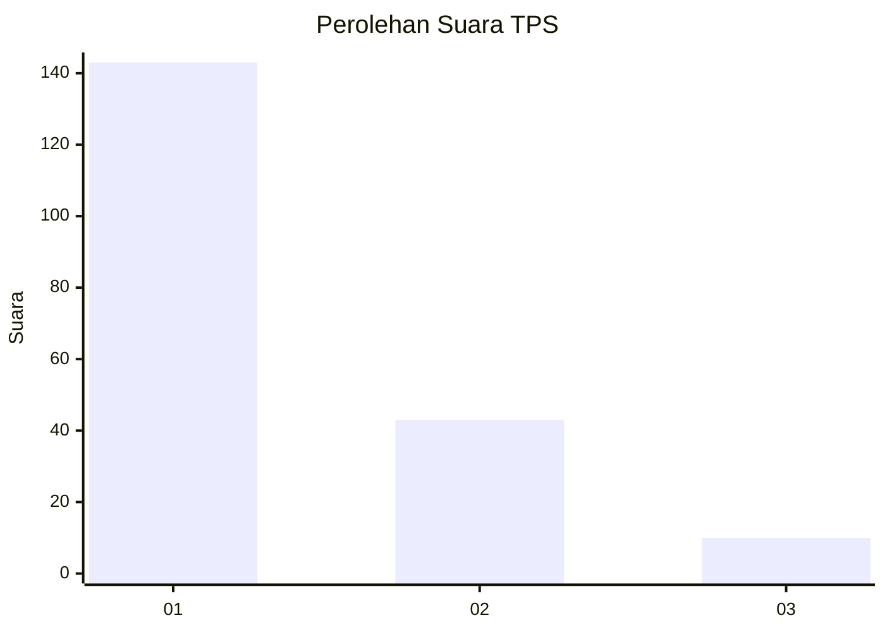
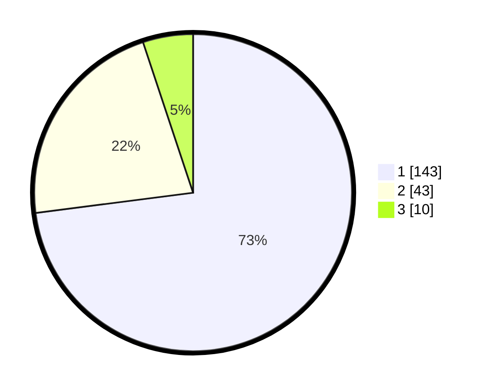

# Hasil

## Grafik

## Tabel

| No. | Nama Paslon    | Suara | Suara (raw) | Persentase |
|:--- |:-------------- | -----:| -----------:| ----------:|
| 1   | ANIES MUHAIMIN | 143   | [143][p-1]  | 72,96      |
| 2   | PRABOWO GIBRAN | 43    | [43][p-2]   | 21,94      |
| 3   | GANJAR MAHFUD  | 10    | [10][p-3]   | 5,10       |

[p-1]: https://github.com/gigit-pemilu/pemilu-2024/blob/main/pilpres/hitung-suara/sub/35-jawa-timur/sub/29-sumenep/sub/12-ambunten/sub/2009-bukabu/sub/006-tps/sub/paslon-1.txt
[p-2]: https://github.com/gigit-pemilu/pemilu-2024/blob/main/pilpres/hitung-suara/sub/35-jawa-timur/sub/29-sumenep/sub/12-ambunten/sub/2009-bukabu/sub/006-tps/sub/paslon-2.txt
[p-3]: https://github.com/gigit-pemilu/pemilu-2024/blob/main/pilpres/hitung-suara/sub/35-jawa-timur/sub/29-sumenep/sub/12-ambunten/sub/2009-bukabu/sub/006-tps/sub/paslon-3.txt

## Foto C Plano

https://sirekap-obj-formc.kpu.go.id/d2c3/pemilu/ppwp/35/29/12/20/09/3529122009006-20240215-125243--54f11937-fc57-4733-a775-af3670642877.jpg

https://sirekap-obj-formc.kpu.go.id/d2c3/pemilu/ppwp/35/29/12/20/09/3529122009006-20240214-213124--aef4e979-6ebb-45a9-b3ae-7701e38dfb0c.jpg

https://sirekap-obj-formc.kpu.go.id/d2c3/pemilu/ppwp/35/29/12/20/09/3529122009006-20240214-213314--710a64e4-3acf-4343-88ba-a279f44fa836.jpg

## Metadata

| Key        | Value               |
| ---------- | ------------------- |
| Time Stamp | 2024-02-16 14:30:33 |

