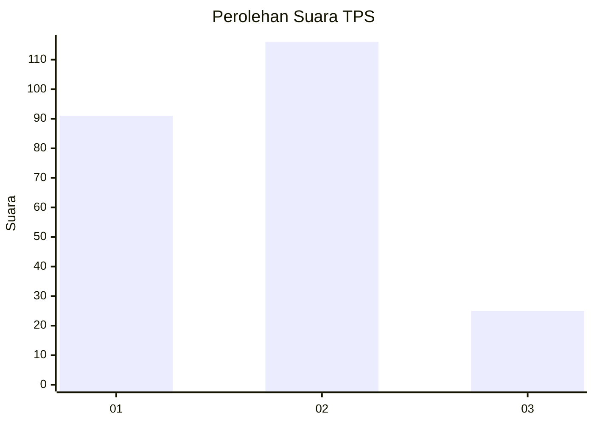
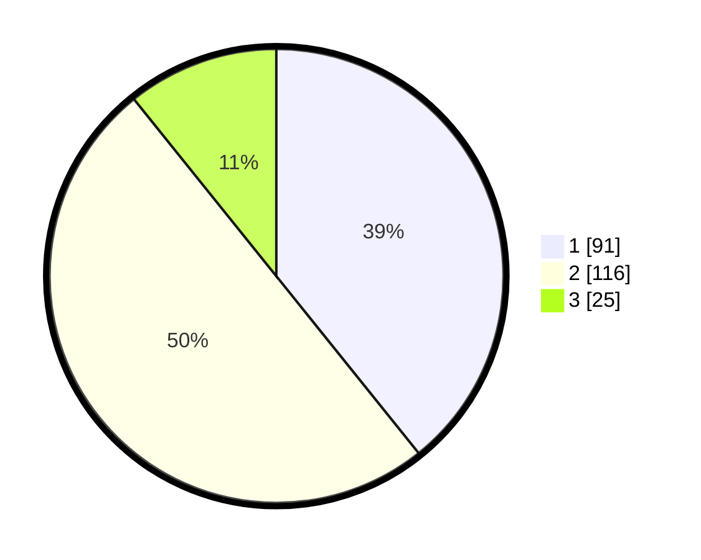

# Hasil

## Grafik

## Tabel

| No. | Nama Paslon    | Suara | Suara (raw) | Persentase |
|:--- |:-------------- | -----:| -----------:| ----------:|
| 1   | ANIES MUHAIMIN | 91    | [91][p-1]   | 39,22      |
| 2   | PRABOWO GIBRAN | 116   | [116][p-2]  | 50,00      |
| 3   | GANJAR MAHFUD  | 25    | [25][p-3]   | 10,78      |

[p-1]: https://github.com/gigit-pemilu/pemilu-2024/blob/main/pilpres/hitung-suara/sub/35-jawa-timur/sub/29-sumenep/sub/12-ambunten/sub/2015-belluk-raja/sub/005-tps/sub/paslon-1.txt
[p-2]: https://github.com/gigit-pemilu/pemilu-2024/blob/main/pilpres/hitung-suara/sub/35-jawa-timur/sub/29-sumenep/sub/12-ambunten/sub/2015-belluk-raja/sub/005-tps/sub/paslon-2.txt
[p-3]: https://github.com/gigit-pemilu/pemilu-2024/blob/main/pilpres/hitung-suara/sub/35-jawa-timur/sub/29-sumenep/sub/12-ambunten/sub/2015-belluk-raja/sub/005-tps/sub/paslon-3.txt

## Foto C Plano

https://sirekap-obj-formc.kpu.go.id/a647/pemilu/ppwp/35/29/12/20/15/3529122015005-20240215-011607--29670c7f-97ad-4415-ae7c-dfa7aa5bfe4d.jpg

https://sirekap-obj-formc.kpu.go.id/a647/pemilu/ppwp/35/29/12/20/15/3529122015005-20240214-214702--cb930f04-05ae-466d-aab2-ec3b912f45a7.jpg

https://sirekap-obj-formc.kpu.go.id/a647/pemilu/ppwp/35/29/12/20/15/3529122015005-20240214-214808--229171bb-ba8e-4053-b49e-b85accb8da05.jpg

## Metadata

| Key        | Value               |
| ---------- | ------------------- |
| Time Stamp | 2024-02-16 21:01:00 |

