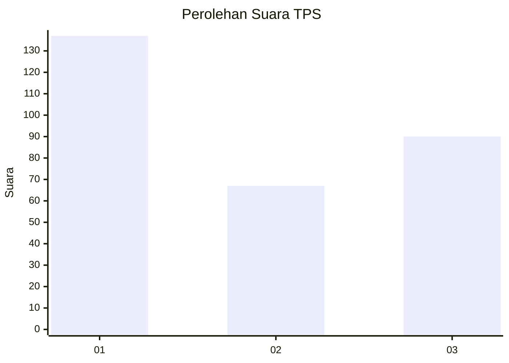
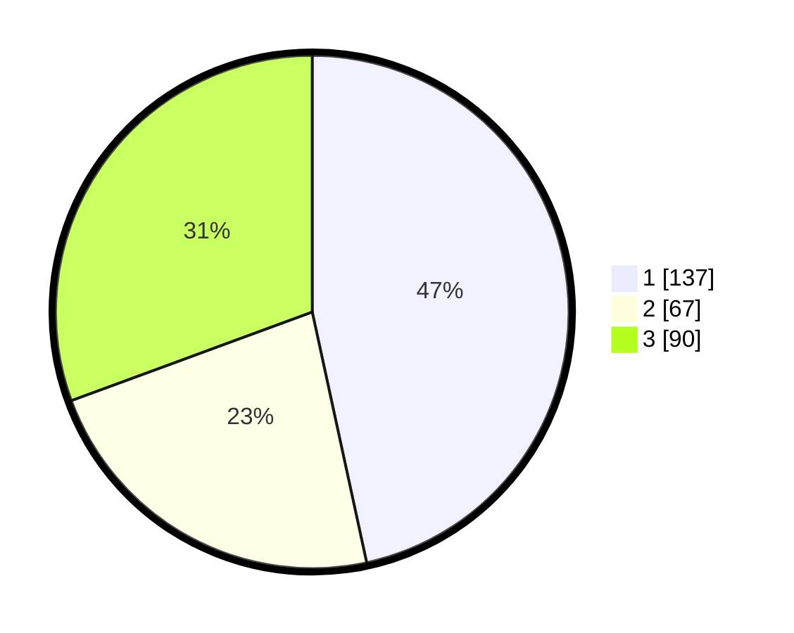

# Hasil

## Grafik

## Tabel

| No. | Nama Paslon    | Suara | Suara (raw) | Persentase |
|:--- |:-------------- | -----:| -----------:| ----------:|
| 1   | ANIES MUHAIMIN | 137   | [137][p-1]  | 46,60      |
| 2   | PRABOWO GIBRAN | 67    | [67][p-2]   | 22,79      |
| 3   | GANJAR MAHFUD  | 90    | [90][p-3]   | 30,61      |

[p-1]: https://github.com/gigit-pemilu/pemilu-2024-35-jawa-timur/blob/main/pilpres/hitung-suara/sub/35-jawa-timur/sub/29-sumenep/sub/13-pasongsongan/sub/2001-montorna/sub/004-tps/sub/paslon-1.txt
[p-2]: https://github.com/gigit-pemilu/pemilu-2024-35-jawa-timur/blob/main/pilpres/hitung-suara/sub/35-jawa-timur/sub/29-sumenep/sub/13-pasongsongan/sub/2001-montorna/sub/004-tps/sub/paslon-2.txt
[p-3]: https://github.com/gigit-pemilu/pemilu-2024-35-jawa-timur/blob/main/pilpres/hitung-suara/sub/35-jawa-timur/sub/29-sumenep/sub/13-pasongsongan/sub/2001-montorna/sub/004-tps/sub/paslon-3.txt

## Foto C Plano

https://sirekap-obj-formc.kpu.go.id/2194/pemilu/ppwp/35/29/13/20/01/3529132001004-20240215-174039--b402254e-50a6-4532-b526-19c6c5f45646.jpg

https://sirekap-obj-formc.kpu.go.id/2194/pemilu/ppwp/35/29/13/20/01/3529132001004-20240216-004636--c8033ae1-15cb-4750-9885-a63772dbd1a8.jpg

https://sirekap-obj-formc.kpu.go.id/2194/pemilu/ppwp/35/29/13/20/01/3529132001004-20240215-212451--accb68a5-d28f-432a-b6f4-ab0e287f44d5.jpg

## Metadata

| Key        | Value               |
| ---------- | ------------------- |
| Time Stamp | 2024-02-16 16:25:10 |

## DATA PEMILIH TETAP

Jumlah pemilih dalam DPT: **297**.
 * L: **133**.
 * P: **164**.

## DATA PENGGUNA HAK PILIH

Jumlah pengguna hak pilih dalam DPT: **293**.
 * L: **133**.
 * P: **160**.

Jumlah pengguna hak pilih dalam DPTb: **2**.
 * L: **0**.
 * P: **2**.

Jumlah pengguna hak pilih dalam DPK: **0**.
 * L: **0**.
 * P: **0**.

Jumlah pengguna hak pilih: **295**.
 * L: **133**.
 * P: **162**.

## JUMLAH SUARA SAH DAN TIDAK SAH

JUMLAH SELURUH SUARA SAH: **294**.

JUMLAH SUARA TIDAK SAH: **1**.

JUMLAH SELURUH SUARA SAH DAN SUARA TIDAK SAH: **295**.

