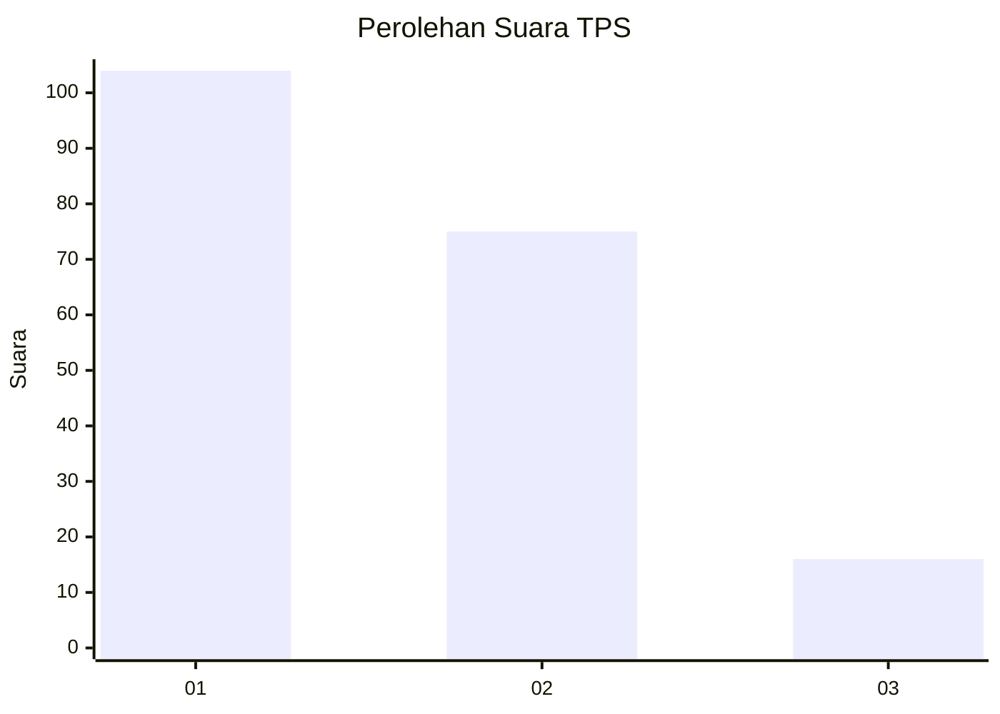
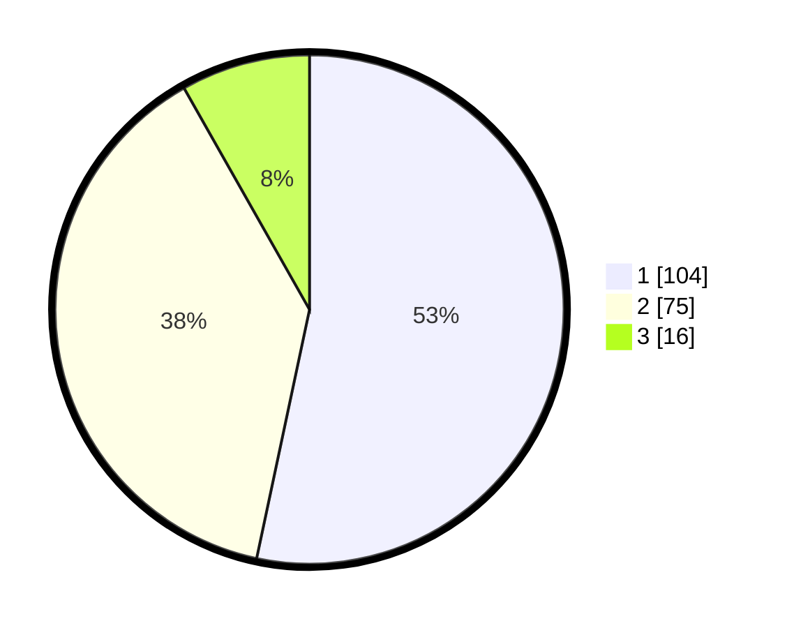

# Hasil

## Grafik

## Tabel

| No. | Nama Paslon    | Suara | Suara (raw) | Persentase |
|:--- |:-------------- | -----:| -----------:| ----------:|
| 1   | ANIES MUHAIMIN | 104   | [104][p-1]  | 53,33      |
| 2   | PRABOWO GIBRAN | 75    | [75][p-2]   | 38,46      |
| 3   | GANJAR MAHFUD  | 16    | [16][p-3]   | 8,21       |

[p-1]: https://github.com/gigit-pemilu/pemilu-2024-35-jawa-timur/blob/main/pilpres/hitung-suara/sub/35-jawa-timur/sub/29-sumenep/sub/13-pasongsongan/sub/2001-montorna/sub/005-tps/sub/paslon-1.txt
[p-2]: https://github.com/gigit-pemilu/pemilu-2024-35-jawa-timur/blob/main/pilpres/hitung-suara/sub/35-jawa-timur/sub/29-sumenep/sub/13-pasongsongan/sub/2001-montorna/sub/005-tps/sub/paslon-2.txt
[p-3]: https://github.com/gigit-pemilu/pemilu-2024-35-jawa-timur/blob/main/pilpres/hitung-suara/sub/35-jawa-timur/sub/29-sumenep/sub/13-pasongsongan/sub/2001-montorna/sub/005-tps/sub/paslon-3.txt

## Foto C Plano

https://sirekap-obj-formc.kpu.go.id/d1d3/pemilu/ppwp/35/29/13/20/01/3529132001005-20240215-160106--9d46e6c4-86aa-4ce6-98d5-5a9de566985b.jpg

https://sirekap-obj-formc.kpu.go.id/d1d3/pemilu/ppwp/35/29/13/20/01/3529132001005-20240215-160253--7d154ffd-f713-4e00-94c7-72ee64de9871.jpg

https://sirekap-obj-formc.kpu.go.id/d1d3/pemilu/ppwp/35/29/13/20/01/3529132001005-20240215-160324--4c1bfe0e-fed6-48e8-b9a5-42118e23a651.jpg

## Metadata

| Key        | Value               |
| ---------- | ------------------- |
| Time Stamp | 2024-02-15 19:30:26 |

