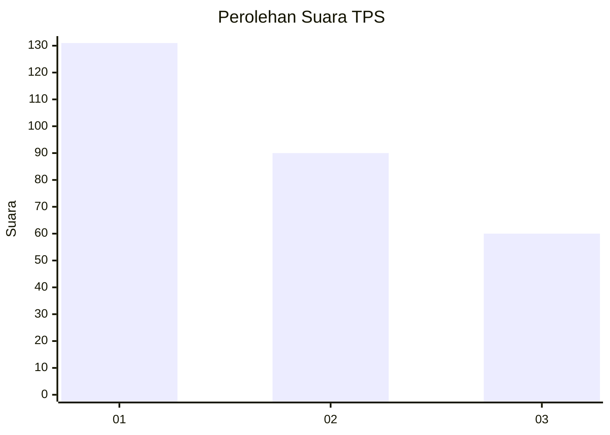
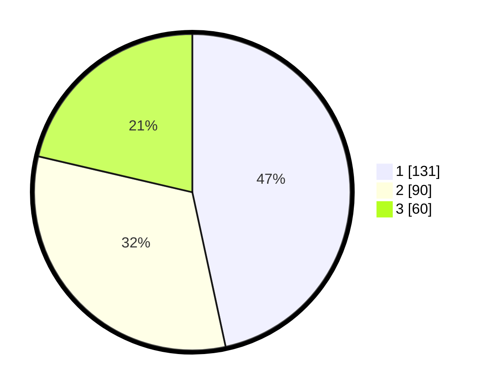

# Hasil

## Grafik

## Tabel

| No. | Nama Paslon    | Suara | Suara (raw) | Persentase |
|:--- |:-------------- | -----:| -----------:| ----------:|
| 1   | ANIES MUHAIMIN | 131   | [131][p-1]  | 46,62      |
| 2   | PRABOWO GIBRAN | 90    | [90][p-2]   | 32,03      |
| 3   | GANJAR MAHFUD  | 60    | [60][p-3]   | 21,35      |

[p-1]: https://github.com/gigit-pemilu/pemilu-2024-35-jawa-timur/blob/main/pilpres/hitung-suara/sub/35-jawa-timur/sub/29-sumenep/sub/13-pasongsongan/sub/2001-montorna/sub/013-tps/sub/paslon-1.txt
[p-2]: https://github.com/gigit-pemilu/pemilu-2024-35-jawa-timur/blob/main/pilpres/hitung-suara/sub/35-jawa-timur/sub/29-sumenep/sub/13-pasongsongan/sub/2001-montorna/sub/013-tps/sub/paslon-2.txt
[p-3]: https://github.com/gigit-pemilu/pemilu-2024-35-jawa-timur/blob/main/pilpres/hitung-suara/sub/35-jawa-timur/sub/29-sumenep/sub/13-pasongsongan/sub/2001-montorna/sub/013-tps/sub/paslon-3.txt

## Foto C Plano

https://sirekap-obj-formc.kpu.go.id/6540/pemilu/ppwp/35/29/13/20/01/3529132001013-20240215-163717--476c5824-8a28-419f-bf94-96f2359f1c55.jpg

https://sirekap-obj-formc.kpu.go.id/6540/pemilu/ppwp/35/29/13/20/01/3529132001013-20240215-163800--963abd7c-78cb-4b14-be7c-251d2db37261.jpg

https://sirekap-obj-formc.kpu.go.id/6540/pemilu/ppwp/35/29/13/20/01/3529132001013-20240215-163910--65655789-fd82-400a-b099-488dfa9c32a7.jpg

## Metadata

| Key        | Value               |
| ---------- | ------------------- |
| Time Stamp | 2024-02-15 22:30:27 |

