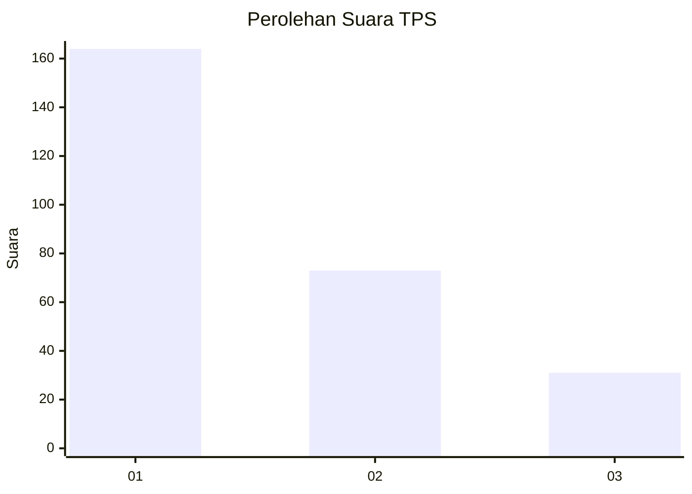
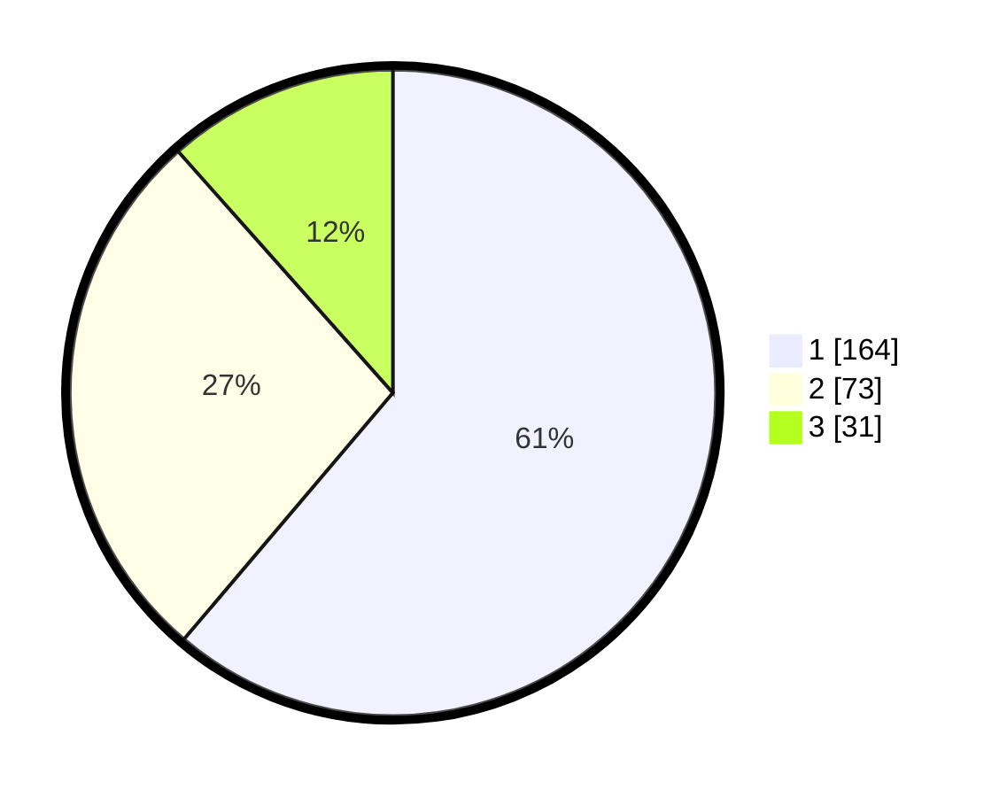

# Hasil

## Grafik

## Tabel

| No. | Nama Paslon    | Suara | Suara (raw) | Persentase |
|:--- |:-------------- | -----:| -----------:| ----------:|
| 1   | ANIES MUHAIMIN | 164   | [164][p-1]  | 61,19      |
| 2   | PRABOWO GIBRAN | 73    | [73][p-2]   | 27,24      |
| 3   | GANJAR MAHFUD  | 31    | [31][p-3]   | 11,57      |

[p-1]: https://github.com/gigit-pemilu/pemilu-2024/blob/main/pilpres/hitung-suara/sub/35-jawa-timur/sub/29-sumenep/sub/13-pasongsongan/sub/2002-prancak/sub/012-tps/sub/paslon-1.txt
[p-2]: https://github.com/gigit-pemilu/pemilu-2024/blob/main/pilpres/hitung-suara/sub/35-jawa-timur/sub/29-sumenep/sub/13-pasongsongan/sub/2002-prancak/sub/012-tps/sub/paslon-2.txt
[p-3]: https://github.com/gigit-pemilu/pemilu-2024/blob/main/pilpres/hitung-suara/sub/35-jawa-timur/sub/29-sumenep/sub/13-pasongsongan/sub/2002-prancak/sub/012-tps/sub/paslon-3.txt

## Foto C Plano

https://sirekap-obj-formc.kpu.go.id/2417/pemilu/ppwp/35/29/13/20/02/3529132002012-20240214-223924--d71e53d2-14ec-4b64-b3e0-4afbd2753ff7.jpg

https://sirekap-obj-formc.kpu.go.id/2417/pemilu/ppwp/35/29/13/20/02/3529132002012-20240214-224204--3cbe59f6-d95b-49e7-92a0-ab239f77a221.jpg

https://sirekap-obj-formc.kpu.go.id/2417/pemilu/ppwp/35/29/13/20/02/3529132002012-20240214-224320--c90369f3-bb81-461d-b86c-a97395ed7a68.jpg

## Metadata

| Key        | Value               |
| ---------- | ------------------- |
| Time Stamp | 2024-02-15 12:00:28 |

