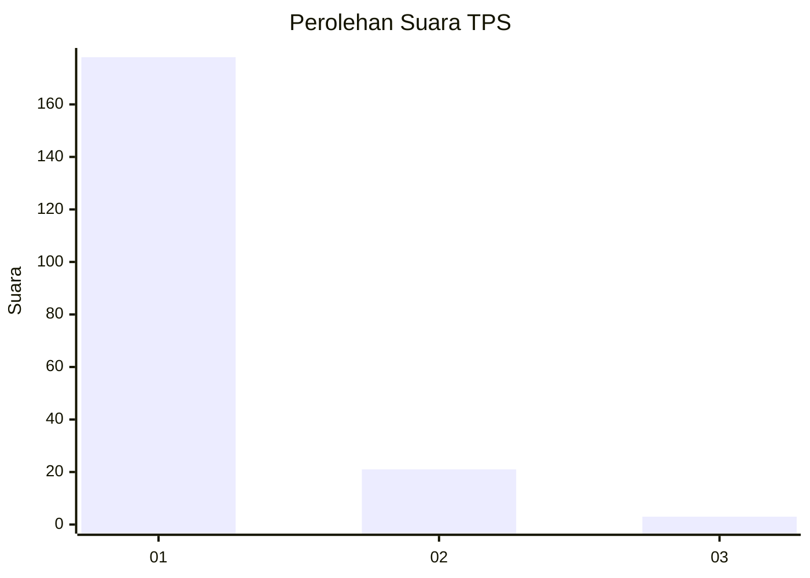
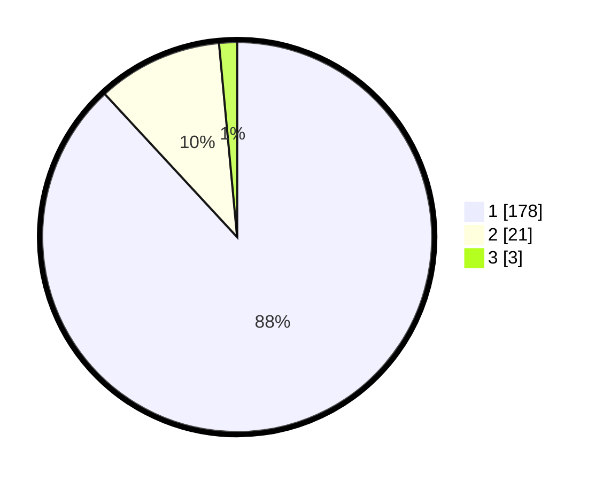

# Hasil

## Grafik

## Tabel

| No. | Nama Paslon    | Suara | Suara (raw) | Persentase |
|:--- |:-------------- | -----:| -----------:| ----------:|
| 1   | ANIES MUHAIMIN | 178   | [178][p-1]  | 88,12      |
| 2   | PRABOWO GIBRAN | 21    | [21][p-2]   | 10,40      |
| 3   | GANJAR MAHFUD  | 3     | [3][p-3]    | 1,49       |

[p-1]: https://github.com/gigit-pemilu/pemilu-2024-35-jawa-timur/blob/main/pilpres/hitung-suara/sub/35-jawa-timur/sub/29-sumenep/sub/13-pasongsongan/sub/2002-prancak/sub/014-tps/sub/paslon-1.txt
[p-2]: https://github.com/gigit-pemilu/pemilu-2024-35-jawa-timur/blob/main/pilpres/hitung-suara/sub/35-jawa-timur/sub/29-sumenep/sub/13-pasongsongan/sub/2002-prancak/sub/014-tps/sub/paslon-2.txt
[p-3]: https://github.com/gigit-pemilu/pemilu-2024-35-jawa-timur/blob/main/pilpres/hitung-suara/sub/35-jawa-timur/sub/29-sumenep/sub/13-pasongsongan/sub/2002-prancak/sub/014-tps/sub/paslon-3.txt

## Foto C Plano

https://sirekap-obj-formc.kpu.go.id/4ace/pemilu/ppwp/35/29/13/20/02/3529132002014-20240214-230055--66afdc10-2175-42c9-aa68-dd2c3a473e76.jpg

https://sirekap-obj-formc.kpu.go.id/4ace/pemilu/ppwp/35/29/13/20/02/3529132002014-20240214-230239--177ef7fa-d284-4ad9-ab24-82340264ed1a.jpg

https://sirekap-obj-formc.kpu.go.id/4ace/pemilu/ppwp/35/29/13/20/02/3529132002014-20240214-230332--8ec6a981-ffa7-4a8c-b8d0-7ffa945f7313.jpg

## Metadata

| Key        | Value               |
| ---------- | ------------------- |
| Time Stamp | 2024-02-16 14:30:33 |

