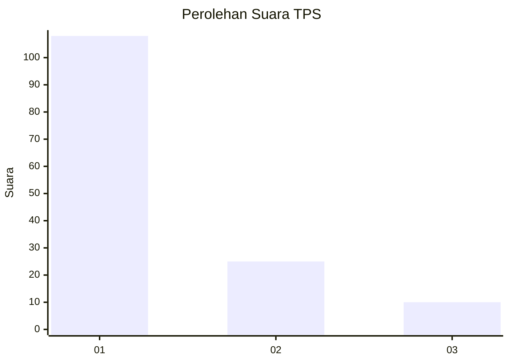
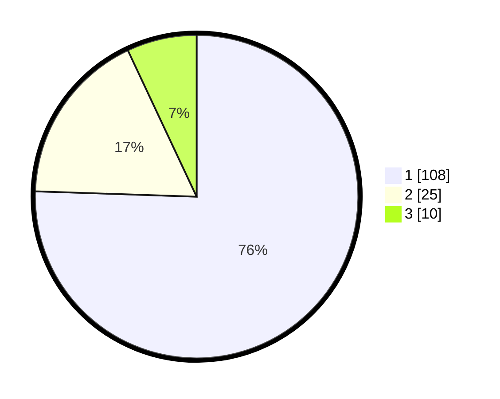

# Hasil

## Grafik

## Tabel

| No. | Nama Paslon    | Suara | Suara (raw) | Persentase |
|:--- |:-------------- | -----:| -----------:| ----------:|
| 1   | ANIES MUHAIMIN | 108   | [108][p-1]  | 75,52      |
| 2   | PRABOWO GIBRAN | 25    | [25][p-2]   | 17,48      |
| 3   | GANJAR MAHFUD  | 10    | [10][p-3]   | 6,99       |

[p-1]: https://github.com/gigit-pemilu/pemilu-2024-35-jawa-timur/blob/main/pilpres/hitung-suara/sub/35-jawa-timur/sub/29-sumenep/sub/13-pasongsongan/sub/2003-campaka/sub/007-tps/sub/paslon-1.txt
[p-2]: https://github.com/gigit-pemilu/pemilu-2024-35-jawa-timur/blob/main/pilpres/hitung-suara/sub/35-jawa-timur/sub/29-sumenep/sub/13-pasongsongan/sub/2003-campaka/sub/007-tps/sub/paslon-2.txt
[p-3]: https://github.com/gigit-pemilu/pemilu-2024-35-jawa-timur/blob/main/pilpres/hitung-suara/sub/35-jawa-timur/sub/29-sumenep/sub/13-pasongsongan/sub/2003-campaka/sub/007-tps/sub/paslon-3.txt

## Foto C Plano

https://sirekap-obj-formc.kpu.go.id/ef40/pemilu/ppwp/35/29/13/20/03/3529132003007-20240214-200430--8b221ced-b877-4706-b401-eb5ef99e3fba.jpg

https://sirekap-obj-formc.kpu.go.id/ef40/pemilu/ppwp/35/29/13/20/03/3529132003007-20240214-200308--85c48e7e-5cd2-4682-972f-e0fd7149d6f9.jpg

https://sirekap-obj-formc.kpu.go.id/ef40/pemilu/ppwp/35/29/13/20/03/3529132003007-20240214-200347--4da2c63c-be0e-4cd2-96b5-53aa7212bfa3.jpg

## Metadata

| Key        | Value               |
| ---------- | ------------------- |
| Time Stamp | 2024-02-16 14:30:33 |

