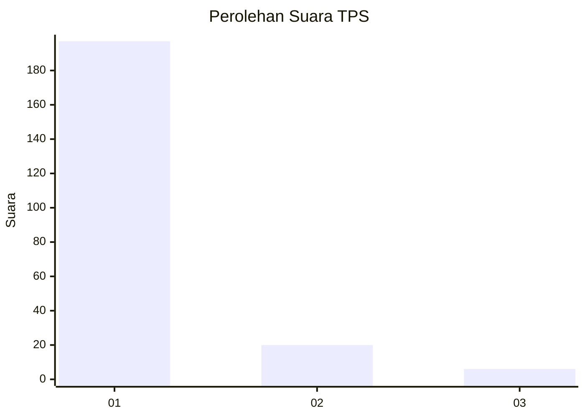
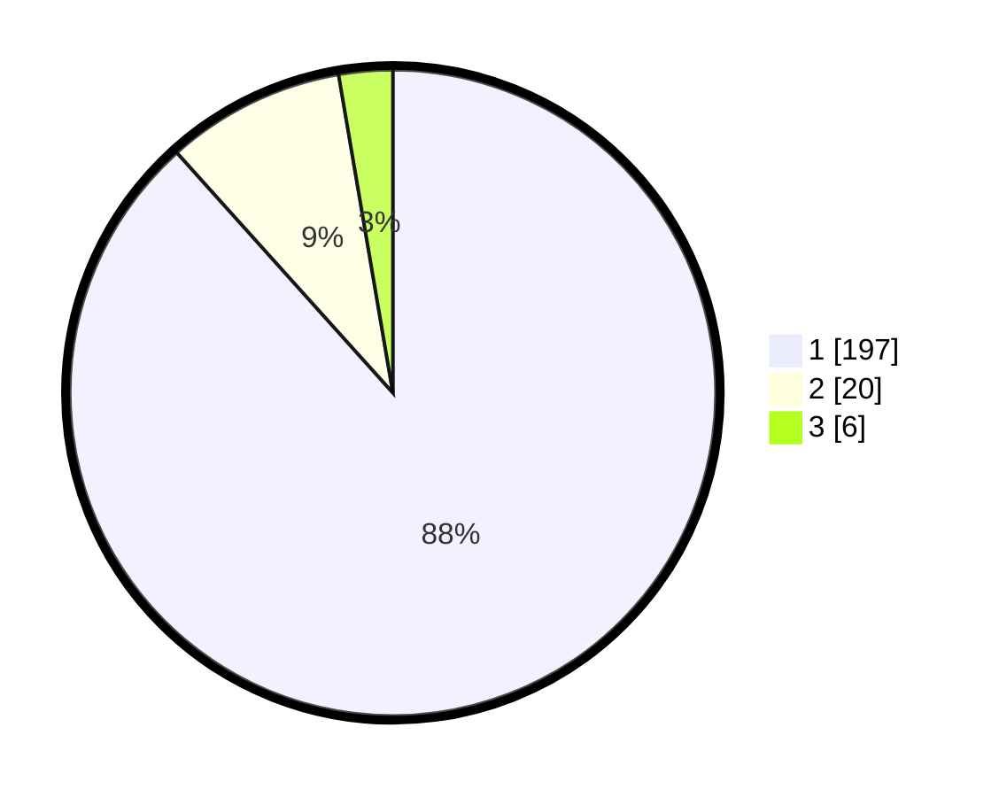

# Hasil

## Grafik

## Tabel

| No. | Nama Paslon    | Suara | Suara (raw) | Persentase |
|:--- |:-------------- | -----:| -----------:| ----------:|
| 1   | ANIES MUHAIMIN | 197   | [197][p-1]  | 88,34      |
| 2   | PRABOWO GIBRAN | 20    | [20][p-2]   | 8,97       |
| 3   | GANJAR MAHFUD  | 6     | [6][p-3]    | 2,69       |

[p-1]: https://github.com/gigit-pemilu/pemilu-2024-35-jawa-timur/blob/main/pilpres/hitung-suara/sub/35-jawa-timur/sub/29-sumenep/sub/13-pasongsongan/sub/2004-rajun/sub/001-tps/sub/paslon-1.txt
[p-2]: https://github.com/gigit-pemilu/pemilu-2024-35-jawa-timur/blob/main/pilpres/hitung-suara/sub/35-jawa-timur/sub/29-sumenep/sub/13-pasongsongan/sub/2004-rajun/sub/001-tps/sub/paslon-2.txt
[p-3]: https://github.com/gigit-pemilu/pemilu-2024-35-jawa-timur/blob/main/pilpres/hitung-suara/sub/35-jawa-timur/sub/29-sumenep/sub/13-pasongsongan/sub/2004-rajun/sub/001-tps/sub/paslon-3.txt

## Foto C Plano

https://sirekap-obj-formc.kpu.go.id/f13b/pemilu/ppwp/35/29/13/20/04/3529132004001-20240214-221903--b42e39ce-83a5-4c01-b373-b20d2d6c60f1.jpg

https://sirekap-obj-formc.kpu.go.id/f13b/pemilu/ppwp/35/29/13/20/04/3529132004001-20240214-222024--5a238e75-c51f-45b0-97a9-c759cce8adf0.jpg

https://sirekap-obj-formc.kpu.go.id/f13b/pemilu/ppwp/35/29/13/20/04/3529132004001-20240214-222145--cb6c763a-8573-4b10-ac0c-2342eb0367d5.jpg

## Metadata

| Key        | Value               |
| ---------- | ------------------- |
| Time Stamp | 2024-02-24 22:31:28 |

