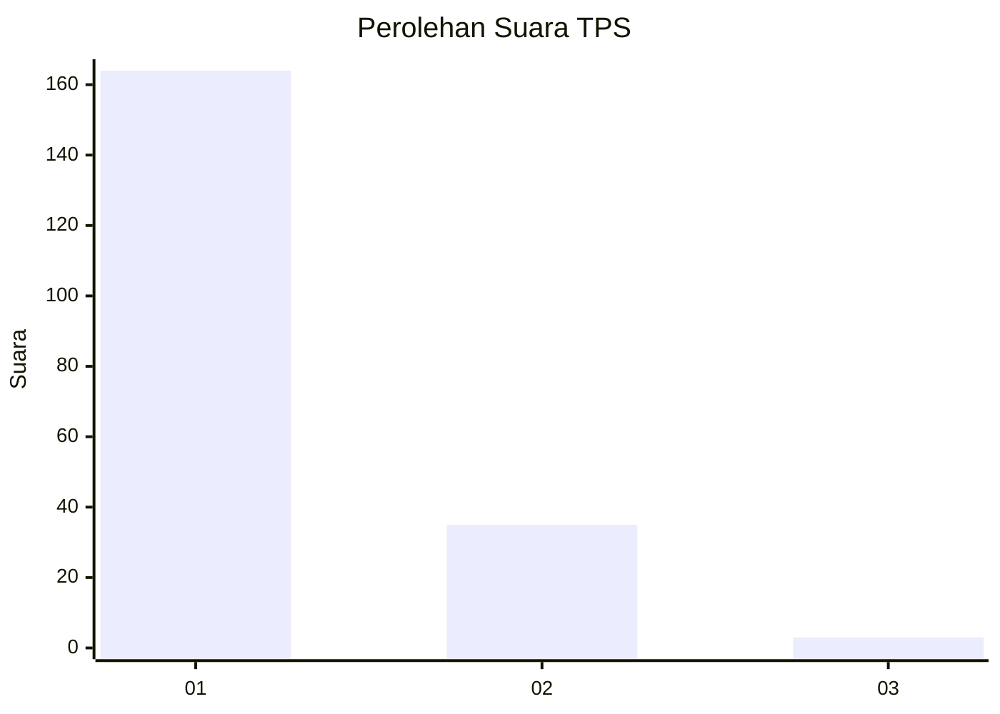
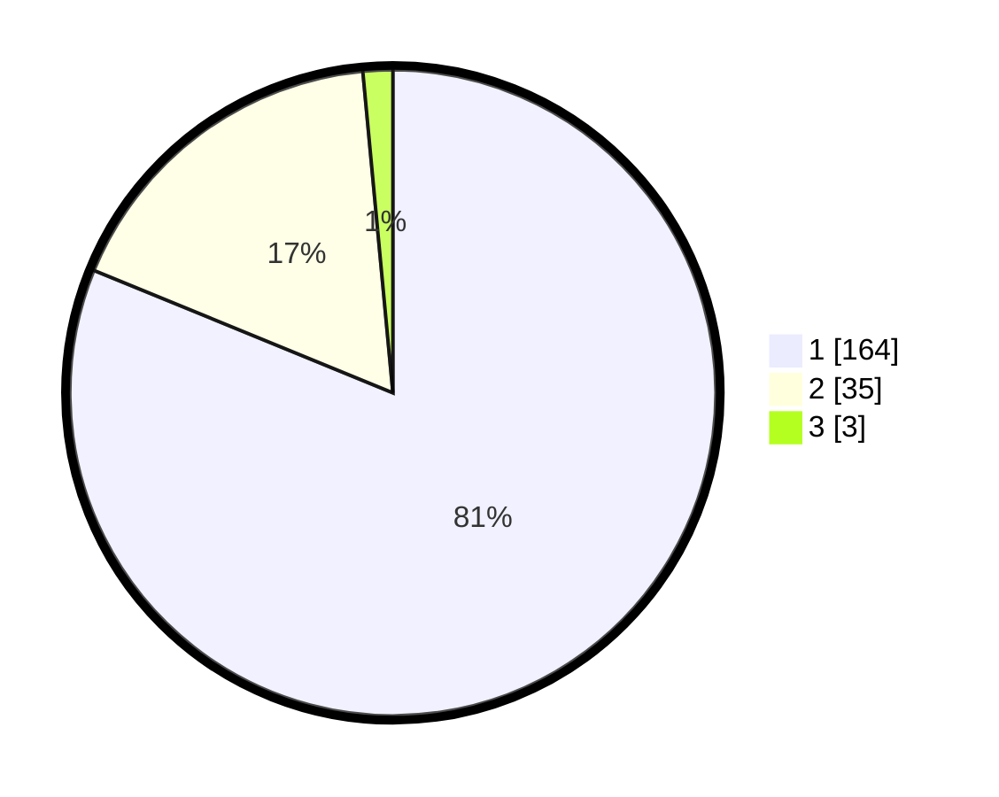

# Hasil

## Grafik

## Tabel

| No. | Nama Paslon    | Suara | Suara (raw) | Persentase |
|:--- |:-------------- | -----:| -----------:| ----------:|
| 1   | ANIES MUHAIMIN | 164   | [164][p-1]  | 81,19      |
| 2   | PRABOWO GIBRAN | 35    | [35][p-2]   | 17,33      |
| 3   | GANJAR MAHFUD  | 3     | [3][p-3]    | 1,49       |

[p-1]: https://github.com/gigit-pemilu/pemilu-2024/blob/main/pilpres/hitung-suara/sub/35-jawa-timur/sub/29-sumenep/sub/13-pasongsongan/sub/2004-rajun/sub/002-tps/sub/paslon-1.txt
[p-2]: https://github.com/gigit-pemilu/pemilu-2024/blob/main/pilpres/hitung-suara/sub/35-jawa-timur/sub/29-sumenep/sub/13-pasongsongan/sub/2004-rajun/sub/002-tps/sub/paslon-2.txt
[p-3]: https://github.com/gigit-pemilu/pemilu-2024/blob/main/pilpres/hitung-suara/sub/35-jawa-timur/sub/29-sumenep/sub/13-pasongsongan/sub/2004-rajun/sub/002-tps/sub/paslon-3.txt

## Foto C Plano

https://sirekap-obj-formc.kpu.go.id/73bd/pemilu/ppwp/35/29/13/20/04/3529132004002-20240215-081025--37af1e71-2aa5-4cd8-a14d-81b8dd89e547.jpg

https://sirekap-obj-formc.kpu.go.id/73bd/pemilu/ppwp/35/29/13/20/04/3529132004002-20240215-081143--b55ebd70-bbff-4aba-a491-b926c2cd0589.jpg

https://sirekap-obj-formc.kpu.go.id/73bd/pemilu/ppwp/35/29/13/20/04/3529132004002-20240215-081228--24396991-565e-4d21-ab83-661f361b3c65.jpg

## Metadata

| Key        | Value               |
| ---------- | ------------------- |
| Time Stamp | 2024-02-25 14:00:00 |

