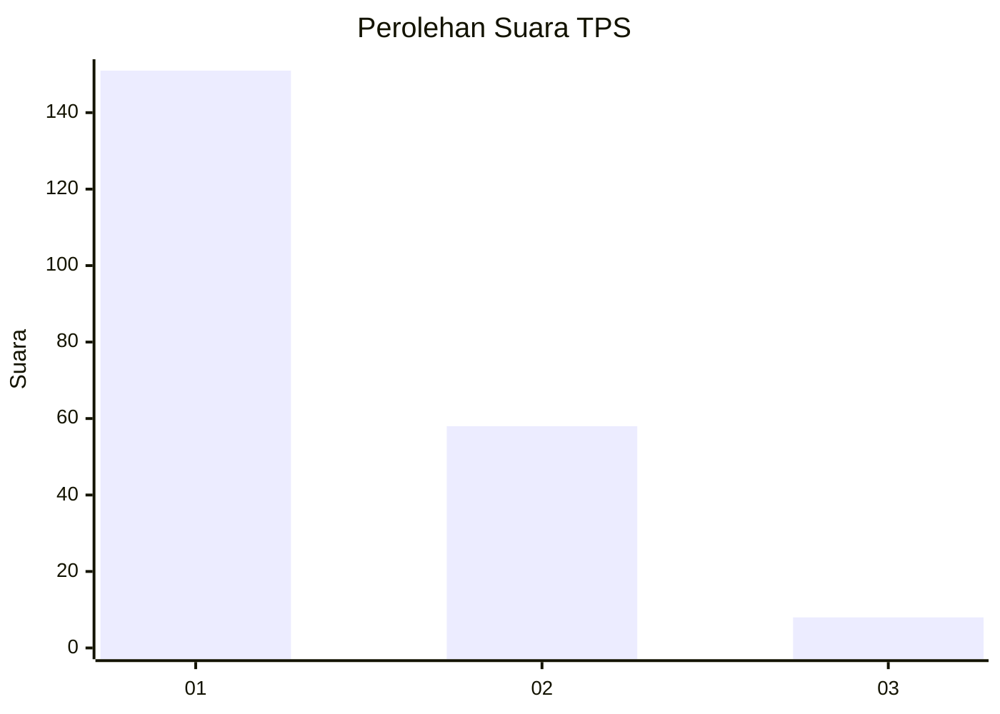
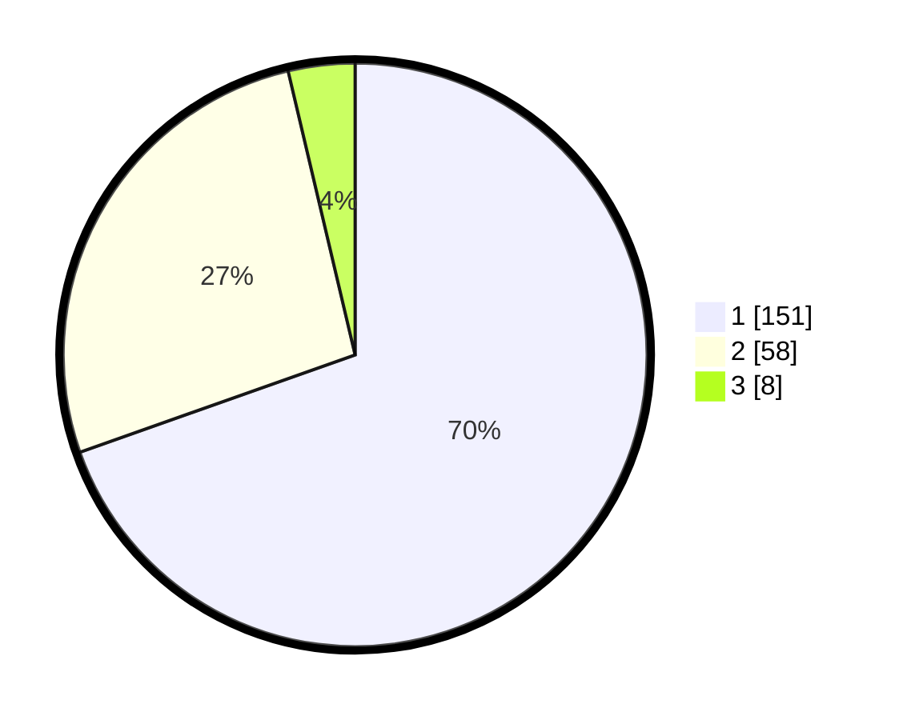

# Hasil

## Grafik

## Tabel

| No. | Nama Paslon    | Suara | Suara (raw) | Persentase |
|:--- |:-------------- | -----:| -----------:| ----------:|
| 1   | ANIES MUHAIMIN | 151   | [151][p-1]  | 69,59      |
| 2   | PRABOWO GIBRAN | 58    | [58][p-2]   | 26,73      |
| 3   | GANJAR MAHFUD  | 8     | [8][p-3]    | 3,69       |

[p-1]: https://github.com/gigit-pemilu/pemilu-2024-35-jawa-timur/blob/main/pilpres/hitung-suara/sub/35-jawa-timur/sub/29-sumenep/sub/13-pasongsongan/sub/2004-rajun/sub/006-tps/sub/paslon-1.txt
[p-2]: https://github.com/gigit-pemilu/pemilu-2024-35-jawa-timur/blob/main/pilpres/hitung-suara/sub/35-jawa-timur/sub/29-sumenep/sub/13-pasongsongan/sub/2004-rajun/sub/006-tps/sub/paslon-2.txt
[p-3]: https://github.com/gigit-pemilu/pemilu-2024-35-jawa-timur/blob/main/pilpres/hitung-suara/sub/35-jawa-timur/sub/29-sumenep/sub/13-pasongsongan/sub/2004-rajun/sub/006-tps/sub/paslon-3.txt

## Foto C Plano

https://sirekap-obj-formc.kpu.go.id/6f8d/pemilu/ppwp/35/29/13/20/04/3529132004006-20240214-225641--8df57958-83b8-4c27-9165-2f0db7dd2e7b.jpg

https://sirekap-obj-formc.kpu.go.id/6f8d/pemilu/ppwp/35/29/13/20/04/3529132004006-20240214-234118--269ed07a-ffc6-40db-bb60-263656eb10f5.jpg

https://sirekap-obj-formc.kpu.go.id/6f8d/pemilu/ppwp/35/29/13/20/04/3529132004006-20240214-215207--34b24b27-ab81-4a6b-967f-86eaee4838e5.jpg

## Metadata

| Key        | Value               |
| ---------- | ------------------- |
| Time Stamp | 2024-02-16 23:30:00 |

