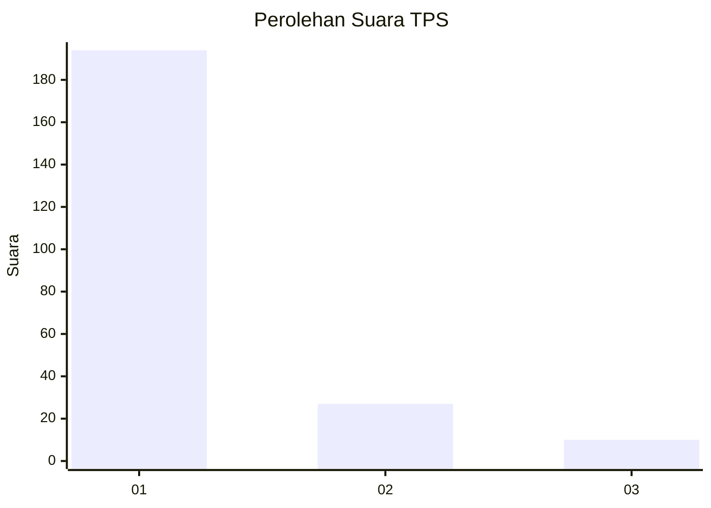
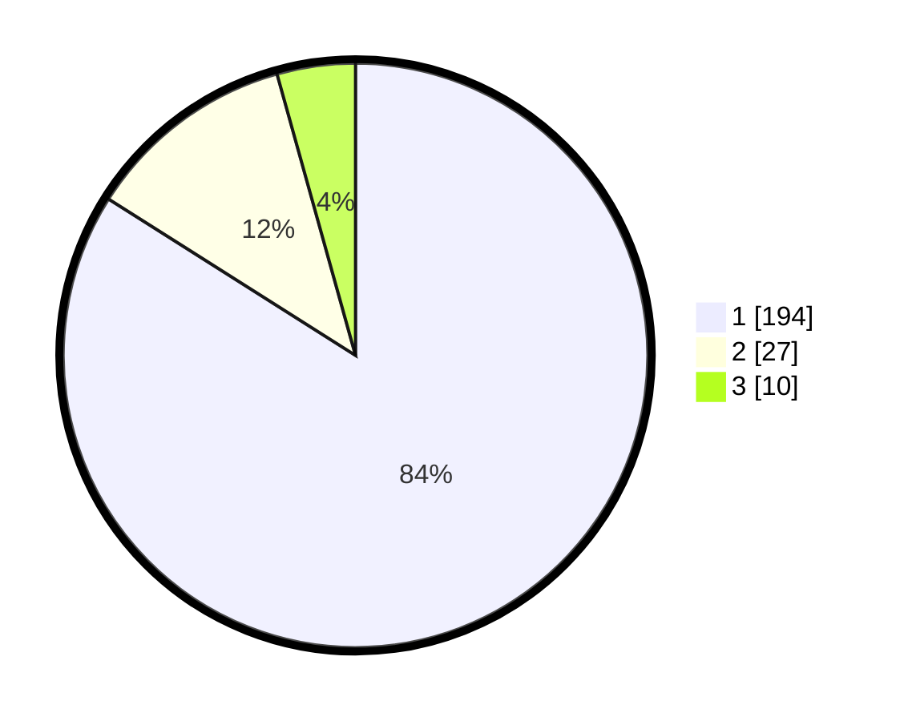

# Hasil

## Grafik

## Tabel

| No. | Nama Paslon    | Suara | Suara (raw) | Persentase |
|:--- |:-------------- | -----:| -----------:| ----------:|
| 1   | ANIES MUHAIMIN | 194   | [194][p-1]  | 83,98      |
| 2   | PRABOWO GIBRAN | 27    | [27][p-2]   | 11,69      |
| 3   | GANJAR MAHFUD  | 10    | [10][p-3]   | 4,33       |

[p-1]: https://github.com/gigit-pemilu/pemilu-2024-35-jawa-timur/blob/main/pilpres/hitung-suara/sub/35-jawa-timur/sub/29-sumenep/sub/13-pasongsongan/sub/2004-rajun/sub/010-tps/sub/paslon-1.txt
[p-2]: https://github.com/gigit-pemilu/pemilu-2024-35-jawa-timur/blob/main/pilpres/hitung-suara/sub/35-jawa-timur/sub/29-sumenep/sub/13-pasongsongan/sub/2004-rajun/sub/010-tps/sub/paslon-2.txt
[p-3]: https://github.com/gigit-pemilu/pemilu-2024-35-jawa-timur/blob/main/pilpres/hitung-suara/sub/35-jawa-timur/sub/29-sumenep/sub/13-pasongsongan/sub/2004-rajun/sub/010-tps/sub/paslon-3.txt

## Foto C Plano

https://sirekap-obj-formc.kpu.go.id/e9c8/pemilu/ppwp/35/29/13/20/04/3529132004010-20240214-232113--1fc1c46b-2952-4d91-a122-1dd195b2ee1c.jpg

https://sirekap-obj-formc.kpu.go.id/e9c8/pemilu/ppwp/35/29/13/20/04/3529132004010-20240214-232434--817f5e87-7028-4554-9926-5d6ca68ef1b3.jpg

https://sirekap-obj-formc.kpu.go.id/e9c8/pemilu/ppwp/35/29/13/20/04/3529132004010-20240214-232710--cc632731-5222-4848-a907-60ba4084b498.jpg

## Metadata

| Key        | Value               |
| ---------- | ------------------- |
| Time Stamp | 2024-02-24 22:31:28 |

