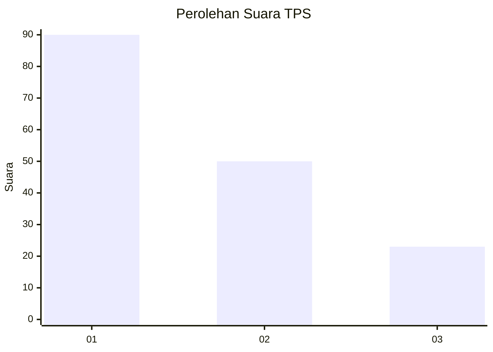
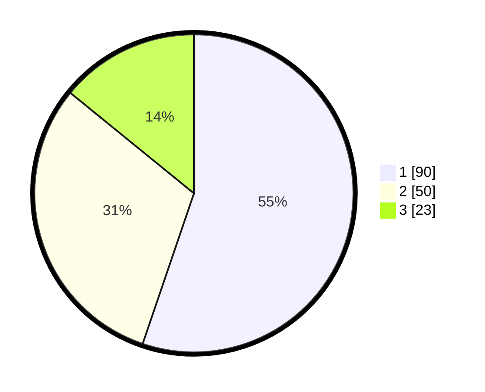

# Hasil

## Grafik

## Tabel

| No. | Nama Paslon    | Suara | Suara (raw) | Persentase |
|:--- |:-------------- | -----:| -----------:| ----------:|
| 1   | ANIES MUHAIMIN | 90    | [90][p-1]   | 55,21      |
| 2   | PRABOWO GIBRAN | 50    | [50][p-2]   | 30,67      |
| 3   | GANJAR MAHFUD  | 23    | [23][p-3]   | 14,11      |

[p-1]: https://github.com/gigit-pemilu/pemilu-2024-35-jawa-timur/blob/main/pilpres/hitung-suara/sub/35-jawa-timur/sub/29-sumenep/sub/13-pasongsongan/sub/2005-lebeng-timur/sub/004-tps/sub/paslon-1.txt
[p-2]: https://github.com/gigit-pemilu/pemilu-2024-35-jawa-timur/blob/main/pilpres/hitung-suara/sub/35-jawa-timur/sub/29-sumenep/sub/13-pasongsongan/sub/2005-lebeng-timur/sub/004-tps/sub/paslon-2.txt
[p-3]: https://github.com/gigit-pemilu/pemilu-2024-35-jawa-timur/blob/main/pilpres/hitung-suara/sub/35-jawa-timur/sub/29-sumenep/sub/13-pasongsongan/sub/2005-lebeng-timur/sub/004-tps/sub/paslon-3.txt

## Foto C Plano

https://sirekap-obj-formc.kpu.go.id/b83c/pemilu/ppwp/35/29/13/20/05/3529132005004-20240214-215015--5a2f6a4c-5b55-46d1-88e1-47db0f573a16.jpg

https://sirekap-obj-formc.kpu.go.id/b83c/pemilu/ppwp/35/29/13/20/05/3529132005004-20240214-215211--a6d75540-e4cf-4725-8fa8-34782cc31e60.jpg

https://sirekap-obj-formc.kpu.go.id/b83c/pemilu/ppwp/35/29/13/20/05/3529132005004-20240214-215355--48349eee-0da0-4e44-af2c-1ececa9245b7.jpg

## Metadata

| Key        | Value               |
| ---------- | ------------------- |
| Time Stamp | 2024-02-25 15:00:00 |

