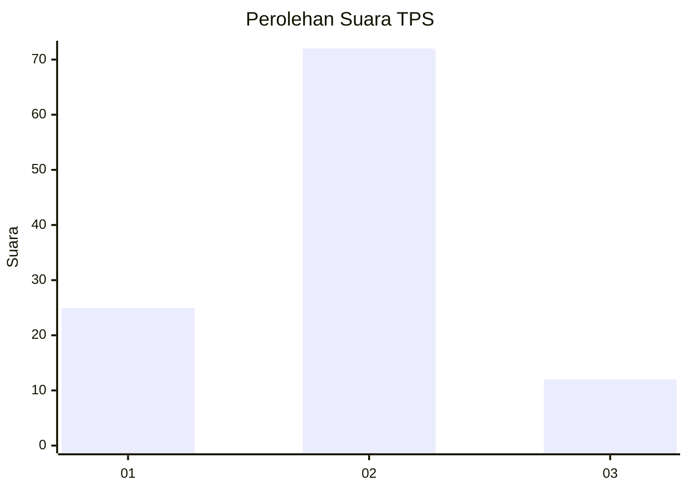

# Hasil

## Grafik

## Tabel

| No. | Nama Paslon    | Suara | Suara (raw) | Persentase |
|:--- |:-------------- | -----:| -----------:| ----------:|
| 1   | ANIES MUHAIMIN | 25    | [25][p-1]   | 22,94      |
| 2   | PRABOWO GIBRAN | 72    | [72][p-2]   | 66,06      |
| 3   | GANJAR MAHFUD  | 12    | [12][p-3]   | 11,01      |

[p-1]: https://github.com/gigit-pemilu/pemilu-2024/blob/main/pilpres/hitung-suara/sub/35-jawa-timur/sub/29-sumenep/sub/13-pasongsongan/sub/2008-pasongsongan/sub/006-tps/sub/paslon-1.txt
[p-2]: https://github.com/gigit-pemilu/pemilu-2024/blob/main/pilpres/hitung-suara/sub/35-jawa-timur/sub/29-sumenep/sub/13-pasongsongan/sub/2008-pasongsongan/sub/006-tps/sub/paslon-2.txt
[p-3]: https://github.com/gigit-pemilu/pemilu-2024/blob/main/pilpres/hitung-suara/sub/35-jawa-timur/sub/29-sumenep/sub/13-pasongsongan/sub/2008-pasongsongan/sub/006-tps/sub/paslon-3.txt

## Foto C Plano

https://sirekap-obj-formc.kpu.go.id/e7ea/pemilu/ppwp/35/29/13/20/08/3529132008006-20240215-140031--be68b44e-103e-42af-93f3-e991caa52fe4.jpg

https://sirekap-obj-formc.kpu.go.id/e7ea/pemilu/ppwp/35/29/13/20/08/3529132008006-20240214-224406--685067f1-1266-422d-bd2c-eeb6b997d635.jpg

https://sirekap-obj-formc.kpu.go.id/e7ea/pemilu/ppwp/35/29/13/20/08/3529132008006-20240215-140131--56ade380-9e99-4205-920d-34115c0fab95.jpg

## Metadata

| Key        | Value               |
| ---------- | ------------------- |
| Time Stamp | 2024-02-16 16:25:10 |

