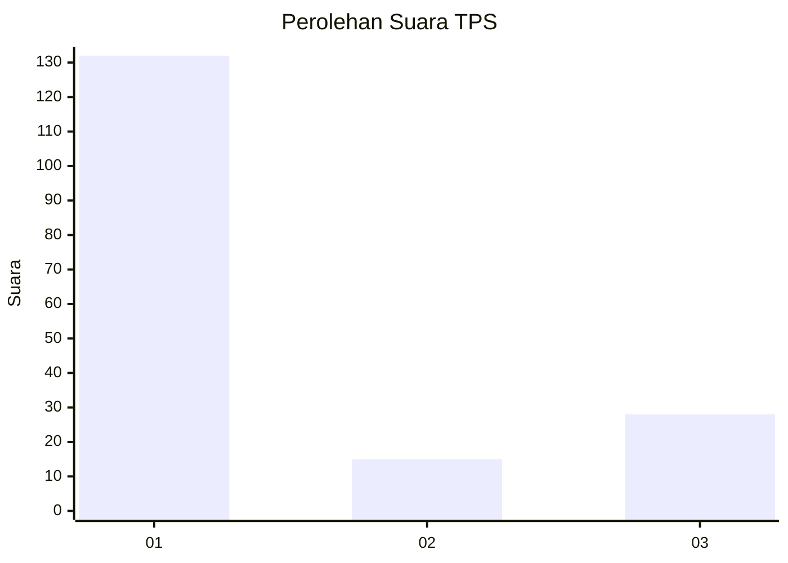
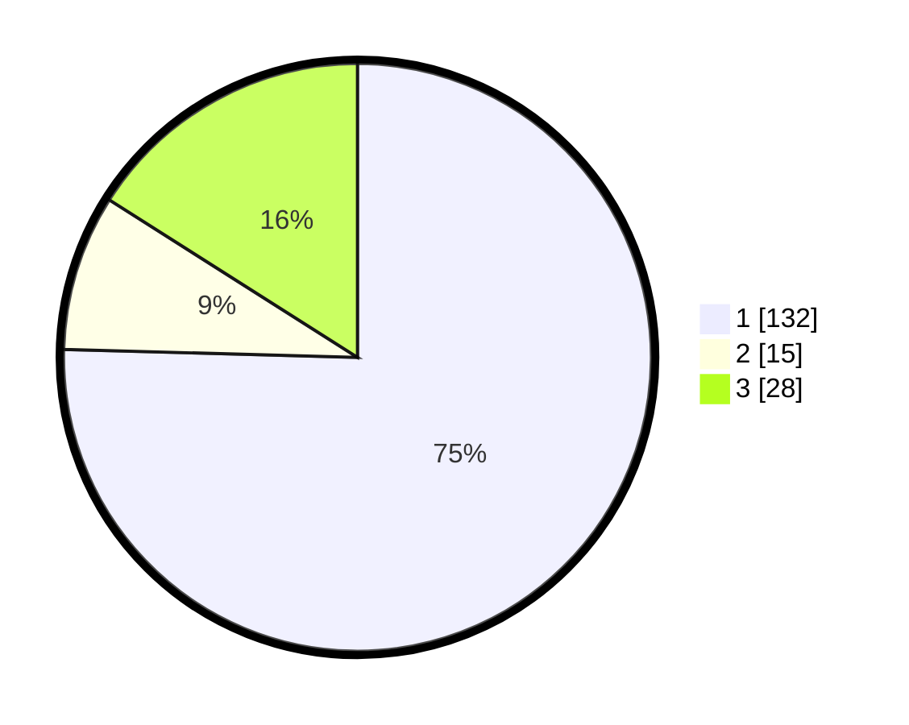

# Hasil

## Grafik

## Tabel

| No. | Nama Paslon    | Suara | Suara (raw) | Persentase |
|:--- |:-------------- | -----:| -----------:| ----------:|
| 1   | ANIES MUHAIMIN | 132   | [132][p-1]  | 75,43      |
| 2   | PRABOWO GIBRAN | 15    | [15][p-2]   | 8,57       |
| 3   | GANJAR MAHFUD  | 28    | [28][p-3]   | 16,00      |

[p-1]: https://github.com/gigit-pemilu/pemilu-2024/blob/main/pilpres/hitung-suara/sub/35-jawa-timur/sub/29-sumenep/sub/13-pasongsongan/sub/2008-pasongsongan/sub/020-tps/sub/paslon-1.txt
[p-2]: https://github.com/gigit-pemilu/pemilu-2024/blob/main/pilpres/hitung-suara/sub/35-jawa-timur/sub/29-sumenep/sub/13-pasongsongan/sub/2008-pasongsongan/sub/020-tps/sub/paslon-2.txt
[p-3]: https://github.com/gigit-pemilu/pemilu-2024/blob/main/pilpres/hitung-suara/sub/35-jawa-timur/sub/29-sumenep/sub/13-pasongsongan/sub/2008-pasongsongan/sub/020-tps/sub/paslon-3.txt

## Foto C Plano

https://sirekap-obj-formc.kpu.go.id/bccb/pemilu/ppwp/35/29/13/20/08/3529132008020-20240214-222413--1d2a31f0-e10f-4cb1-b74b-5d254ecb42cc.jpg

https://sirekap-obj-formc.kpu.go.id/bccb/pemilu/ppwp/35/29/13/20/08/3529132008020-20240214-155550--da59f4be-c7e2-4d57-86cb-63f3b7b4280d.jpg

https://sirekap-obj-formc.kpu.go.id/bccb/pemilu/ppwp/35/29/13/20/08/3529132008020-20240214-155749--95f570eb-27cf-4b07-94a6-332d1403a002.jpg

## Metadata

| Key        | Value               |
| ---------- | ------------------- |
| Time Stamp | 2024-02-16 16:25:10 |

