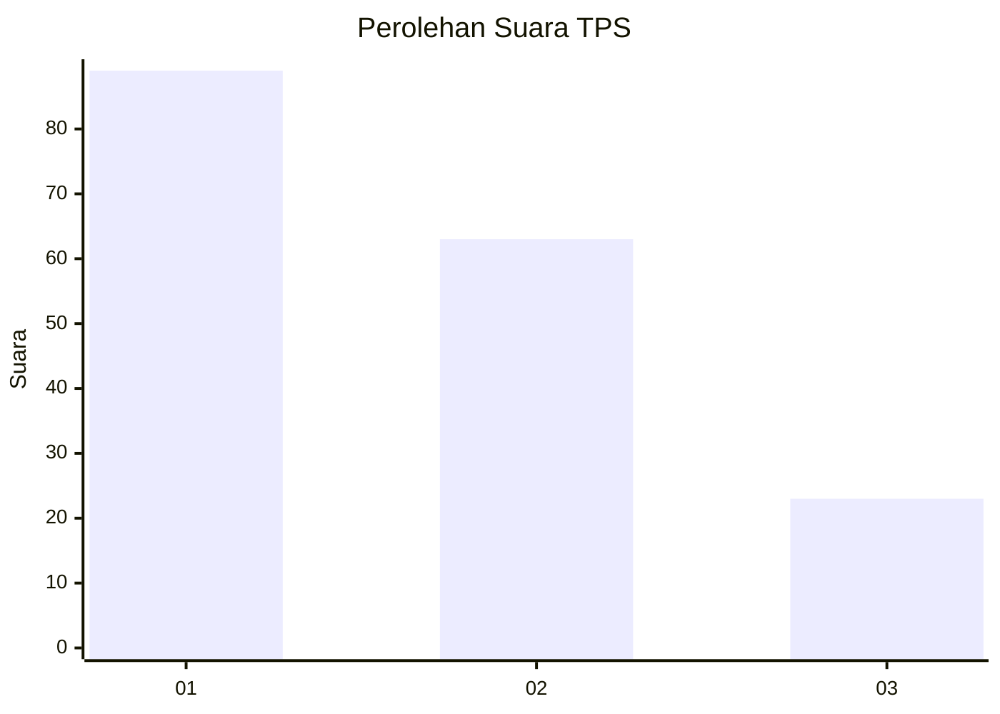
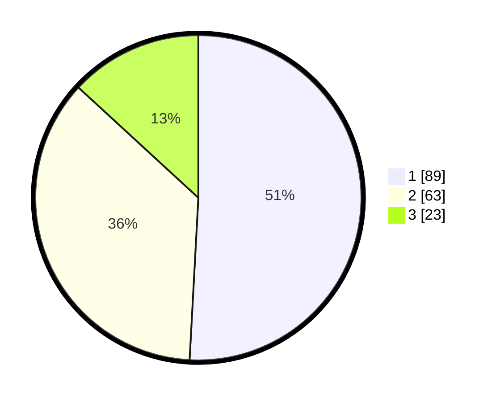

# Hasil

## Grafik

## Tabel

| No. | Nama Paslon    | Suara | Suara (raw) | Persentase |
|:--- |:-------------- | -----:| -----------:| ----------:|
| 1   | ANIES MUHAIMIN | 89    | [89][p-1]   | 50,86      |
| 2   | PRABOWO GIBRAN | 63    | [63][p-2]   | 36,00      |
| 3   | GANJAR MAHFUD  | 23    | [23][p-3]   | 13,14      |

[p-1]: https://github.com/gigit-pemilu/pemilu-2024-35-jawa-timur/blob/main/pilpres/hitung-suara/sub/35-jawa-timur/sub/29-sumenep/sub/13-pasongsongan/sub/2008-pasongsongan/sub/021-tps/sub/paslon-1.txt
[p-2]: https://github.com/gigit-pemilu/pemilu-2024-35-jawa-timur/blob/main/pilpres/hitung-suara/sub/35-jawa-timur/sub/29-sumenep/sub/13-pasongsongan/sub/2008-pasongsongan/sub/021-tps/sub/paslon-2.txt
[p-3]: https://github.com/gigit-pemilu/pemilu-2024-35-jawa-timur/blob/main/pilpres/hitung-suara/sub/35-jawa-timur/sub/29-sumenep/sub/13-pasongsongan/sub/2008-pasongsongan/sub/021-tps/sub/paslon-3.txt

## Foto C Plano

https://sirekap-obj-formc.kpu.go.id/4935/pemilu/ppwp/35/29/13/20/08/3529132008021-20240214-233052--a8764a44-dca9-4be1-8140-9c2327f54fc9.jpg

https://sirekap-obj-formc.kpu.go.id/4935/pemilu/ppwp/35/29/13/20/08/3529132008021-20240214-233128--9865bfb8-de21-441e-bc15-bcaf54a7eb19.jpg

https://sirekap-obj-formc.kpu.go.id/4935/pemilu/ppwp/35/29/13/20/08/3529132008021-20240214-233211--1264803a-3707-43e9-85ad-9d0d63a67301.jpg

## Metadata

| Key        | Value               |
| ---------- | ------------------- |
| Time Stamp | 2024-02-25 11:00:00 |

