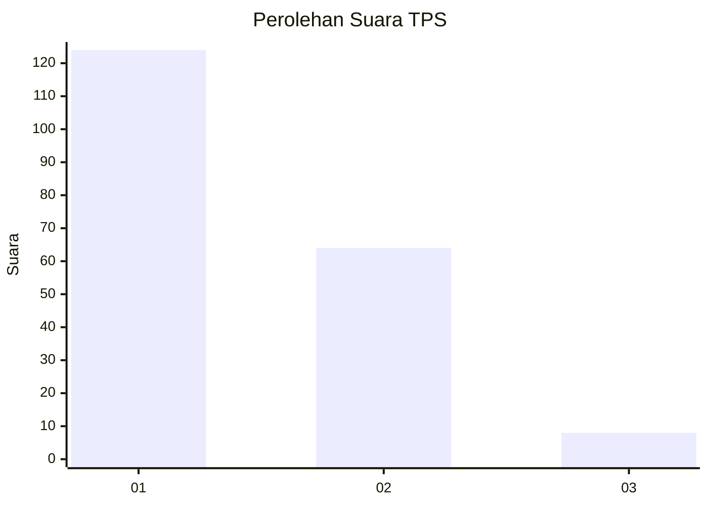
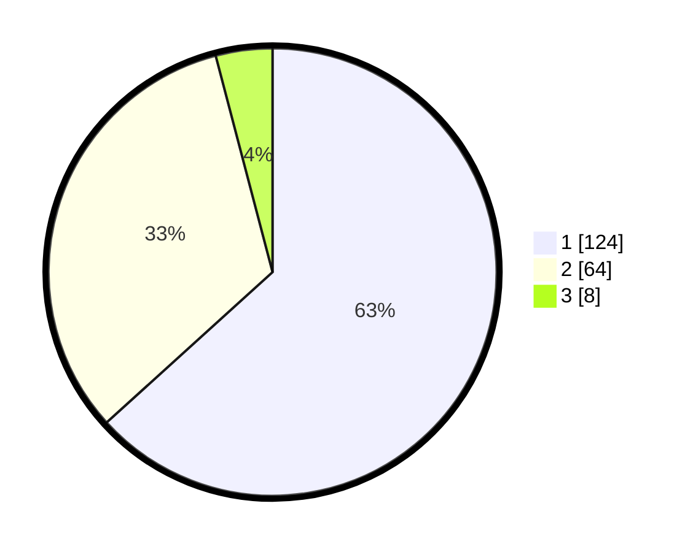

# Hasil

## Grafik

## Tabel

| No. | Nama Paslon    | Suara | Suara (raw) | Persentase |
|:--- |:-------------- | -----:| -----------:| ----------:|
| 1   | ANIES MUHAIMIN | 124   | [124][p-1]  | 63,27      |
| 2   | PRABOWO GIBRAN | 64    | [64][p-2]   | 32,65      |
| 3   | GANJAR MAHFUD  | 8     | [8][p-3]    | 4,08       |

[p-1]: https://github.com/gigit-pemilu/pemilu-2024-35-jawa-timur/blob/main/pilpres/hitung-suara/sub/35-jawa-timur/sub/29-sumenep/sub/13-pasongsongan/sub/2008-pasongsongan/sub/023-tps/sub/paslon-1.txt
[p-2]: https://github.com/gigit-pemilu/pemilu-2024-35-jawa-timur/blob/main/pilpres/hitung-suara/sub/35-jawa-timur/sub/29-sumenep/sub/13-pasongsongan/sub/2008-pasongsongan/sub/023-tps/sub/paslon-2.txt
[p-3]: https://github.com/gigit-pemilu/pemilu-2024-35-jawa-timur/blob/main/pilpres/hitung-suara/sub/35-jawa-timur/sub/29-sumenep/sub/13-pasongsongan/sub/2008-pasongsongan/sub/023-tps/sub/paslon-3.txt

## Foto C Plano

https://sirekap-obj-formc.kpu.go.id/a8b9/pemilu/ppwp/35/29/13/20/08/3529132008023-20240214-233016--69072856-98c6-44b5-a680-6d1f6e21af6d.jpg

https://sirekap-obj-formc.kpu.go.id/a8b9/pemilu/ppwp/35/29/13/20/08/3529132008023-20240214-232835--b649c87b-1f6a-4b00-8f56-f510311a7b7f.jpg

https://sirekap-obj-formc.kpu.go.id/a8b9/pemilu/ppwp/35/29/13/20/08/3529132008023-20240214-233133--b4228aa4-5095-4762-aced-01a508db1dc4.jpg

## Metadata

| Key        | Value               |
| ---------- | ------------------- |
| Time Stamp | 2024-02-16 16:25:10 |

