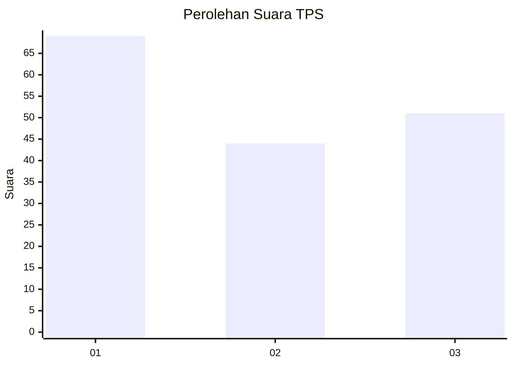
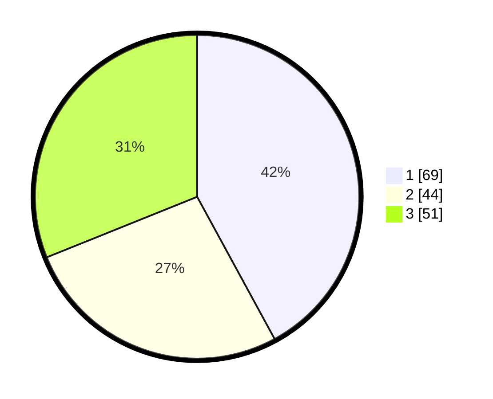

# Hasil

## Grafik

## Tabel

| No. | Nama Paslon    | Suara | Suara (raw) | Persentase |
|:--- |:-------------- | -----:| -----------:| ----------:|
| 1   | ANIES MUHAIMIN | 69    | [69][p-1]   | 42,07      |
| 2   | PRABOWO GIBRAN | 44    | [44][p-2]   | 26,83      |
| 3   | GANJAR MAHFUD  | 51    | [51][p-3]   | 31,10      |

[p-1]: https://github.com/gigit-pemilu/pemilu-2024/blob/main/pilpres/hitung-suara/sub/35-jawa-timur/sub/29-sumenep/sub/13-pasongsongan/sub/2010-panaongan/sub/008-tps/sub/paslon-1.txt
[p-2]: https://github.com/gigit-pemilu/pemilu-2024/blob/main/pilpres/hitung-suara/sub/35-jawa-timur/sub/29-sumenep/sub/13-pasongsongan/sub/2010-panaongan/sub/008-tps/sub/paslon-2.txt
[p-3]: https://github.com/gigit-pemilu/pemilu-2024/blob/main/pilpres/hitung-suara/sub/35-jawa-timur/sub/29-sumenep/sub/13-pasongsongan/sub/2010-panaongan/sub/008-tps/sub/paslon-3.txt

## Foto C Plano

https://sirekap-obj-formc.kpu.go.id/425f/pemilu/ppwp/35/29/13/20/10/3529132010008-20240215-135737--c0fb9e43-591f-4f25-8b3b-85843cb3f2a4.jpg

https://sirekap-obj-formc.kpu.go.id/425f/pemilu/ppwp/35/29/13/20/10/3529132010008-20240215-123042--9551853b-8519-4531-a126-0712f0783096.jpg

https://sirekap-obj-formc.kpu.go.id/425f/pemilu/ppwp/35/29/13/20/10/3529132010008-20240215-150528--d20ed5a9-1aa2-4c49-8394-07585d168f7a.jpg

## Metadata

| Key        | Value               |
| ---------- | ------------------- |
| Time Stamp | 2024-02-16 16:25:10 |

