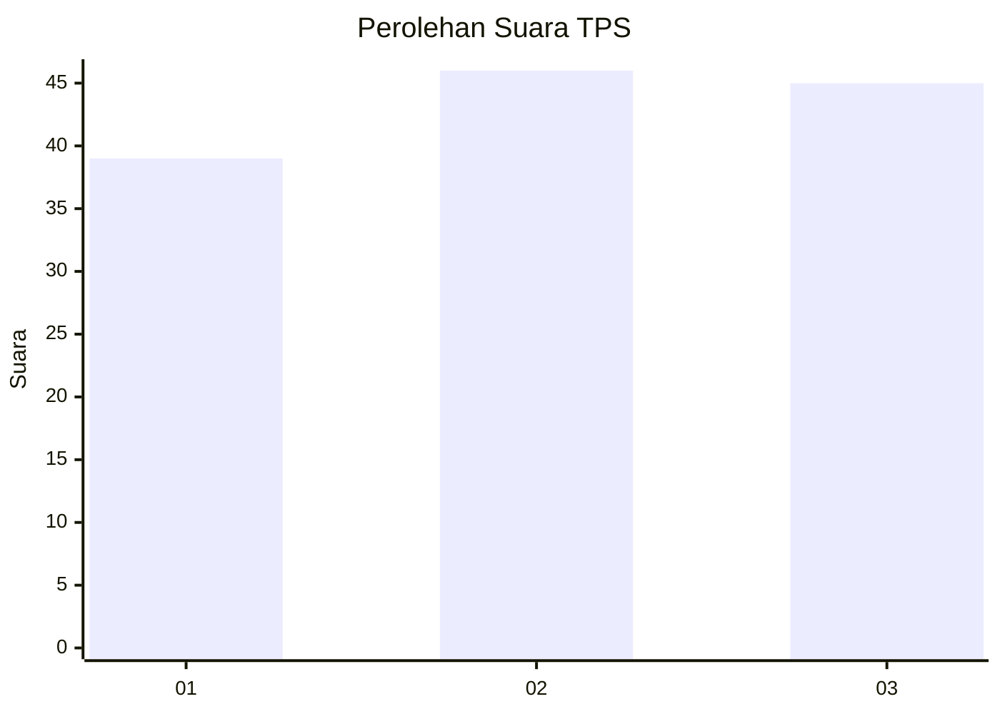
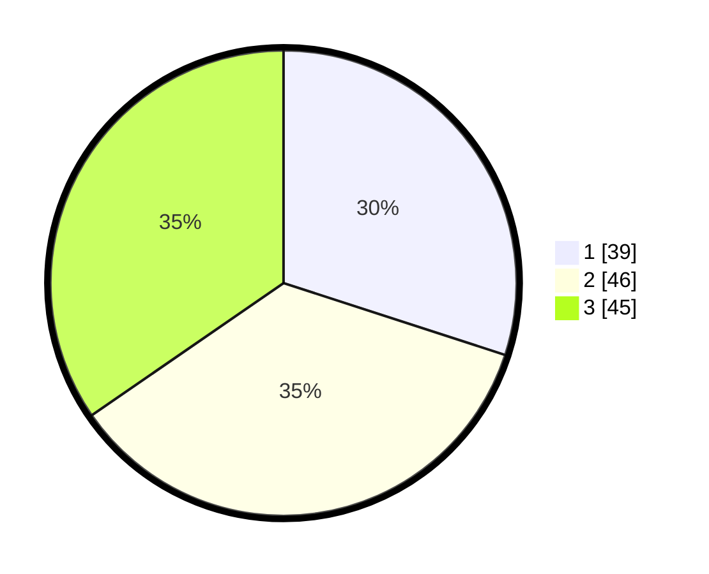

# Hasil

## Grafik

## Tabel

| No. | Nama Paslon    | Suara | Suara (raw) | Persentase |
|:--- |:-------------- | -----:| -----------:| ----------:|
| 1   | ANIES MUHAIMIN | 39    | [39][p-1]   | 30,00      |
| 2   | PRABOWO GIBRAN | 46    | [46][p-2]   | 35,38      |
| 3   | GANJAR MAHFUD  | 45    | [45][p-3]   | 34,62      |

[p-1]: https://github.com/gigit-pemilu/pemilu-2024/blob/main/pilpres/hitung-suara/sub/35-jawa-timur/sub/29-sumenep/sub/13-pasongsongan/sub/2010-panaongan/sub/009-tps/sub/paslon-1.txt
[p-2]: https://github.com/gigit-pemilu/pemilu-2024/blob/main/pilpres/hitung-suara/sub/35-jawa-timur/sub/29-sumenep/sub/13-pasongsongan/sub/2010-panaongan/sub/009-tps/sub/paslon-2.txt
[p-3]: https://github.com/gigit-pemilu/pemilu-2024/blob/main/pilpres/hitung-suara/sub/35-jawa-timur/sub/29-sumenep/sub/13-pasongsongan/sub/2010-panaongan/sub/009-tps/sub/paslon-3.txt

## Foto C Plano

https://sirekap-obj-formc.kpu.go.id/caa2/pemilu/ppwp/35/29/13/20/10/3529132010009-20240214-213013--3a5d175e-4b76-4852-9e24-7c8d8cd8244d.jpg

https://sirekap-obj-formc.kpu.go.id/caa2/pemilu/ppwp/35/29/13/20/10/3529132010009-20240214-184626--a6619fd5-a3b5-40e9-b668-be4f95c739e6.jpg

https://sirekap-obj-formc.kpu.go.id/caa2/pemilu/ppwp/35/29/13/20/10/3529132010009-20240214-224606--b85cf4fe-cdc0-44dd-a11b-ab87399c9fec.jpg

## Metadata

| Key        | Value               |
| ---------- | ------------------- |
| Time Stamp | 2024-02-25 18:00:00 |

