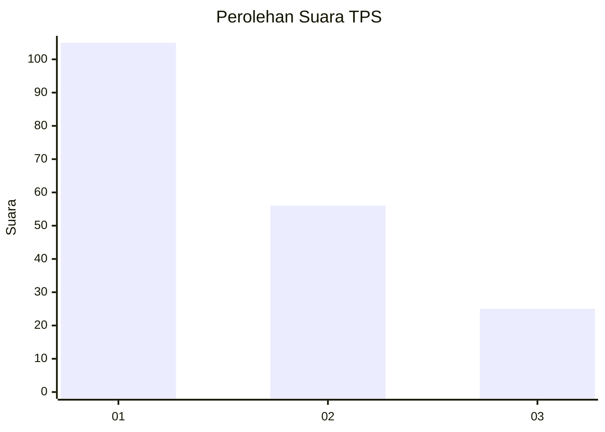
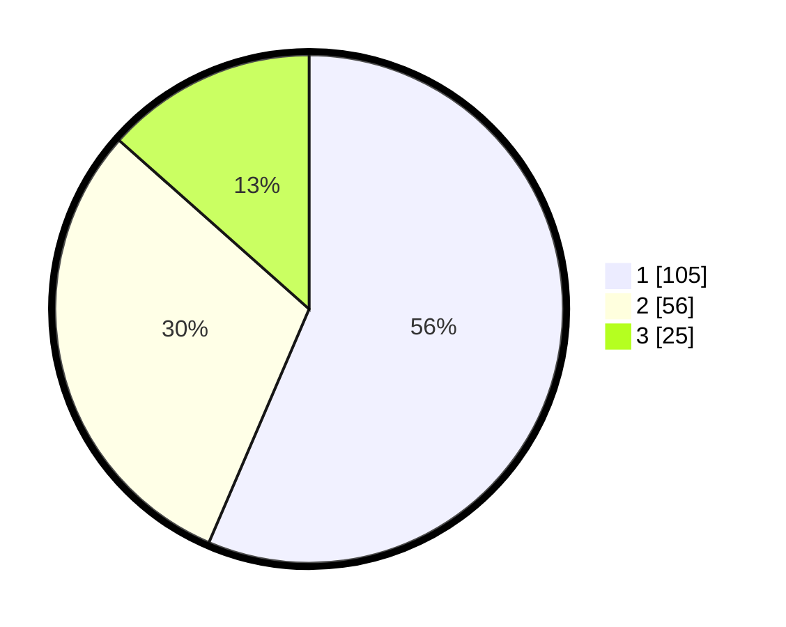

# Hasil

## Grafik

## Tabel

| No. | Nama Paslon    | Suara | Suara (raw) | Persentase |
|:--- |:-------------- | -----:| -----------:| ----------:|
| 1   | ANIES MUHAIMIN | 105   | [105][p-1]  | 56,45      |
| 2   | PRABOWO GIBRAN | 56    | [56][p-2]   | 30,11      |
| 3   | GANJAR MAHFUD  | 25    | [25][p-3]   | 13,44      |

[p-1]: https://github.com/gigit-pemilu/pemilu-2024/blob/main/pilpres/hitung-suara/sub/35-jawa-timur/sub/29-sumenep/sub/14-dasuk/sub/2004-batubellah-timur/sub/003-tps/sub/paslon-1.txt
[p-2]: https://github.com/gigit-pemilu/pemilu-2024/blob/main/pilpres/hitung-suara/sub/35-jawa-timur/sub/29-sumenep/sub/14-dasuk/sub/2004-batubellah-timur/sub/003-tps/sub/paslon-2.txt
[p-3]: https://github.com/gigit-pemilu/pemilu-2024/blob/main/pilpres/hitung-suara/sub/35-jawa-timur/sub/29-sumenep/sub/14-dasuk/sub/2004-batubellah-timur/sub/003-tps/sub/paslon-3.txt

## Foto C Plano

https://sirekap-obj-formc.kpu.go.id/50ca/pemilu/ppwp/35/29/14/20/04/3529142004003-20240214-232155--13f7c155-8552-44a3-8703-48b544b53484.jpg

https://sirekap-obj-formc.kpu.go.id/50ca/pemilu/ppwp/35/29/14/20/04/3529142004003-20240214-232251--4a76c7f6-d47d-48b5-a2f8-4f2c85d17202.jpg

https://sirekap-obj-formc.kpu.go.id/50ca/pemilu/ppwp/35/29/14/20/04/3529142004003-20240214-221103--2e6ada81-bd94-4df4-ac9a-613138ff500e.jpg

## Metadata

| Key        | Value               |
| ---------- | ------------------- |
| Time Stamp | 2024-02-17 14:45:18 |

