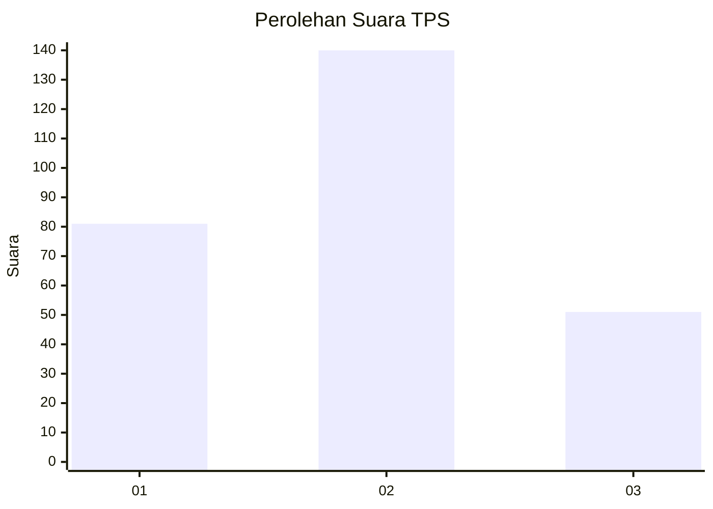
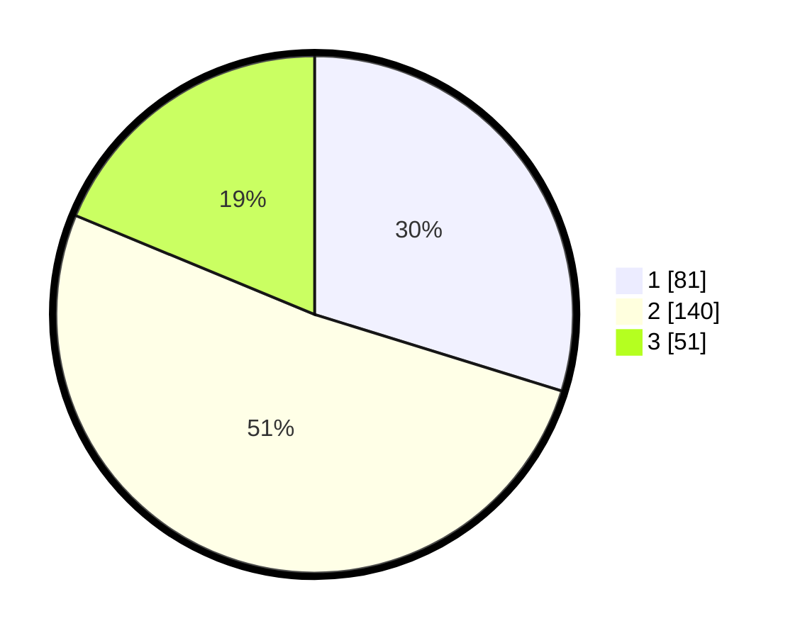

# Hasil

## Grafik

## Tabel

| No. | Nama Paslon    | Suara | Suara (raw) | Persentase |
|:--- |:-------------- | -----:| -----------:| ----------:|
| 1   | ANIES MUHAIMIN | 81    | [81][p-1]   | 29,78      |
| 2   | PRABOWO GIBRAN | 140   | [140][p-2]  | 51,47      |
| 3   | GANJAR MAHFUD  | 51    | [51][p-3]   | 18,75      |

[p-1]: https://github.com/gigit-pemilu/pemilu-2024-35-jawa-timur/blob/main/pilpres/hitung-suara/sub/35-jawa-timur/sub/29-sumenep/sub/14-dasuk/sub/2007-bringin/sub/006-tps/sub/paslon-1.txt
[p-2]: https://github.com/gigit-pemilu/pemilu-2024-35-jawa-timur/blob/main/pilpres/hitung-suara/sub/35-jawa-timur/sub/29-sumenep/sub/14-dasuk/sub/2007-bringin/sub/006-tps/sub/paslon-2.txt
[p-3]: https://github.com/gigit-pemilu/pemilu-2024-35-jawa-timur/blob/main/pilpres/hitung-suara/sub/35-jawa-timur/sub/29-sumenep/sub/14-dasuk/sub/2007-bringin/sub/006-tps/sub/paslon-3.txt

## Foto C Plano

https://sirekap-obj-formc.kpu.go.id/2fbe/pemilu/ppwp/35/29/14/20/07/3529142007006-20240214-214323--4403ad4b-e06f-4b9c-8038-d0910e21e038.jpg

https://sirekap-obj-formc.kpu.go.id/2fbe/pemilu/ppwp/35/29/14/20/07/3529142007006-20240214-214543--d3890f70-8e6e-4e5d-81c0-a8a02e4afb24.jpg

https://sirekap-obj-formc.kpu.go.id/2fbe/pemilu/ppwp/35/29/14/20/07/3529142007006-20240214-214738--62011e15-a836-4cb7-a226-2a7a2b160640.jpg

## Metadata

| Key        | Value               |
| ---------- | ------------------- |
| Time Stamp | 2024-02-16 16:25:10 |

