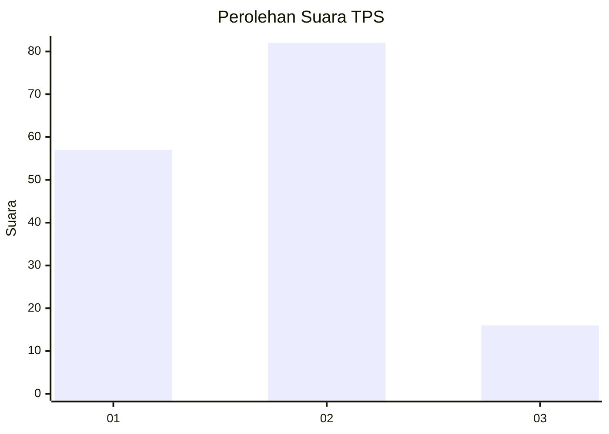
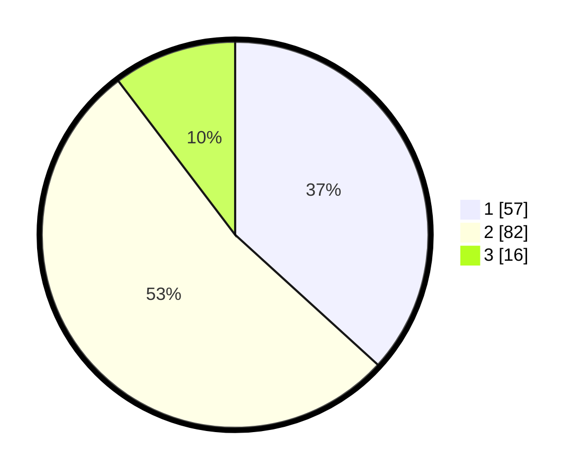

# Hasil

## Grafik

## Tabel

| No. | Nama Paslon    | Suara | Suara (raw) | Persentase |
|:--- |:-------------- | -----:| -----------:| ----------:|
| 1   | ANIES MUHAIMIN | 57    | [57][p-1]   | 36,77      |
| 2   | PRABOWO GIBRAN | 82    | [82][p-2]   | 52,90      |
| 3   | GANJAR MAHFUD  | 16    | [16][p-3]   | 10,32      |

[p-1]: https://github.com/gigit-pemilu/pemilu-2024/blob/main/pilpres/hitung-suara/sub/35-jawa-timur/sub/29-sumenep/sub/14-dasuk/sub/2008-jelbudan/sub/003-tps/sub/paslon-1.txt
[p-2]: https://github.com/gigit-pemilu/pemilu-2024/blob/main/pilpres/hitung-suara/sub/35-jawa-timur/sub/29-sumenep/sub/14-dasuk/sub/2008-jelbudan/sub/003-tps/sub/paslon-2.txt
[p-3]: https://github.com/gigit-pemilu/pemilu-2024/blob/main/pilpres/hitung-suara/sub/35-jawa-timur/sub/29-sumenep/sub/14-dasuk/sub/2008-jelbudan/sub/003-tps/sub/paslon-3.txt

## Foto C Plano

https://sirekap-obj-formc.kpu.go.id/b498/pemilu/ppwp/35/29/14/20/08/3529142008003-20240214-215856--2d9ab511-c37a-4514-aa4c-040dd88e3c9b.jpg

https://sirekap-obj-formc.kpu.go.id/b498/pemilu/ppwp/35/29/14/20/08/3529142008003-20240214-193614--4bcf9d87-52bd-4597-8e19-c54c8cd8fa5f.jpg

https://sirekap-obj-formc.kpu.go.id/b498/pemilu/ppwp/35/29/14/20/08/3529142008003-20240214-205742--5e3ca479-9927-424b-b76f-b577c3e93028.jpg

## Metadata

| Key        | Value               |
| ---------- | ------------------- |
| Time Stamp | 2024-02-17 16:52:47 |

