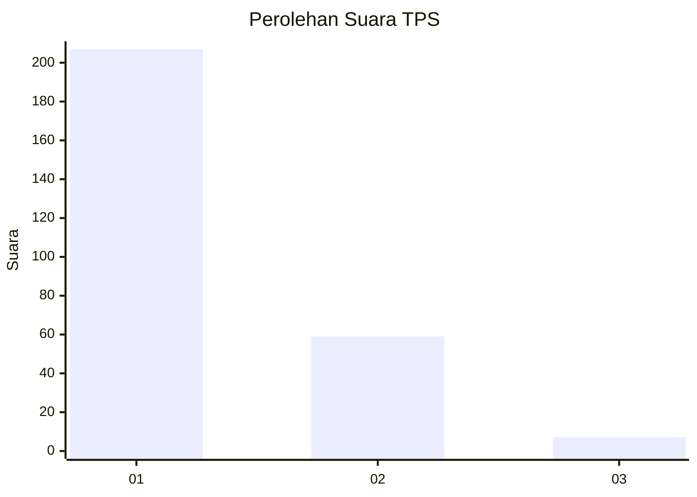
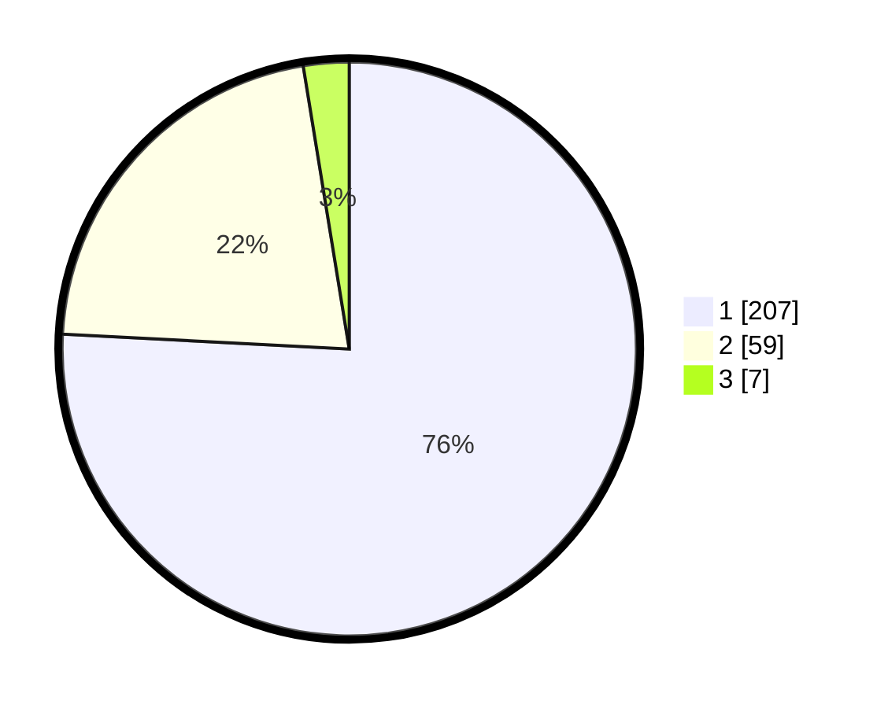

# Hasil

## Grafik

## Tabel

| No. | Nama Paslon    | Suara | Suara (raw) | Persentase |
|:--- |:-------------- | -----:| -----------:| ----------:|
| 1   | ANIES MUHAIMIN | 207   | [207][p-1]  | 75,82      |
| 2   | PRABOWO GIBRAN | 59    | [59][p-2]   | 21,61      |
| 3   | GANJAR MAHFUD  | 7     | [7][p-3]    | 2,56       |

[p-1]: https://github.com/gigit-pemilu/pemilu-2024/blob/main/pilpres/hitung-suara/sub/35-jawa-timur/sub/29-sumenep/sub/15-rubaru/sub/2002-pakondang/sub/008-tps/sub/paslon-1.txt
[p-2]: https://github.com/gigit-pemilu/pemilu-2024/blob/main/pilpres/hitung-suara/sub/35-jawa-timur/sub/29-sumenep/sub/15-rubaru/sub/2002-pakondang/sub/008-tps/sub/paslon-2.txt
[p-3]: https://github.com/gigit-pemilu/pemilu-2024/blob/main/pilpres/hitung-suara/sub/35-jawa-timur/sub/29-sumenep/sub/15-rubaru/sub/2002-pakondang/sub/008-tps/sub/paslon-3.txt

## Foto C Plano

https://sirekap-obj-formc.kpu.go.id/ab89/pemilu/ppwp/35/29/15/20/02/3529152002008-20240214-211808--0bf1ef4c-a49b-48e2-a0f3-5799e23362be.jpg

https://sirekap-obj-formc.kpu.go.id/ab89/pemilu/ppwp/35/29/15/20/02/3529152002008-20240214-212512--efca08c9-5f7e-4de7-a9ec-33d8932969f5.jpg

https://sirekap-obj-formc.kpu.go.id/ab89/pemilu/ppwp/35/29/15/20/02/3529152002008-20240214-212714--b4c19ef6-cf8d-45e8-8a99-a27413dd2365.jpg

## Metadata

| Key        | Value               |
| ---------- | ------------------- |
| Time Stamp | 2024-02-25 00:00:00 |

