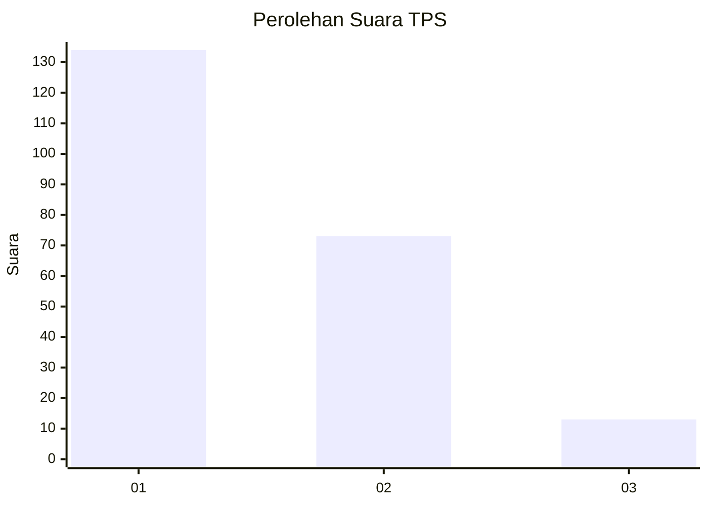
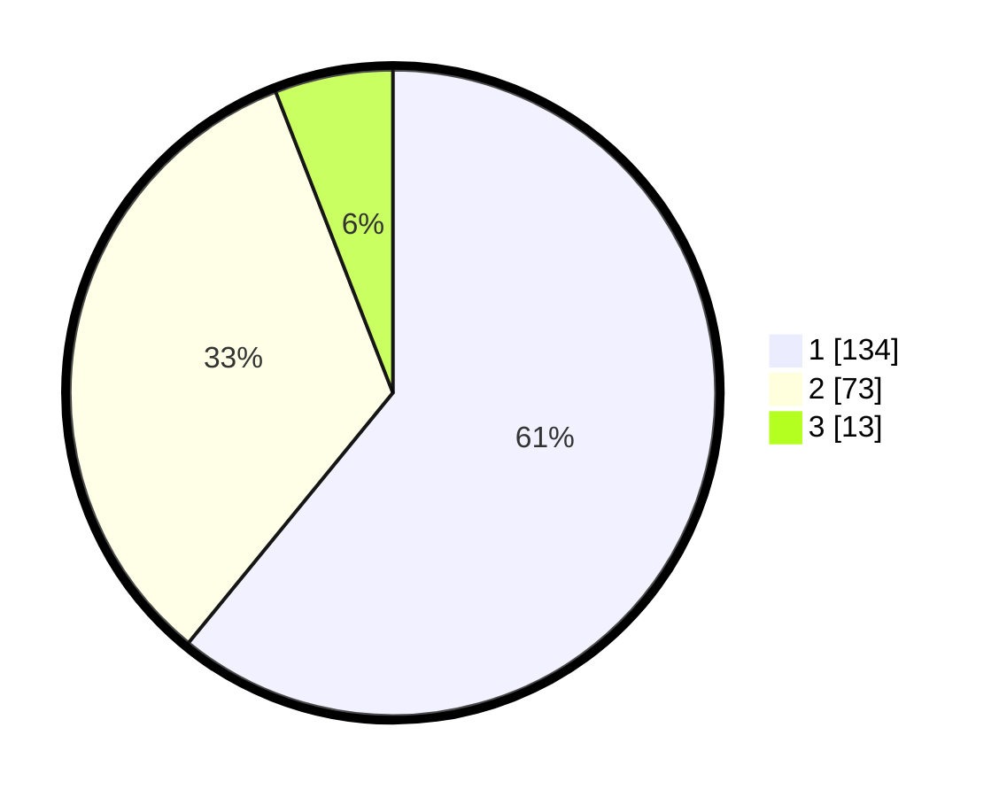

# Hasil

## Grafik

## Tabel

| No. | Nama Paslon    | Suara | Suara (raw) | Persentase |
|:--- |:-------------- | -----:| -----------:| ----------:|
| 1   | ANIES MUHAIMIN | 134   | [134][p-1]  | 60,91      |
| 2   | PRABOWO GIBRAN | 73    | [73][p-2]   | 33,18      |
| 3   | GANJAR MAHFUD  | 13    | [13][p-3]   | 5,91       |

[p-1]: https://github.com/gigit-pemilu/pemilu-2024-35-jawa-timur/blob/main/pilpres/hitung-suara/sub/35-jawa-timur/sub/29-sumenep/sub/15-rubaru/sub/2003-matanair/sub/004-tps/sub/paslon-1.txt
[p-2]: https://github.com/gigit-pemilu/pemilu-2024-35-jawa-timur/blob/main/pilpres/hitung-suara/sub/35-jawa-timur/sub/29-sumenep/sub/15-rubaru/sub/2003-matanair/sub/004-tps/sub/paslon-2.txt
[p-3]: https://github.com/gigit-pemilu/pemilu-2024-35-jawa-timur/blob/main/pilpres/hitung-suara/sub/35-jawa-timur/sub/29-sumenep/sub/15-rubaru/sub/2003-matanair/sub/004-tps/sub/paslon-3.txt

## Foto C Plano

https://sirekap-obj-formc.kpu.go.id/da3e/pemilu/ppwp/35/29/15/20/03/3529152003004-20240215-100235--54278a69-8395-4312-93c7-6f64a958849a.jpg

https://sirekap-obj-formc.kpu.go.id/da3e/pemilu/ppwp/35/29/15/20/03/3529152003004-20240215-110054--d32f8ab6-5301-4caf-ab69-958ce8eae97a.jpg

https://sirekap-obj-formc.kpu.go.id/da3e/pemilu/ppwp/35/29/15/20/03/3529152003004-20240215-110313--ad0a57e2-d51b-4f0d-ac48-f47912a8764e.jpg

## Metadata

| Key        | Value               |
| ---------- | ------------------- |
| Time Stamp | 2024-02-16 16:25:10 |

