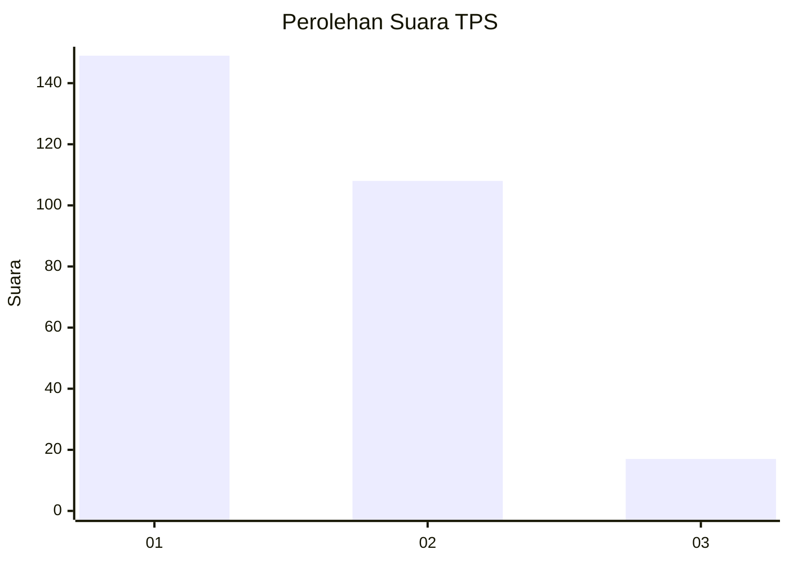
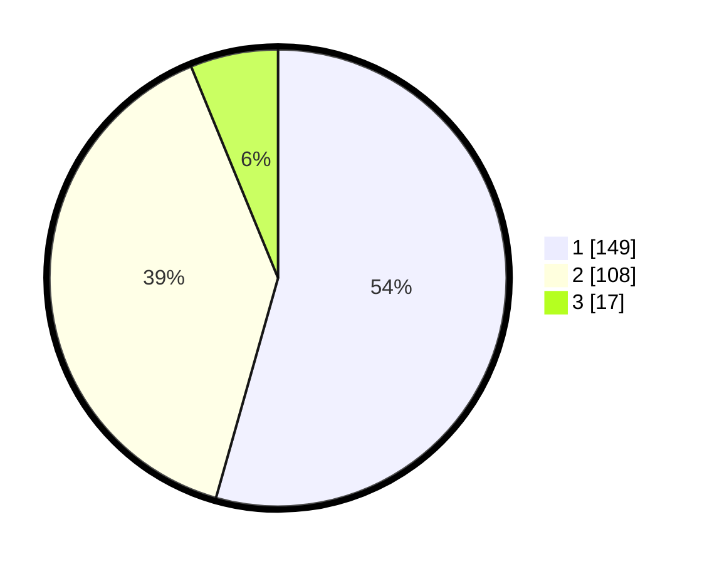

# Hasil

## Grafik

## Tabel

| No. | Nama Paslon    | Suara | Suara (raw) | Persentase |
|:--- |:-------------- | -----:| -----------:| ----------:|
| 1   | ANIES MUHAIMIN | 149   | [149][p-1]  | 54,38      |
| 2   | PRABOWO GIBRAN | 108   | [108][p-2]  | 39,42      |
| 3   | GANJAR MAHFUD  | 17    | [17][p-3]   | 6,20       |

[p-1]: https://github.com/gigit-pemilu/pemilu-2024-35-jawa-timur/blob/main/pilpres/hitung-suara/sub/35-jawa-timur/sub/29-sumenep/sub/15-rubaru/sub/2006-bunbarat/sub/005-tps/sub/paslon-1.txt
[p-2]: https://github.com/gigit-pemilu/pemilu-2024-35-jawa-timur/blob/main/pilpres/hitung-suara/sub/35-jawa-timur/sub/29-sumenep/sub/15-rubaru/sub/2006-bunbarat/sub/005-tps/sub/paslon-2.txt
[p-3]: https://github.com/gigit-pemilu/pemilu-2024-35-jawa-timur/blob/main/pilpres/hitung-suara/sub/35-jawa-timur/sub/29-sumenep/sub/15-rubaru/sub/2006-bunbarat/sub/005-tps/sub/paslon-3.txt

## Foto C Plano

https://sirekap-obj-formc.kpu.go.id/d1a6/pemilu/ppwp/35/29/15/20/06/3529152006005-20240215-093338--c6525342-fd8b-42bb-80b7-8621050238cf.jpg

https://sirekap-obj-formc.kpu.go.id/d1a6/pemilu/ppwp/35/29/15/20/06/3529152006005-20240215-002602--8100dbf5-cbf3-4bbe-a619-c02f96e9f05b.jpg

https://sirekap-obj-formc.kpu.go.id/d1a6/pemilu/ppwp/35/29/15/20/06/3529152006005-20240215-002704--30c9efbe-e50c-41bd-8705-de7170d4e218.jpg

## Metadata

| Key        | Value               |
| ---------- | ------------------- |
| Time Stamp | 2024-02-16 16:25:10 |

