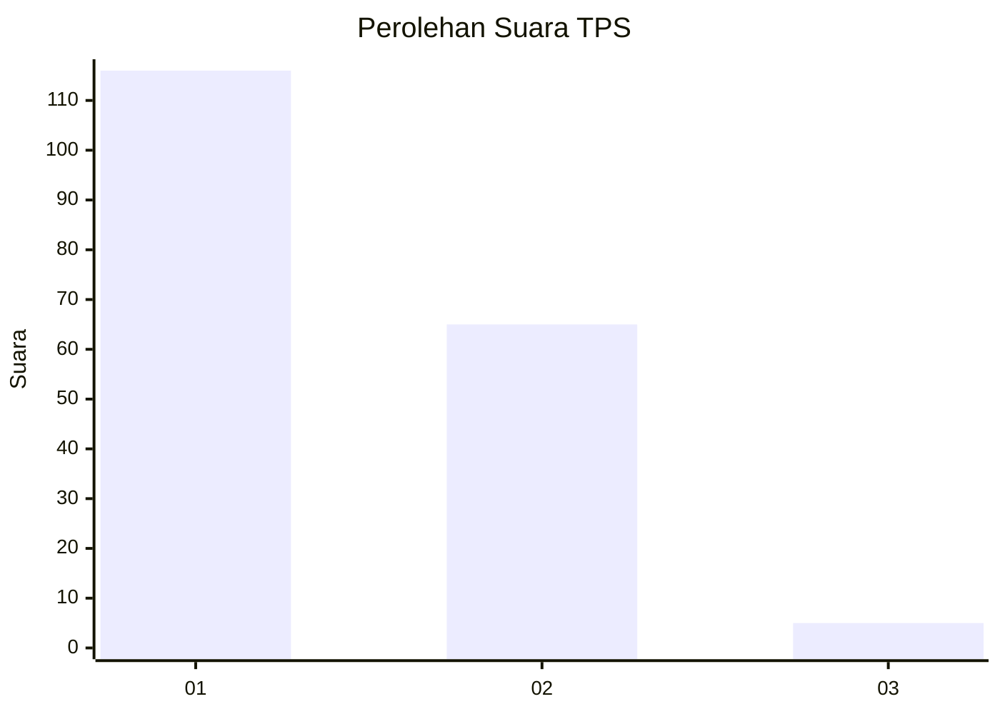
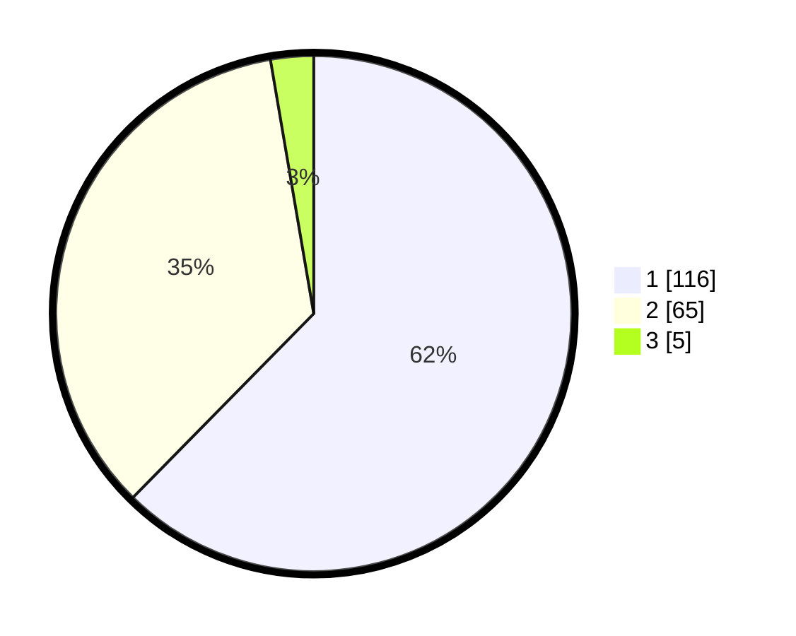

# Hasil

## Grafik

## Tabel

| No. | Nama Paslon    | Suara | Suara (raw) | Persentase |
|:--- |:-------------- | -----:| -----------:| ----------:|
| 1   | ANIES MUHAIMIN | 116   | [116][p-1]  | 62,37      |
| 2   | PRABOWO GIBRAN | 65    | [65][p-2]   | 34,95      |
| 3   | GANJAR MAHFUD  | 5     | [5][p-3]    | 2,69       |

[p-1]: https://github.com/gigit-pemilu/pemilu-2024/blob/main/pilpres/hitung-suara/sub/35-jawa-timur/sub/29-sumenep/sub/15-rubaru/sub/2008-basoka/sub/009-tps/sub/paslon-1.txt
[p-2]: https://github.com/gigit-pemilu/pemilu-2024/blob/main/pilpres/hitung-suara/sub/35-jawa-timur/sub/29-sumenep/sub/15-rubaru/sub/2008-basoka/sub/009-tps/sub/paslon-2.txt
[p-3]: https://github.com/gigit-pemilu/pemilu-2024/blob/main/pilpres/hitung-suara/sub/35-jawa-timur/sub/29-sumenep/sub/15-rubaru/sub/2008-basoka/sub/009-tps/sub/paslon-3.txt

## Foto C Plano

https://sirekap-obj-formc.kpu.go.id/916b/pemilu/ppwp/35/29/15/20/08/3529152008009-20240215-091500--0beaea5d-4d6a-4e6c-b5d1-f32efc5ed674.jpg

https://sirekap-obj-formc.kpu.go.id/916b/pemilu/ppwp/35/29/15/20/08/3529152008009-20240215-002856--336dc034-bdb6-484a-baa2-f5602ec63df1.jpg

https://sirekap-obj-formc.kpu.go.id/916b/pemilu/ppwp/35/29/15/20/08/3529152008009-20240215-091510--7db45fd7-d19a-494a-b829-9909723e0f92.jpg

## Metadata

| Key        | Value               |
| ---------- | ------------------- |
| Time Stamp | 2024-02-24 22:31:28 |

