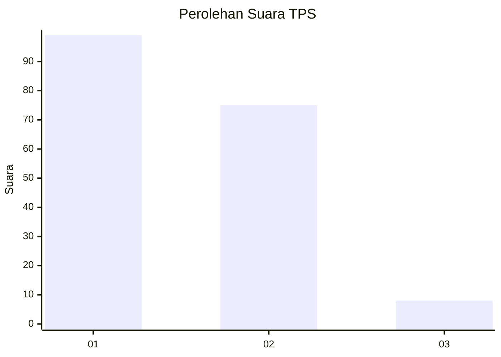
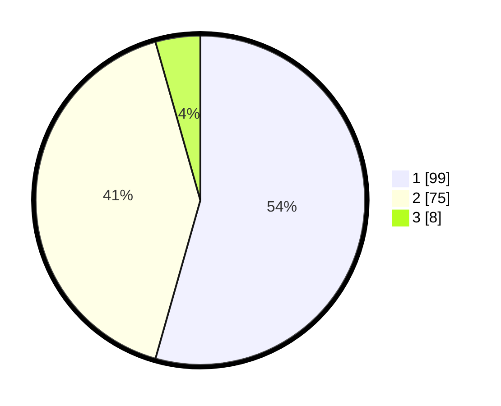

# Hasil

## Grafik

## Tabel

| No. | Nama Paslon    | Suara | Suara (raw) | Persentase |
|:--- |:-------------- | -----:| -----------:| ----------:|
| 1   | ANIES MUHAIMIN | 99    | [99][p-1]   | 54,40      |
| 2   | PRABOWO GIBRAN | 75    | [75][p-2]   | 41,21      |
| 3   | GANJAR MAHFUD  | 8     | [8][p-3]    | 4,40       |

[p-1]: https://github.com/gigit-pemilu/pemilu-2024/blob/main/pilpres/hitung-suara/sub/35-jawa-timur/sub/29-sumenep/sub/15-rubaru/sub/2008-basoka/sub/012-tps/sub/paslon-1.txt
[p-2]: https://github.com/gigit-pemilu/pemilu-2024/blob/main/pilpres/hitung-suara/sub/35-jawa-timur/sub/29-sumenep/sub/15-rubaru/sub/2008-basoka/sub/012-tps/sub/paslon-2.txt
[p-3]: https://github.com/gigit-pemilu/pemilu-2024/blob/main/pilpres/hitung-suara/sub/35-jawa-timur/sub/29-sumenep/sub/15-rubaru/sub/2008-basoka/sub/012-tps/sub/paslon-3.txt

## Foto C Plano

https://sirekap-obj-formc.kpu.go.id/0d6d/pemilu/ppwp/35/29/15/20/08/3529152008012-20240215-082556--0a4c7a7a-65bf-4dff-9f89-33d93e3b39b2.jpg

https://sirekap-obj-formc.kpu.go.id/0d6d/pemilu/ppwp/35/29/15/20/08/3529152008012-20240215-083030--d6eb2ea7-de9e-478c-ba18-73c5feb7e869.jpg

## Metadata

| Key        | Value               |
| ---------- | ------------------- |
| Time Stamp | 2024-02-17 18:30:00 |

