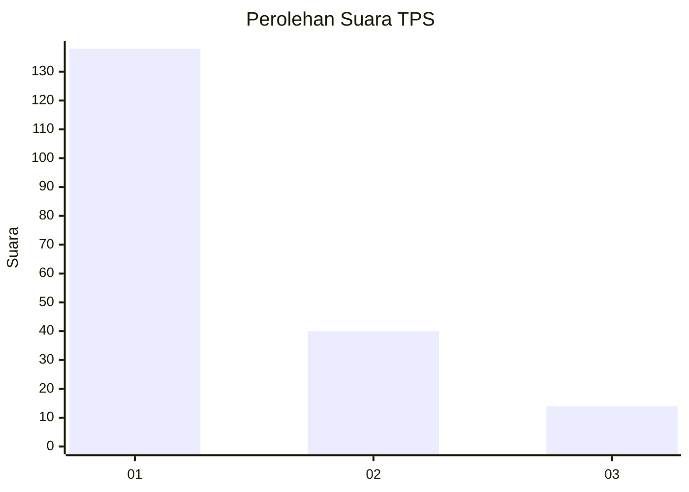
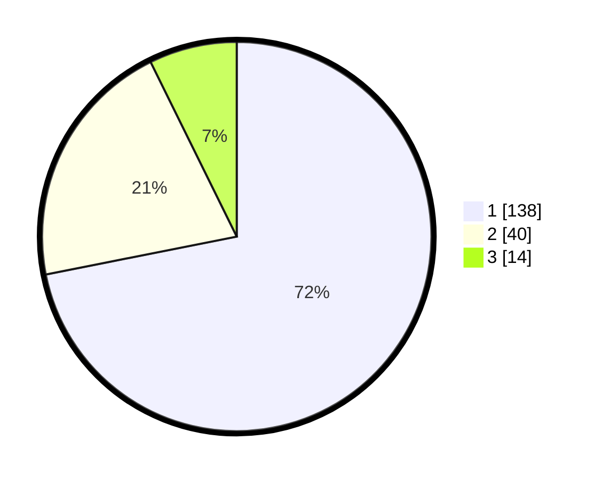

# Hasil

## Grafik

## Tabel

| No. | Nama Paslon    | Suara | Suara (raw) | Persentase |
|:--- |:-------------- | -----:| -----------:| ----------:|
| 1   | ANIES MUHAIMIN | 138   | [138][p-1]  | 71,88      |
| 2   | PRABOWO GIBRAN | 40    | [40][p-2]   | 20,83      |
| 3   | GANJAR MAHFUD  | 14    | [14][p-3]   | 7,29       |

[p-1]: https://github.com/gigit-pemilu/pemilu-2024/blob/main/pilpres/hitung-suara/sub/35-jawa-timur/sub/29-sumenep/sub/15-rubaru/sub/2009-duko/sub/003-tps/sub/paslon-1.txt
[p-2]: https://github.com/gigit-pemilu/pemilu-2024/blob/main/pilpres/hitung-suara/sub/35-jawa-timur/sub/29-sumenep/sub/15-rubaru/sub/2009-duko/sub/003-tps/sub/paslon-2.txt
[p-3]: https://github.com/gigit-pemilu/pemilu-2024/blob/main/pilpres/hitung-suara/sub/35-jawa-timur/sub/29-sumenep/sub/15-rubaru/sub/2009-duko/sub/003-tps/sub/paslon-3.txt

## Foto C Plano

https://sirekap-obj-formc.kpu.go.id/e560/pemilu/ppwp/35/29/15/20/09/3529152009003-20240214-224821--2f450a81-4134-42dd-99bf-2734f85f983e.jpg

https://sirekap-obj-formc.kpu.go.id/e560/pemilu/ppwp/35/29/15/20/09/3529152009003-20240214-224547--4237426e-d54b-43df-8482-1fb86ef8aa5a.jpg

https://sirekap-obj-formc.kpu.go.id/e560/pemilu/ppwp/35/29/15/20/09/3529152009003-20240214-224611--9d127ec4-c7c4-4442-9e01-94300a7e8a39.jpg

## Metadata

| Key        | Value               |
| ---------- | ------------------- |
| Time Stamp | 2024-02-15 21:01:18 |

