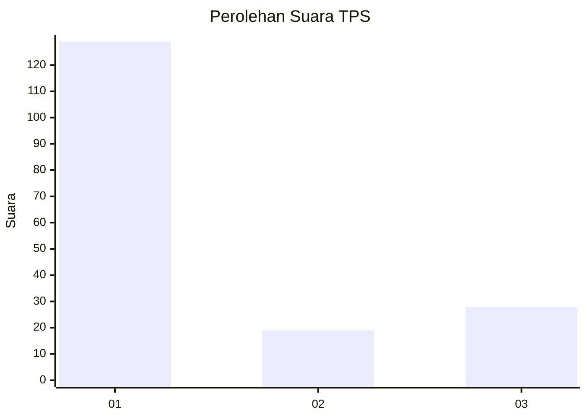
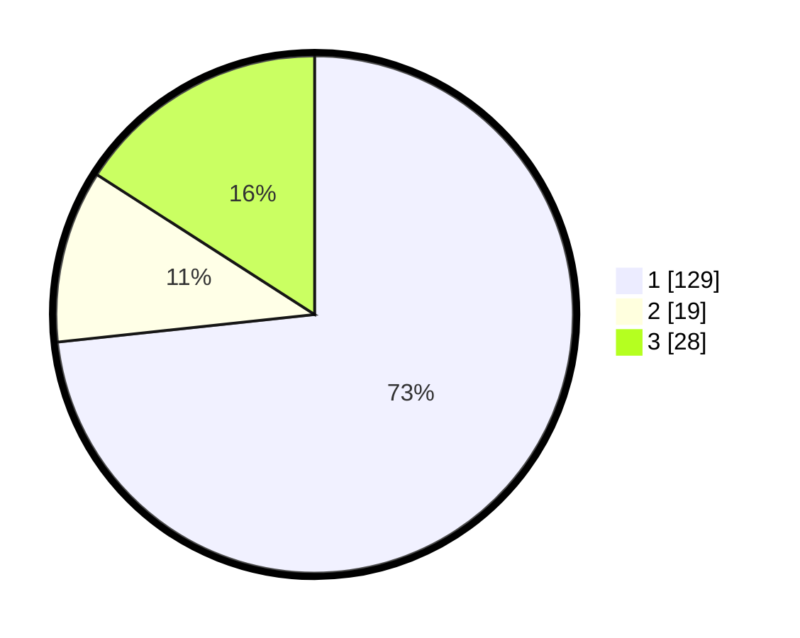

# Hasil

## Grafik

## Tabel

| No. | Nama Paslon    | Suara | Suara (raw) | Persentase |
|:--- |:-------------- | -----:| -----------:| ----------:|
| 1   | ANIES MUHAIMIN | 129   | [129][p-1]  | 73,30      |
| 2   | PRABOWO GIBRAN | 19    | [19][p-2]   | 10,80      |
| 3   | GANJAR MAHFUD  | 28    | [28][p-3]   | 15,91      |

[p-1]: https://github.com/gigit-pemilu/pemilu-2024/blob/main/pilpres/hitung-suara/sub/35-jawa-timur/sub/29-sumenep/sub/15-rubaru/sub/2011-kalebengan/sub/006-tps/sub/paslon-1.txt
[p-2]: https://github.com/gigit-pemilu/pemilu-2024/blob/main/pilpres/hitung-suara/sub/35-jawa-timur/sub/29-sumenep/sub/15-rubaru/sub/2011-kalebengan/sub/006-tps/sub/paslon-2.txt
[p-3]: https://github.com/gigit-pemilu/pemilu-2024/blob/main/pilpres/hitung-suara/sub/35-jawa-timur/sub/29-sumenep/sub/15-rubaru/sub/2011-kalebengan/sub/006-tps/sub/paslon-3.txt

## Foto C Plano

https://sirekap-obj-formc.kpu.go.id/f81f/pemilu/ppwp/35/29/15/20/11/3529152011006-20240215-013313--cafb7289-6cf7-4b0f-83fc-36ee3558e3f4.jpg

https://sirekap-obj-formc.kpu.go.id/f81f/pemilu/ppwp/35/29/15/20/11/3529152011006-20240215-013355--5ceb8750-8a81-4ec6-8ccd-ed69ad8fdf08.jpg

https://sirekap-obj-formc.kpu.go.id/f81f/pemilu/ppwp/35/29/15/20/11/3529152011006-20240215-013435--339d0553-b49b-4241-82ea-08da11e7b372.jpg

## Metadata

| Key        | Value               |
| ---------- | ------------------- |
| Time Stamp | 2024-02-24 22:31:28 |

