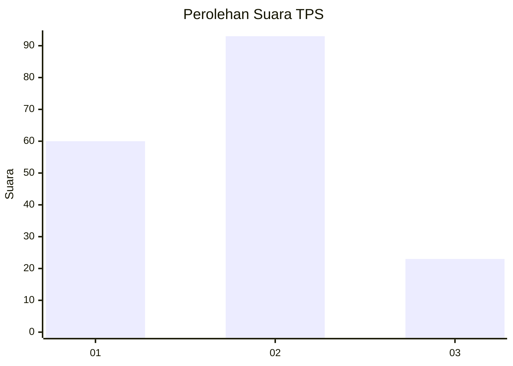
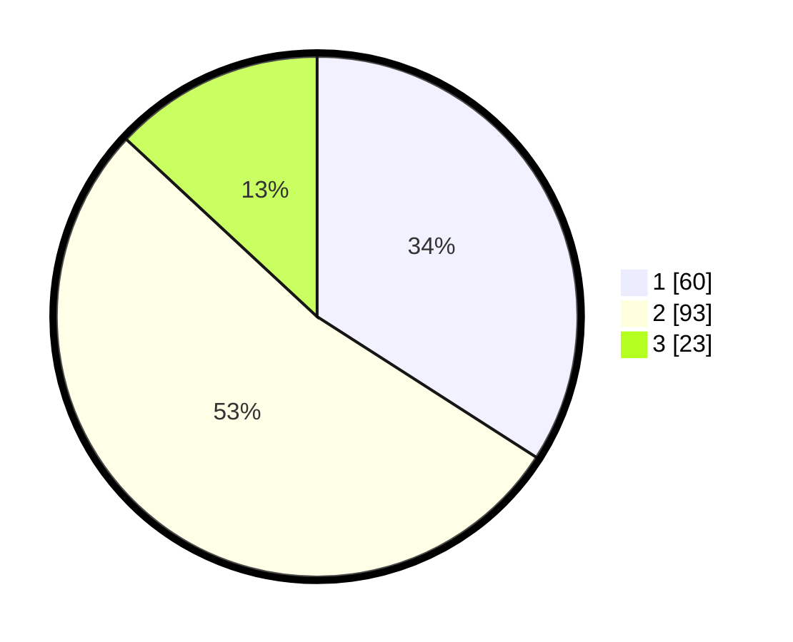

# Hasil

## Grafik

## Tabel

| No. | Nama Paslon    | Suara | Suara (raw) | Persentase |
|:--- |:-------------- | -----:| -----------:| ----------:|
| 1   | ANIES MUHAIMIN | 60    | [60][p-1]   | 34,09      |
| 2   | PRABOWO GIBRAN | 93    | [93][p-2]   | 52,84      |
| 3   | GANJAR MAHFUD  | 23    | [23][p-3]   | 13,07      |

[p-1]: https://github.com/gigit-pemilu/pemilu-2024/blob/main/pilpres/hitung-suara/sub/35-jawa-timur/sub/29-sumenep/sub/16-batang-batang/sub/2001-kolpo/sub/004-tps/sub/paslon-1.txt
[p-2]: https://github.com/gigit-pemilu/pemilu-2024/blob/main/pilpres/hitung-suara/sub/35-jawa-timur/sub/29-sumenep/sub/16-batang-batang/sub/2001-kolpo/sub/004-tps/sub/paslon-2.txt
[p-3]: https://github.com/gigit-pemilu/pemilu-2024/blob/main/pilpres/hitung-suara/sub/35-jawa-timur/sub/29-sumenep/sub/16-batang-batang/sub/2001-kolpo/sub/004-tps/sub/paslon-3.txt

## Foto C Plano

https://sirekap-obj-formc.kpu.go.id/22fe/pemilu/ppwp/35/29/16/20/01/3529162001004-20240222-112609--3515f4d3-6224-406d-9c6f-613933958c3d.jpg

https://sirekap-obj-formc.kpu.go.id/22fe/pemilu/ppwp/35/29/16/20/01/3529162001004-20240222-112731--215db4e6-80c0-4953-abbf-a0c846da06f1.jpg

https://sirekap-obj-formc.kpu.go.id/22fe/pemilu/ppwp/35/29/16/20/01/3529162001004-20240222-112832--859b4623-958c-49f4-b281-76850304dec0.jpg

## Metadata

| Key        | Value               |
| ---------- | ------------------- |
| Time Stamp | 2024-02-24 22:31:28 |

