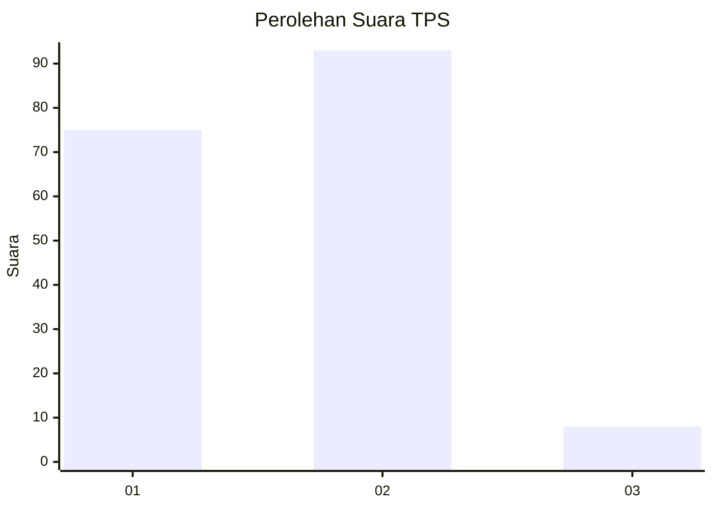
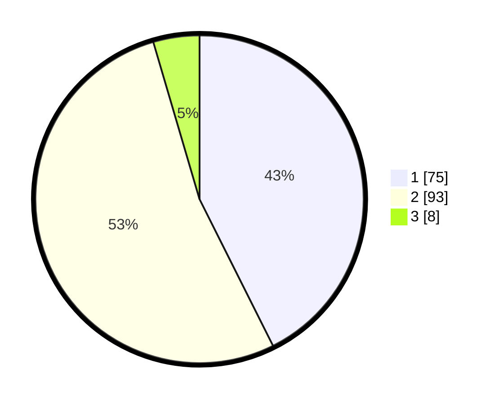

# Hasil

## Grafik

## Tabel

| No. | Nama Paslon    | Suara | Suara (raw) | Persentase |
|:--- |:-------------- | -----:| -----------:| ----------:|
| 1   | ANIES MUHAIMIN | 75    | [75][p-1]   | 42,61      |
| 2   | PRABOWO GIBRAN | 93    | [93][p-2]   | 52,84      |
| 3   | GANJAR MAHFUD  | 8     | [8][p-3]    | 4,55       |

[p-1]: https://github.com/gigit-pemilu/pemilu-2024/blob/main/pilpres/hitung-suara/sub/35-jawa-timur/sub/29-sumenep/sub/16-batang-batang/sub/2001-kolpo/sub/007-tps/sub/paslon-1.txt
[p-2]: https://github.com/gigit-pemilu/pemilu-2024/blob/main/pilpres/hitung-suara/sub/35-jawa-timur/sub/29-sumenep/sub/16-batang-batang/sub/2001-kolpo/sub/007-tps/sub/paslon-2.txt
[p-3]: https://github.com/gigit-pemilu/pemilu-2024/blob/main/pilpres/hitung-suara/sub/35-jawa-timur/sub/29-sumenep/sub/16-batang-batang/sub/2001-kolpo/sub/007-tps/sub/paslon-3.txt

## Foto C Plano

https://sirekap-obj-formc.kpu.go.id/e6e3/pemilu/ppwp/35/29/16/20/01/3529162001007-20240214-213910--fe0c1a23-27a7-4496-91b4-3a2f1bd82959.jpg

https://sirekap-obj-formc.kpu.go.id/e6e3/pemilu/ppwp/35/29/16/20/01/3529162001007-20240214-214142--6b9064db-50fd-4b29-a9d5-8e1979cfb5a9.jpg

https://sirekap-obj-formc.kpu.go.id/e6e3/pemilu/ppwp/35/29/16/20/01/3529162001007-20240214-214302--e7a19d6c-d123-4a90-bf69-6b19b80ee481.jpg

## Metadata

| Key        | Value               |
| ---------- | ------------------- |
| Time Stamp | 2024-02-25 14:00:00 |

