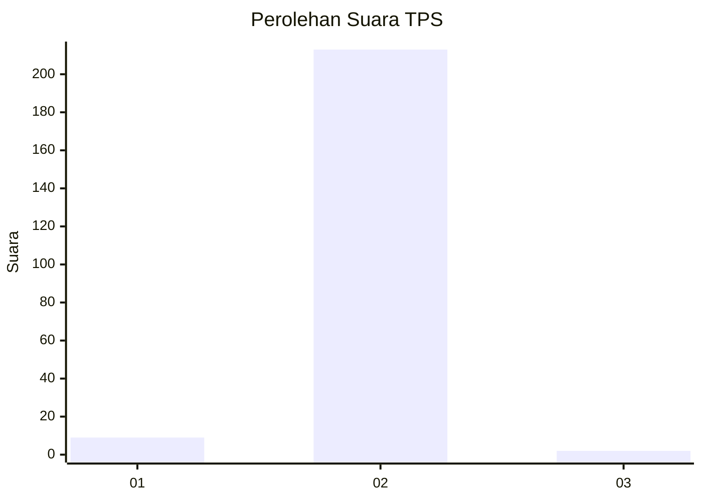
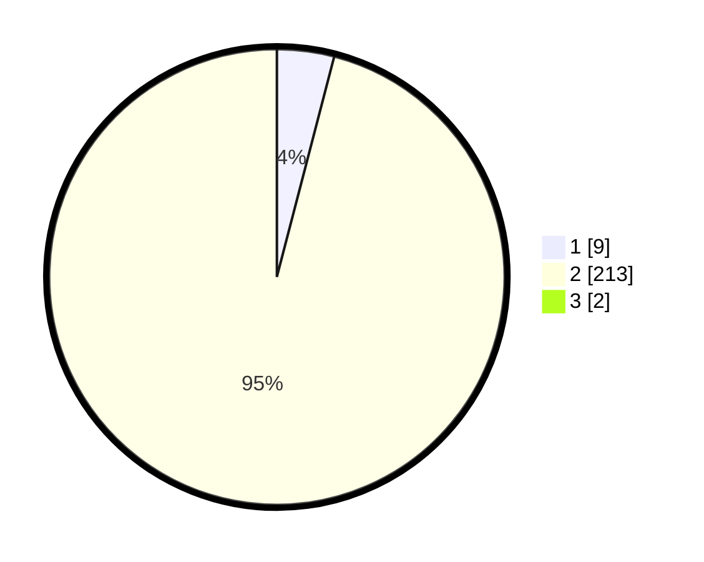

# Hasil

## Grafik

## Tabel

| No. | Nama Paslon    | Suara | Suara (raw) | Persentase |
|:--- |:-------------- | -----:| -----------:| ----------:|
| 1   | ANIES MUHAIMIN | 9     | [9][p-1]    | 4,02       |
| 2   | PRABOWO GIBRAN | 213   | [213][p-2]  | 95,09      |
| 3   | GANJAR MAHFUD  | 2     | [2][p-3]    | 0,89       |

[p-1]: https://github.com/gigit-pemilu/pemilu-2024-35-jawa-timur/blob/main/pilpres/hitung-suara/sub/35-jawa-timur/sub/29-sumenep/sub/16-batang-batang/sub/2002-tamidung/sub/005-tps/sub/paslon-1.txt
[p-2]: https://github.com/gigit-pemilu/pemilu-2024-35-jawa-timur/blob/main/pilpres/hitung-suara/sub/35-jawa-timur/sub/29-sumenep/sub/16-batang-batang/sub/2002-tamidung/sub/005-tps/sub/paslon-2.txt
[p-3]: https://github.com/gigit-pemilu/pemilu-2024-35-jawa-timur/blob/main/pilpres/hitung-suara/sub/35-jawa-timur/sub/29-sumenep/sub/16-batang-batang/sub/2002-tamidung/sub/005-tps/sub/paslon-3.txt

## Foto C Plano

https://sirekap-obj-formc.kpu.go.id/ddc1/pemilu/ppwp/35/29/16/20/02/3529162002005-20240215-084915--069a5b2a-7774-4045-a432-fe0bc8eff19b.jpg

https://sirekap-obj-formc.kpu.go.id/ddc1/pemilu/ppwp/35/29/16/20/02/3529162002005-20240215-091247--406e8882-2c1c-4faa-ae88-f65ce8f39ced.jpg

https://sirekap-obj-formc.kpu.go.id/ddc1/pemilu/ppwp/35/29/16/20/02/3529162002005-20240215-084338--6ac551df-5e3c-4e40-a3f7-6987b7c93390.jpg

## Metadata

| Key        | Value               |
| ---------- | ------------------- |
| Time Stamp | 2024-02-16 16:25:10 |

