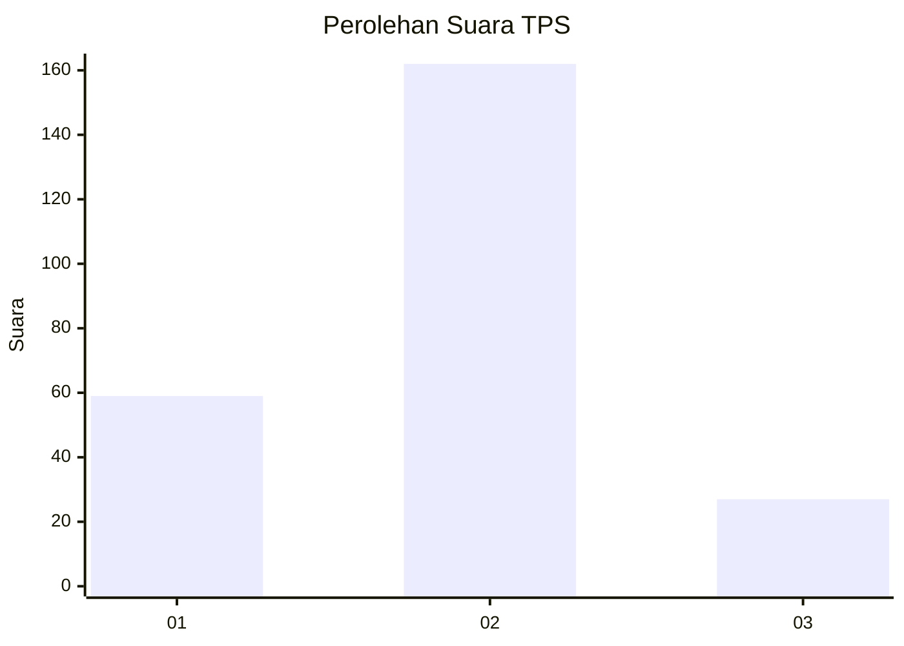
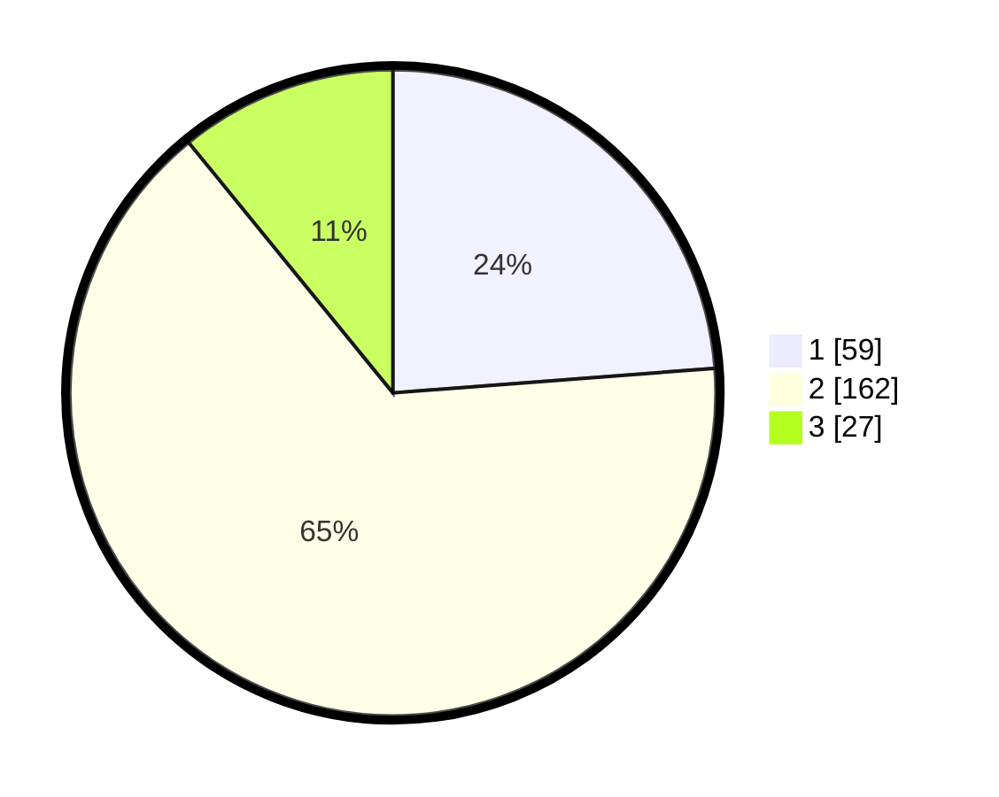

# Hasil

## Grafik

## Tabel

| No. | Nama Paslon    | Suara | Suara (raw) | Persentase |
|:--- |:-------------- | -----:| -----------:| ----------:|
| 1   | ANIES MUHAIMIN | 59    | [59][p-1]   | 23,79      |
| 2   | PRABOWO GIBRAN | 162   | [162][p-2]  | 65,32      |
| 3   | GANJAR MAHFUD  | 27    | [27][p-3]   | 10,89      |

[p-1]: https://github.com/gigit-pemilu/pemilu-2024/blob/main/pilpres/hitung-suara/sub/35-jawa-timur/sub/29-sumenep/sub/16-batang-batang/sub/2003-batang-batang-laok/sub/004-tps/sub/paslon-1.txt
[p-2]: https://github.com/gigit-pemilu/pemilu-2024/blob/main/pilpres/hitung-suara/sub/35-jawa-timur/sub/29-sumenep/sub/16-batang-batang/sub/2003-batang-batang-laok/sub/004-tps/sub/paslon-2.txt
[p-3]: https://github.com/gigit-pemilu/pemilu-2024/blob/main/pilpres/hitung-suara/sub/35-jawa-timur/sub/29-sumenep/sub/16-batang-batang/sub/2003-batang-batang-laok/sub/004-tps/sub/paslon-3.txt

## Foto C Plano

https://sirekap-obj-formc.kpu.go.id/9a00/pemilu/ppwp/35/29/16/20/03/3529162003004-20240214-230124--1f6dbd51-cb0c-45e5-bb44-634eb322d186.jpg

https://sirekap-obj-formc.kpu.go.id/9a00/pemilu/ppwp/35/29/16/20/03/3529162003004-20240214-230740--e15dffd1-7db2-4526-9c63-2c5ae17eaf13.jpg

https://sirekap-obj-formc.kpu.go.id/9a00/pemilu/ppwp/35/29/16/20/03/3529162003004-20240214-230907--ec19e0c2-1df5-432d-9a06-b57f94544f02.jpg

## Metadata

| Key        | Value               |
| ---------- | ------------------- |
| Time Stamp | 2024-02-24 22:31:28 |

