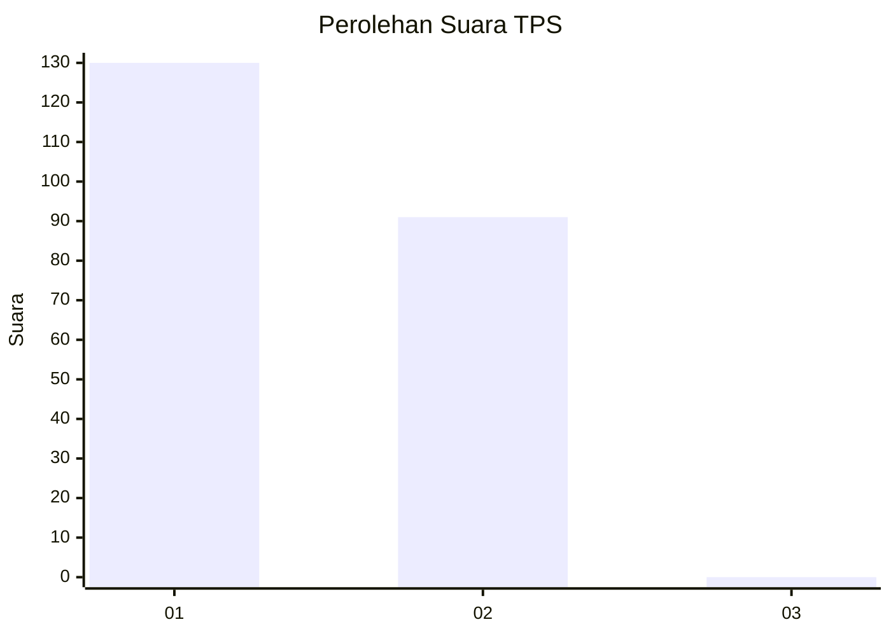
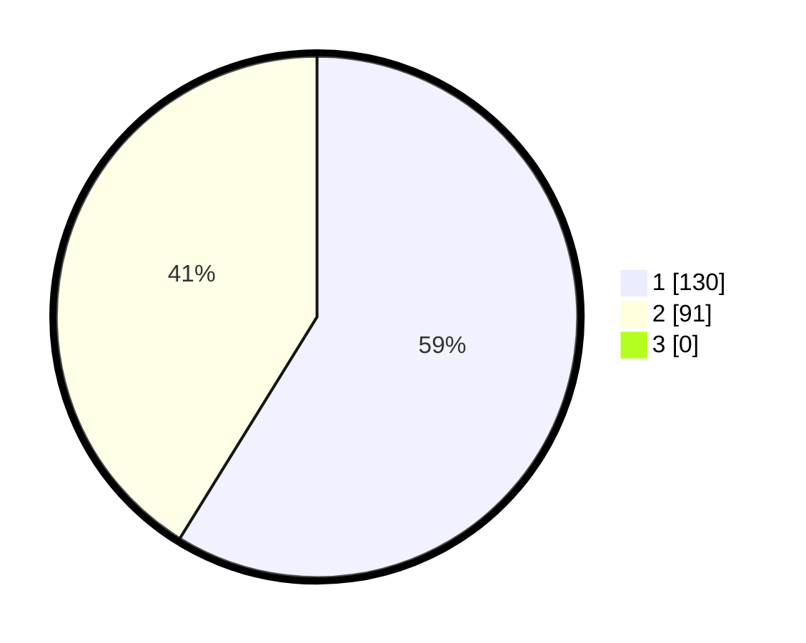

# Hasil

## Grafik

## Tabel

| No. | Nama Paslon    | Suara | Suara (raw) | Persentase |
|:--- |:-------------- | -----:| -----------:| ----------:|
| 1   | ANIES MUHAIMIN | 130   | [130][p-1]  | 58,82      |
| 2   | PRABOWO GIBRAN | 91    | [91][p-2]   | 41,18      |
| 3   | GANJAR MAHFUD  | 0     | [0][p-3]    | 0,00       |

[p-1]: https://github.com/gigit-pemilu/pemilu-2024/blob/main/pilpres/hitung-suara/sub/35-jawa-timur/sub/29-sumenep/sub/16-batang-batang/sub/2004-batang-batang-daya/sub/006-tps/sub/paslon-1.txt
[p-2]: https://github.com/gigit-pemilu/pemilu-2024/blob/main/pilpres/hitung-suara/sub/35-jawa-timur/sub/29-sumenep/sub/16-batang-batang/sub/2004-batang-batang-daya/sub/006-tps/sub/paslon-2.txt
[p-3]: https://github.com/gigit-pemilu/pemilu-2024/blob/main/pilpres/hitung-suara/sub/35-jawa-timur/sub/29-sumenep/sub/16-batang-batang/sub/2004-batang-batang-daya/sub/006-tps/sub/paslon-3.txt

## Foto C Plano

https://sirekap-obj-formc.kpu.go.id/c272/pemilu/ppwp/35/29/16/20/04/3529162004006-20240215-095159--348550ee-6f3e-4ca2-be66-400e283fc3a9.jpg

https://sirekap-obj-formc.kpu.go.id/c272/pemilu/ppwp/35/29/16/20/04/3529162004006-20240215-095455--54f35e9c-fbcb-4da3-873c-7ceacb7af320.jpg

https://sirekap-obj-formc.kpu.go.id/c272/pemilu/ppwp/35/29/16/20/04/3529162004006-20240215-095557--f66677e9-6e37-4198-99ac-0db7f9ab5224.jpg

## Metadata

| Key        | Value               |
| ---------- | ------------------- |
| Time Stamp | 2024-02-16 16:25:10 |

