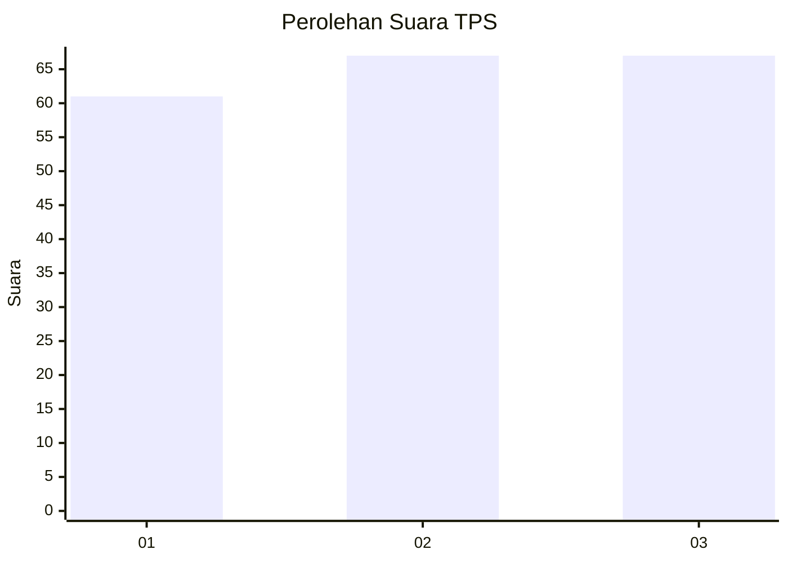
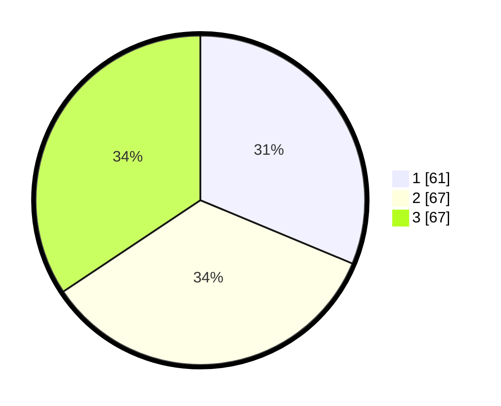

# Hasil

## Grafik

## Tabel

| No. | Nama Paslon    | Suara | Suara (raw) | Persentase |
|:--- |:-------------- | -----:| -----------:| ----------:|
| 1   | ANIES MUHAIMIN | 61    | [61][p-1]   | 31,28      |
| 2   | PRABOWO GIBRAN | 67    | [67][p-2]   | 34,36      |
| 3   | GANJAR MAHFUD  | 67    | [67][p-3]   | 34,36      |

[p-1]: https://github.com/gigit-pemilu/pemilu-2024-35-jawa-timur/blob/main/pilpres/hitung-suara/sub/35-jawa-timur/sub/29-sumenep/sub/16-batang-batang/sub/2006-banuaju-barat/sub/001-tps/sub/paslon-1.txt
[p-2]: https://github.com/gigit-pemilu/pemilu-2024-35-jawa-timur/blob/main/pilpres/hitung-suara/sub/35-jawa-timur/sub/29-sumenep/sub/16-batang-batang/sub/2006-banuaju-barat/sub/001-tps/sub/paslon-2.txt
[p-3]: https://github.com/gigit-pemilu/pemilu-2024-35-jawa-timur/blob/main/pilpres/hitung-suara/sub/35-jawa-timur/sub/29-sumenep/sub/16-batang-batang/sub/2006-banuaju-barat/sub/001-tps/sub/paslon-3.txt

## Foto C Plano

https://sirekap-obj-formc.kpu.go.id/b20c/pemilu/ppwp/35/29/16/20/06/3529162006001-20240215-102527--64ba26fd-032d-47a2-ad1b-59fe18ec22c0.jpg

https://sirekap-obj-formc.kpu.go.id/b20c/pemilu/ppwp/35/29/16/20/06/3529162006001-20240215-102619--011dca42-07ab-4046-b547-4f83a93a8b77.jpg

https://sirekap-obj-formc.kpu.go.id/b20c/pemilu/ppwp/35/29/16/20/06/3529162006001-20240215-102705--486be574-5915-48a5-a45f-0412860f7dfd.jpg

## Metadata

| Key        | Value               |
| ---------- | ------------------- |
| Time Stamp | 2024-02-24 23:00:00 |

