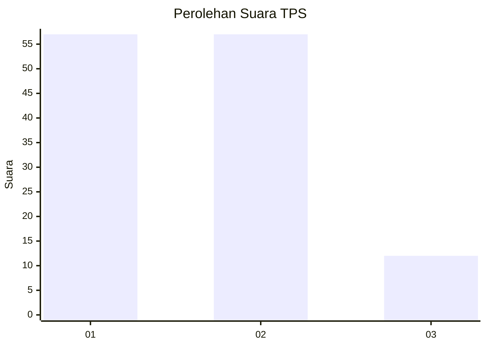
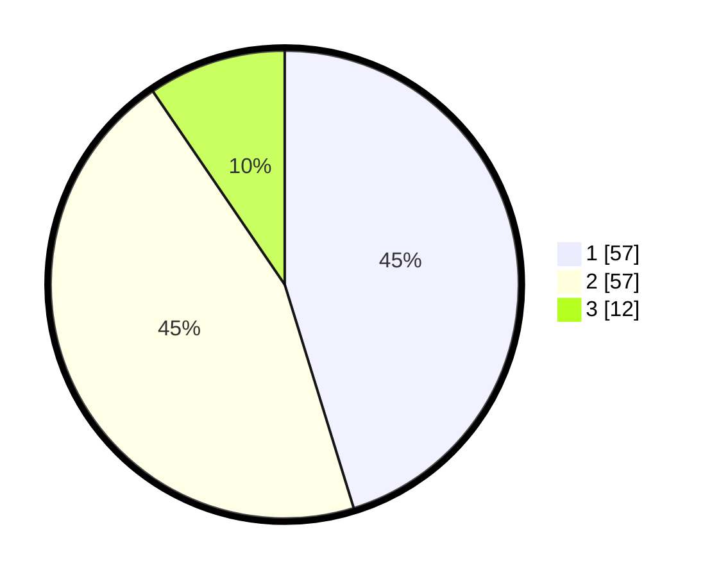

# Hasil

## Grafik

## Tabel

| No. | Nama Paslon    | Suara | Suara (raw) | Persentase |
|:--- |:-------------- | -----:| -----------:| ----------:|
| 1   | ANIES MUHAIMIN | 57    | [57][p-1]   | 45,24      |
| 2   | PRABOWO GIBRAN | 57    | [57][p-2]   | 45,24      |
| 3   | GANJAR MAHFUD  | 12    | [12][p-3]   | 9,52       |

[p-1]: https://github.com/gigit-pemilu/pemilu-2024/blob/main/pilpres/hitung-suara/sub/35-jawa-timur/sub/29-sumenep/sub/16-batang-batang/sub/2009-nyabakan-timur/sub/003-tps/sub/paslon-1.txt
[p-2]: https://github.com/gigit-pemilu/pemilu-2024/blob/main/pilpres/hitung-suara/sub/35-jawa-timur/sub/29-sumenep/sub/16-batang-batang/sub/2009-nyabakan-timur/sub/003-tps/sub/paslon-2.txt
[p-3]: https://github.com/gigit-pemilu/pemilu-2024/blob/main/pilpres/hitung-suara/sub/35-jawa-timur/sub/29-sumenep/sub/16-batang-batang/sub/2009-nyabakan-timur/sub/003-tps/sub/paslon-3.txt

## Foto C Plano

https://sirekap-obj-formc.kpu.go.id/5272/pemilu/ppwp/35/29/16/20/09/3529162009003-20240225-171735--ed74b3af-a517-4d0d-8238-5244dc949ebf.jpg

https://sirekap-obj-formc.kpu.go.id/5272/pemilu/ppwp/35/29/16/20/09/3529162009003-20240225-171736--837669eb-85c8-469b-851a-bbfb0de9bd62.jpg

https://sirekap-obj-formc.kpu.go.id/5272/pemilu/ppwp/35/29/16/20/09/3529162009003-20240225-171735--eedcaa1a-f809-4683-aed8-940c9dfdea3c.jpg

## Metadata

| Key        | Value               |
| ---------- | ------------------- |
| Time Stamp | 2024-02-25 21:00:00 |

## DATA PEMILIH TETAP

Jumlah pemilih dalam DPT: **204**.
 * L: **89**.
 * P: **115**.

## DATA PENGGUNA HAK PILIH

Jumlah pengguna hak pilih dalam DPT: **188**.
 * L: **77**.
 * P: **111**.

Jumlah pengguna hak pilih dalam DPTb: **0**.
 * L: **0**.
 * P: **0**.

Jumlah pengguna hak pilih dalam DPK: **0**.
 * L: **0**.
 * P: **0**.

Jumlah pengguna hak pilih: **188**.
 * L: **77**.
 * P: **111**.

## JUMLAH SUARA SAH DAN TIDAK SAH

JUMLAH SELURUH SUARA SAH: **126**.

JUMLAH SUARA TIDAK SAH: **62**.

JUMLAH SELURUH SUARA SAH DAN SUARA TIDAK SAH: **188**.

