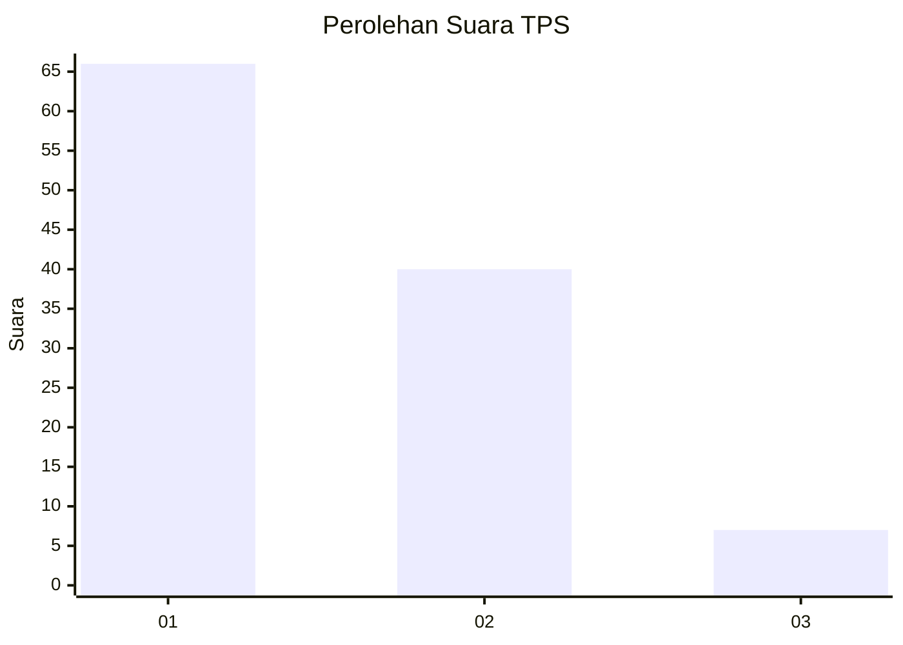
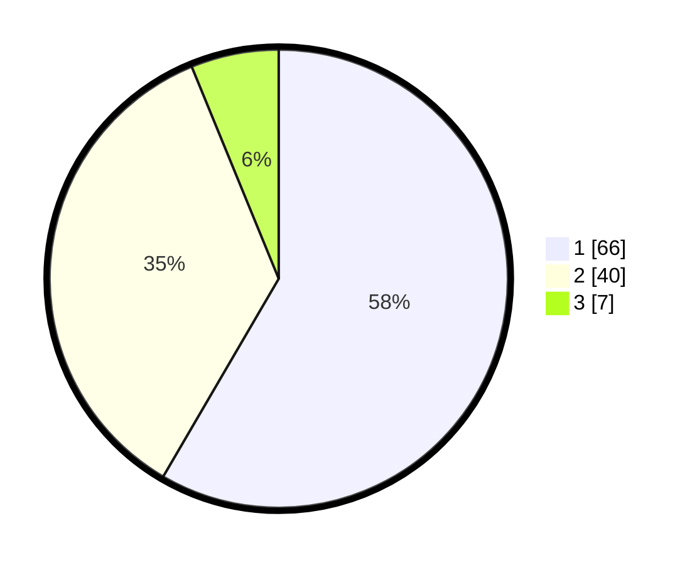

# Hasil

## Grafik

## Tabel

| No. | Nama Paslon    | Suara | Suara (raw) | Persentase |
|:--- |:-------------- | -----:| -----------:| ----------:|
| 1   | ANIES MUHAIMIN | 66    | [66][p-1]   | 58,41      |
| 2   | PRABOWO GIBRAN | 40    | [40][p-2]   | 35,40      |
| 3   | GANJAR MAHFUD  | 7     | [7][p-3]    | 6,19       |

[p-1]: https://github.com/gigit-pemilu/pemilu-2024-35-jawa-timur/blob/main/pilpres/hitung-suara/sub/35-jawa-timur/sub/29-sumenep/sub/16-batang-batang/sub/2009-nyabakan-timur/sub/008-tps/sub/paslon-1.txt
[p-2]: https://github.com/gigit-pemilu/pemilu-2024-35-jawa-timur/blob/main/pilpres/hitung-suara/sub/35-jawa-timur/sub/29-sumenep/sub/16-batang-batang/sub/2009-nyabakan-timur/sub/008-tps/sub/paslon-2.txt
[p-3]: https://github.com/gigit-pemilu/pemilu-2024-35-jawa-timur/blob/main/pilpres/hitung-suara/sub/35-jawa-timur/sub/29-sumenep/sub/16-batang-batang/sub/2009-nyabakan-timur/sub/008-tps/sub/paslon-3.txt

## Foto C Plano

https://sirekap-obj-formc.kpu.go.id/27c9/pemilu/ppwp/35/29/16/20/09/3529162009008-20240215-044614--1d14ea47-ba41-447d-b60b-49aae98ea40d.jpg

https://sirekap-obj-formc.kpu.go.id/27c9/pemilu/ppwp/35/29/16/20/09/3529162009008-20240215-044622--9e4697bb-9548-4cda-85ea-9318ea05be53.jpg

https://sirekap-obj-formc.kpu.go.id/27c9/pemilu/ppwp/35/29/16/20/09/3529162009008-20240215-044627--d79967cb-05b0-4d7f-b0ad-24a295066d88.jpg

## Metadata

| Key        | Value               |
| ---------- | ------------------- |
| Time Stamp | 2024-02-25 16:00:00 |

