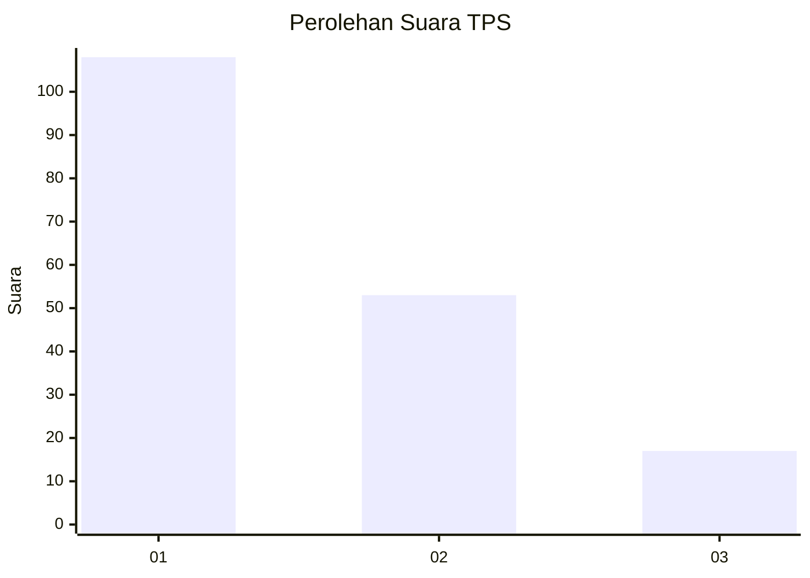
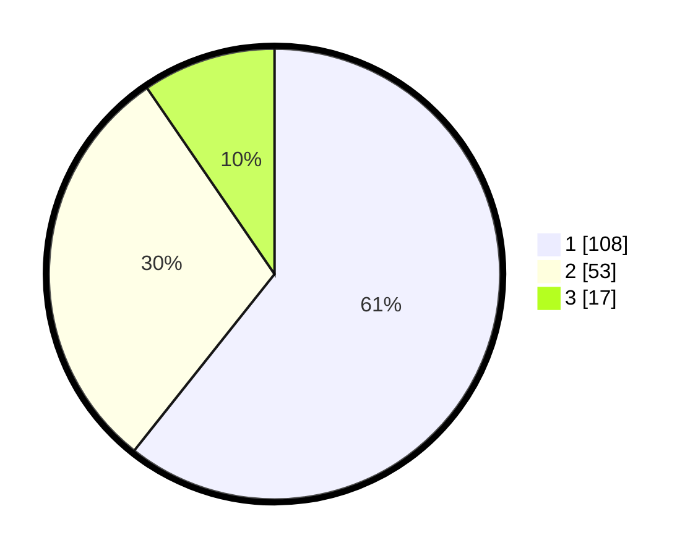

# Hasil

## Grafik

## Tabel

| No. | Nama Paslon    | Suara | Suara (raw) | Persentase |
|:--- |:-------------- | -----:| -----------:| ----------:|
| 1   | ANIES MUHAIMIN | 108   | [108][p-1]  | 60,67      |
| 2   | PRABOWO GIBRAN | 53    | [53][p-2]   | 29,78      |
| 3   | GANJAR MAHFUD  | 17    | [17][p-3]   | 9,55       |

[p-1]: https://github.com/gigit-pemilu/pemilu-2024/blob/main/pilpres/hitung-suara/sub/35-jawa-timur/sub/29-sumenep/sub/16-batang-batang/sub/2009-nyabakan-timur/sub/012-tps/sub/paslon-1.txt
[p-2]: https://github.com/gigit-pemilu/pemilu-2024/blob/main/pilpres/hitung-suara/sub/35-jawa-timur/sub/29-sumenep/sub/16-batang-batang/sub/2009-nyabakan-timur/sub/012-tps/sub/paslon-2.txt
[p-3]: https://github.com/gigit-pemilu/pemilu-2024/blob/main/pilpres/hitung-suara/sub/35-jawa-timur/sub/29-sumenep/sub/16-batang-batang/sub/2009-nyabakan-timur/sub/012-tps/sub/paslon-3.txt

## Foto C Plano

https://sirekap-obj-formc.kpu.go.id/a5ea/pemilu/ppwp/35/29/16/20/09/3529162009012-20240214-214843--00c07b0f-f473-48fc-9ade-df99c6c45e25.jpg

https://sirekap-obj-formc.kpu.go.id/a5ea/pemilu/ppwp/35/29/16/20/09/3529162009012-20240214-215117--cb685d47-9e66-4430-9a0c-4c702f29836b.jpg

https://sirekap-obj-formc.kpu.go.id/a5ea/pemilu/ppwp/35/29/16/20/09/3529162009012-20240214-215638--8d5c9f7b-09eb-4bc3-8186-c3b72f70ac1b.jpg

## Metadata

| Key        | Value               |
| ---------- | ------------------- |
| Time Stamp | 2024-02-16 16:25:10 |

