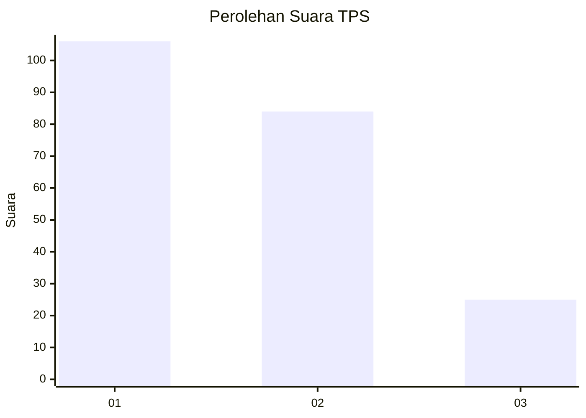
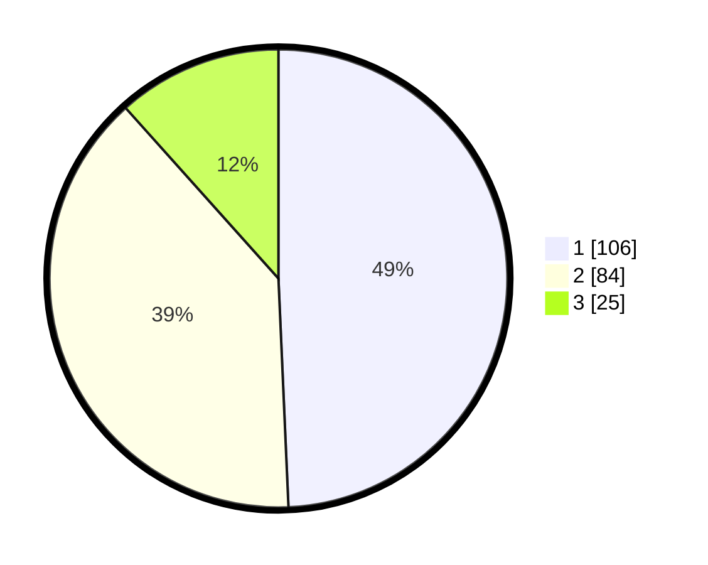

# Hasil

## Grafik

## Tabel

| No. | Nama Paslon    | Suara | Suara (raw) | Persentase |
|:--- |:-------------- | -----:| -----------:| ----------:|
| 1   | ANIES MUHAIMIN | 106   | [106][p-1]  | 49,30      |
| 2   | PRABOWO GIBRAN | 84    | [84][p-2]   | 39,07      |
| 3   | GANJAR MAHFUD  | 25    | [25][p-3]   | 11,63      |

[p-1]: https://github.com/gigit-pemilu/pemilu-2024-35-jawa-timur/blob/main/pilpres/hitung-suara/sub/35-jawa-timur/sub/29-sumenep/sub/17-batuputih/sub/2001-aengmerah/sub/001-tps/sub/paslon-1.txt
[p-2]: https://github.com/gigit-pemilu/pemilu-2024-35-jawa-timur/blob/main/pilpres/hitung-suara/sub/35-jawa-timur/sub/29-sumenep/sub/17-batuputih/sub/2001-aengmerah/sub/001-tps/sub/paslon-2.txt
[p-3]: https://github.com/gigit-pemilu/pemilu-2024-35-jawa-timur/blob/main/pilpres/hitung-suara/sub/35-jawa-timur/sub/29-sumenep/sub/17-batuputih/sub/2001-aengmerah/sub/001-tps/sub/paslon-3.txt

## Foto C Plano

https://sirekap-obj-formc.kpu.go.id/ad1a/pemilu/ppwp/35/29/17/20/01/3529172001001-20240214-221637--1e6f85c6-9c1e-4868-8cf8-56db43d8be90.jpg

https://sirekap-obj-formc.kpu.go.id/ad1a/pemilu/ppwp/35/29/17/20/01/3529172001001-20240214-215525--4a8ca64a-edd0-478d-a801-3f064fef9338.jpg

https://sirekap-obj-formc.kpu.go.id/ad1a/pemilu/ppwp/35/29/17/20/01/3529172001001-20240215-232603--683ee70b-6dd0-4c17-90e6-57b00502d136.jpg

## Metadata

| Key        | Value               |
| ---------- | ------------------- |
| Time Stamp | 2024-02-15 23:29:50 |

