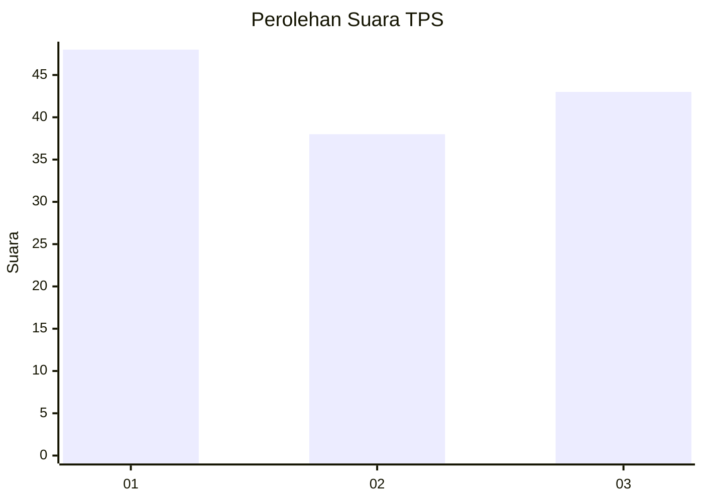
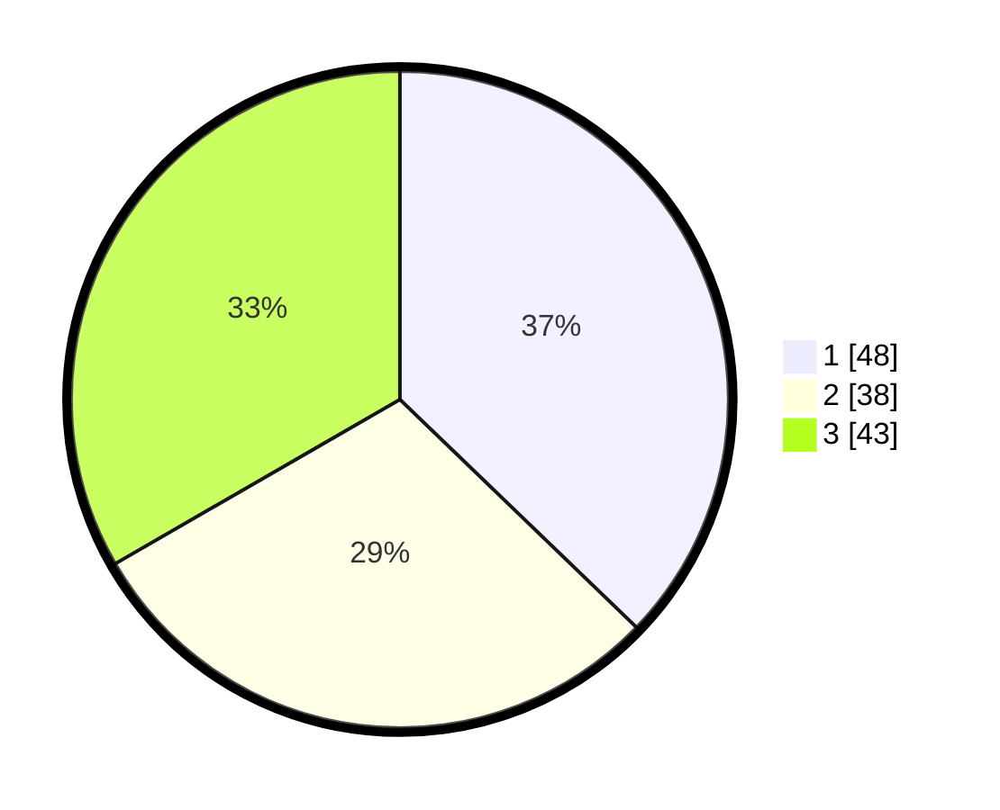

# Hasil

## Grafik

## Tabel

| No. | Nama Paslon    | Suara | Suara (raw) | Persentase |
|:--- |:-------------- | -----:| -----------:| ----------:|
| 1   | ANIES MUHAIMIN | 48    | [48][p-1]   | 37,21      |
| 2   | PRABOWO GIBRAN | 38    | [38][p-2]   | 29,46      |
| 3   | GANJAR MAHFUD  | 43    | [43][p-3]   | 33,33      |

[p-1]: https://github.com/gigit-pemilu/pemilu-2024/blob/main/pilpres/hitung-suara/sub/35-jawa-timur/sub/29-sumenep/sub/17-batuputih/sub/2001-aengmerah/sub/007-tps/sub/paslon-1.txt
[p-2]: https://github.com/gigit-pemilu/pemilu-2024/blob/main/pilpres/hitung-suara/sub/35-jawa-timur/sub/29-sumenep/sub/17-batuputih/sub/2001-aengmerah/sub/007-tps/sub/paslon-2.txt
[p-3]: https://github.com/gigit-pemilu/pemilu-2024/blob/main/pilpres/hitung-suara/sub/35-jawa-timur/sub/29-sumenep/sub/17-batuputih/sub/2001-aengmerah/sub/007-tps/sub/paslon-3.txt

## Foto C Plano

https://sirekap-obj-formc.kpu.go.id/6a00/pemilu/ppwp/35/29/17/20/01/3529172001007-20240216-005209--735f0a84-01dd-46c2-90c7-80256f4fc91e.jpg

https://sirekap-obj-formc.kpu.go.id/6a00/pemilu/ppwp/35/29/17/20/01/3529172001007-20240214-141626--6d38970d-e190-4f39-b46a-378dee124d06.jpg

https://sirekap-obj-formc.kpu.go.id/6a00/pemilu/ppwp/35/29/17/20/01/3529172001007-20240214-141711--18ead73e-8ae7-42ae-84b7-351c825ac2af.jpg

## Metadata

| Key        | Value               |
| ---------- | ------------------- |
| Time Stamp | 2024-02-25 21:00:00 |

