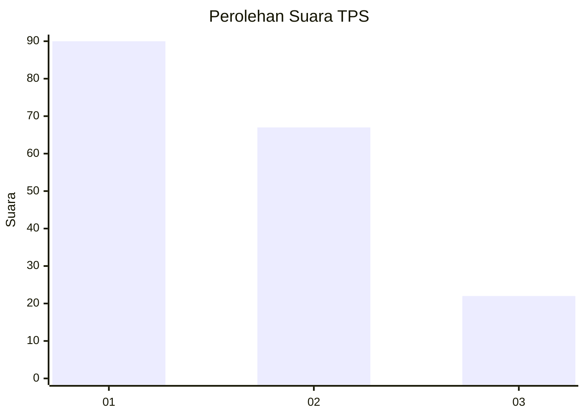
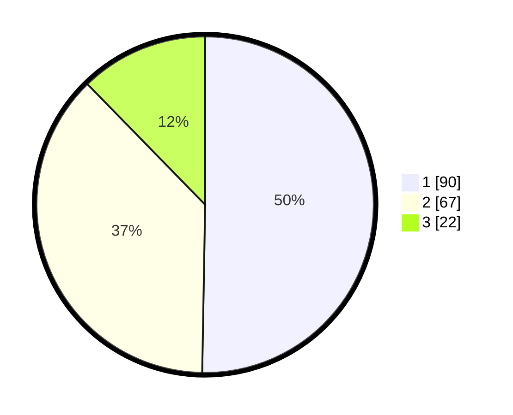

# Hasil

## Grafik

## Tabel

| No. | Nama Paslon    | Suara | Suara (raw) | Persentase |
|:--- |:-------------- | -----:| -----------:| ----------:|
| 1   | ANIES MUHAIMIN | 90    | [90][p-1]   | 50,28      |
| 2   | PRABOWO GIBRAN | 67    | [67][p-2]   | 37,43      |
| 3   | GANJAR MAHFUD  | 22    | [22][p-3]   | 12,29      |

[p-1]: https://github.com/gigit-pemilu/pemilu-2024-35-jawa-timur/blob/main/pilpres/hitung-suara/sub/35-jawa-timur/sub/29-sumenep/sub/17-batuputih/sub/2001-aengmerah/sub/010-tps/sub/paslon-1.txt
[p-2]: https://github.com/gigit-pemilu/pemilu-2024-35-jawa-timur/blob/main/pilpres/hitung-suara/sub/35-jawa-timur/sub/29-sumenep/sub/17-batuputih/sub/2001-aengmerah/sub/010-tps/sub/paslon-2.txt
[p-3]: https://github.com/gigit-pemilu/pemilu-2024-35-jawa-timur/blob/main/pilpres/hitung-suara/sub/35-jawa-timur/sub/29-sumenep/sub/17-batuputih/sub/2001-aengmerah/sub/010-tps/sub/paslon-3.txt

## Foto C Plano

https://sirekap-obj-formc.kpu.go.id/b7bf/pemilu/ppwp/35/29/17/20/01/3529172001010-20240215-040821--65ea46a1-1119-4a4e-b6f3-db0cbbdc757e.jpg

https://sirekap-obj-formc.kpu.go.id/b7bf/pemilu/ppwp/35/29/17/20/01/3529172001010-20240215-041349--85a2c6ac-e334-48d1-89bf-0c04779dc941.jpg

https://sirekap-obj-formc.kpu.go.id/b7bf/pemilu/ppwp/35/29/17/20/01/3529172001010-20240215-041023--4535af4b-b774-4e81-b1b1-f1b9e3d7cf46.jpg

## Metadata

| Key        | Value               |
| ---------- | ------------------- |
| Time Stamp | 2024-02-25 17:00:00 |

