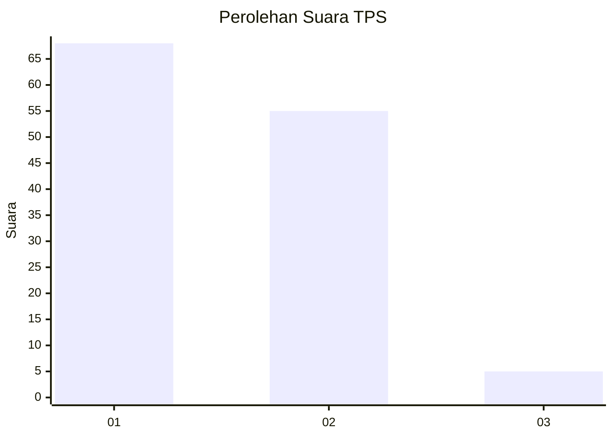
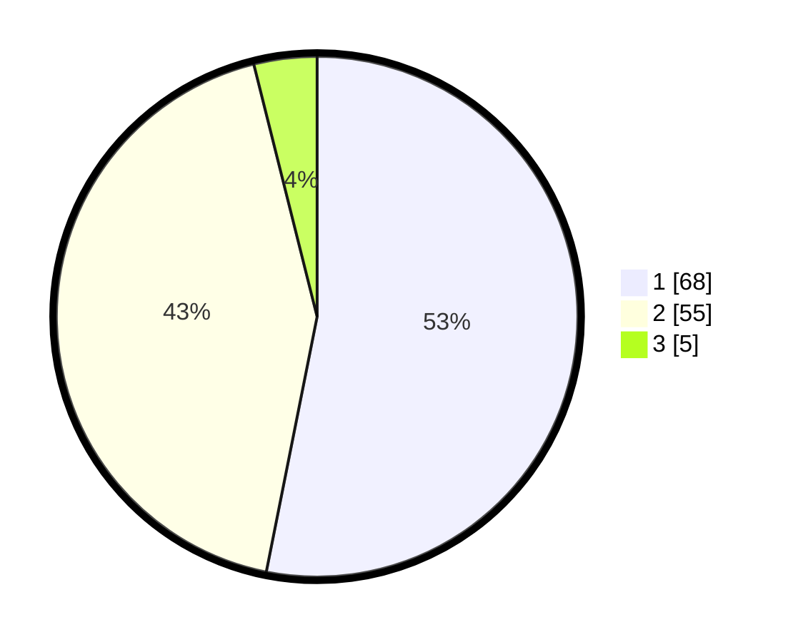

# Hasil

## Grafik

## Tabel

| No. | Nama Paslon    | Suara | Suara (raw) | Persentase |
|:--- |:-------------- | -----:| -----------:| ----------:|
| 1   | ANIES MUHAIMIN | 68    | [68][p-1]   | 53,13      |
| 2   | PRABOWO GIBRAN | 55    | [55][p-2]   | 42,97      |
| 3   | GANJAR MAHFUD  | 5     | [5][p-3]    | 3,91       |

[p-1]: https://github.com/gigit-pemilu/pemilu-2024-35-jawa-timur/blob/main/pilpres/hitung-suara/sub/35-jawa-timur/sub/29-sumenep/sub/17-batuputih/sub/2002-tengedan/sub/006-tps/sub/paslon-1.txt
[p-2]: https://github.com/gigit-pemilu/pemilu-2024-35-jawa-timur/blob/main/pilpres/hitung-suara/sub/35-jawa-timur/sub/29-sumenep/sub/17-batuputih/sub/2002-tengedan/sub/006-tps/sub/paslon-2.txt
[p-3]: https://github.com/gigit-pemilu/pemilu-2024-35-jawa-timur/blob/main/pilpres/hitung-suara/sub/35-jawa-timur/sub/29-sumenep/sub/17-batuputih/sub/2002-tengedan/sub/006-tps/sub/paslon-3.txt

## Foto C Plano

https://sirekap-obj-formc.kpu.go.id/6c3e/pemilu/ppwp/35/29/17/20/02/3529172002006-20240215-000953--d256a545-3a7a-4ff6-b834-f4479a35ef02.jpg

https://sirekap-obj-formc.kpu.go.id/6c3e/pemilu/ppwp/35/29/17/20/02/3529172002006-20240215-001505--c998a5a0-3411-4a7b-8a45-2a518c588dd9.jpg

https://sirekap-obj-formc.kpu.go.id/6c3e/pemilu/ppwp/35/29/17/20/02/3529172002006-20240215-002116--b83ff30f-646f-4ff7-a830-3ce04a445bda.jpg

## Metadata

| Key        | Value               |
| ---------- | ------------------- |
| Time Stamp | 2024-02-25 11:00:00 |

