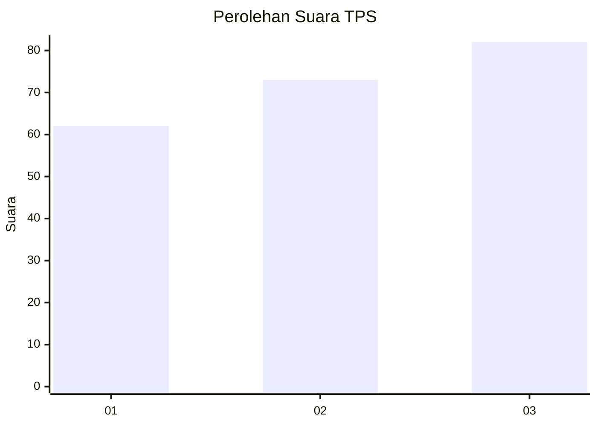
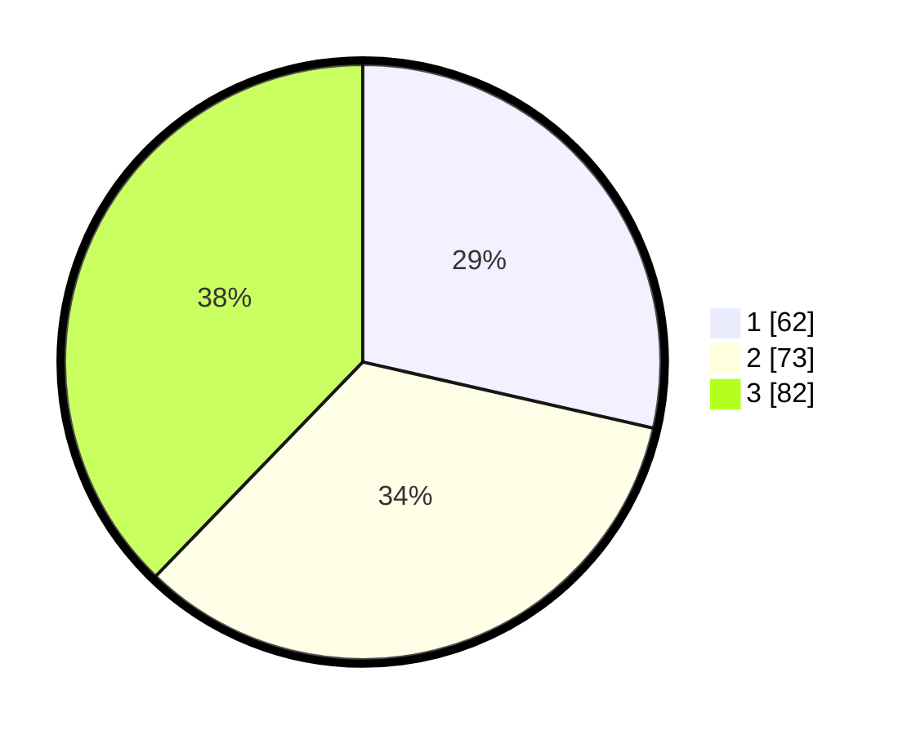

# Hasil

## Grafik

## Tabel

| No. | Nama Paslon    | Suara | Suara (raw) | Persentase |
|:--- |:-------------- | -----:| -----------:| ----------:|
| 1   | ANIES MUHAIMIN | 62    | [62][p-1]   | 28,57      |
| 2   | PRABOWO GIBRAN | 73    | [73][p-2]   | 33,64      |
| 3   | GANJAR MAHFUD  | 82    | [82][p-3]   | 37,79      |

[p-1]: https://github.com/gigit-pemilu/pemilu-2024-35-jawa-timur/blob/main/pilpres/hitung-suara/sub/35-jawa-timur/sub/29-sumenep/sub/17-batuputih/sub/2003-juruan-laok/sub/007-tps/sub/paslon-1.txt
[p-2]: https://github.com/gigit-pemilu/pemilu-2024-35-jawa-timur/blob/main/pilpres/hitung-suara/sub/35-jawa-timur/sub/29-sumenep/sub/17-batuputih/sub/2003-juruan-laok/sub/007-tps/sub/paslon-2.txt
[p-3]: https://github.com/gigit-pemilu/pemilu-2024-35-jawa-timur/blob/main/pilpres/hitung-suara/sub/35-jawa-timur/sub/29-sumenep/sub/17-batuputih/sub/2003-juruan-laok/sub/007-tps/sub/paslon-3.txt

## Foto C Plano

https://sirekap-obj-formc.kpu.go.id/b839/pemilu/ppwp/35/29/17/20/03/3529172003007-20240215-021654--cc06b0d7-82bc-4366-b7cf-bddd0ff834c9.jpg

https://sirekap-obj-formc.kpu.go.id/b839/pemilu/ppwp/35/29/17/20/03/3529172003007-20240215-021703--974f419d-85cf-4f54-b1ca-4256564b4e9a.jpg

https://sirekap-obj-formc.kpu.go.id/b839/pemilu/ppwp/35/29/17/20/03/3529172003007-20240215-021712--c5d5bee4-ed2b-4ae3-8e2b-a7152d8da1f7.jpg

## Metadata

| Key        | Value               |
| ---------- | ------------------- |
| Time Stamp | 2024-02-26 22:00:00 |

