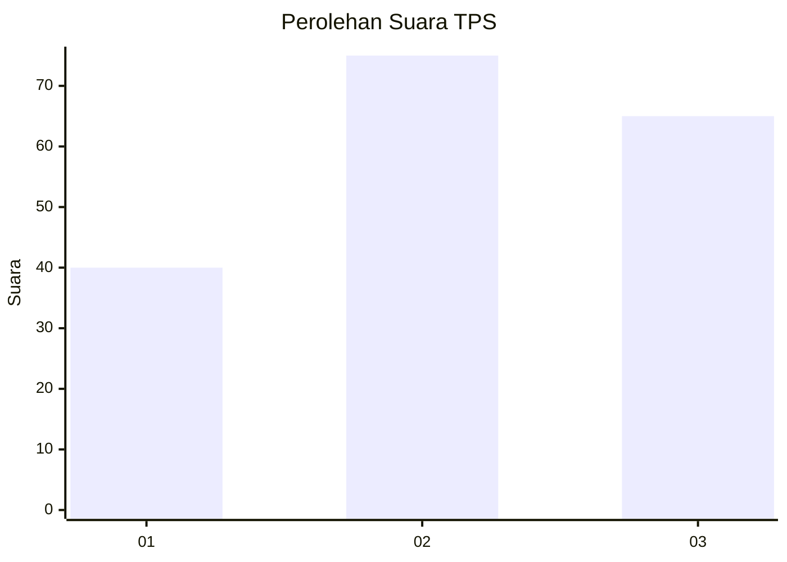
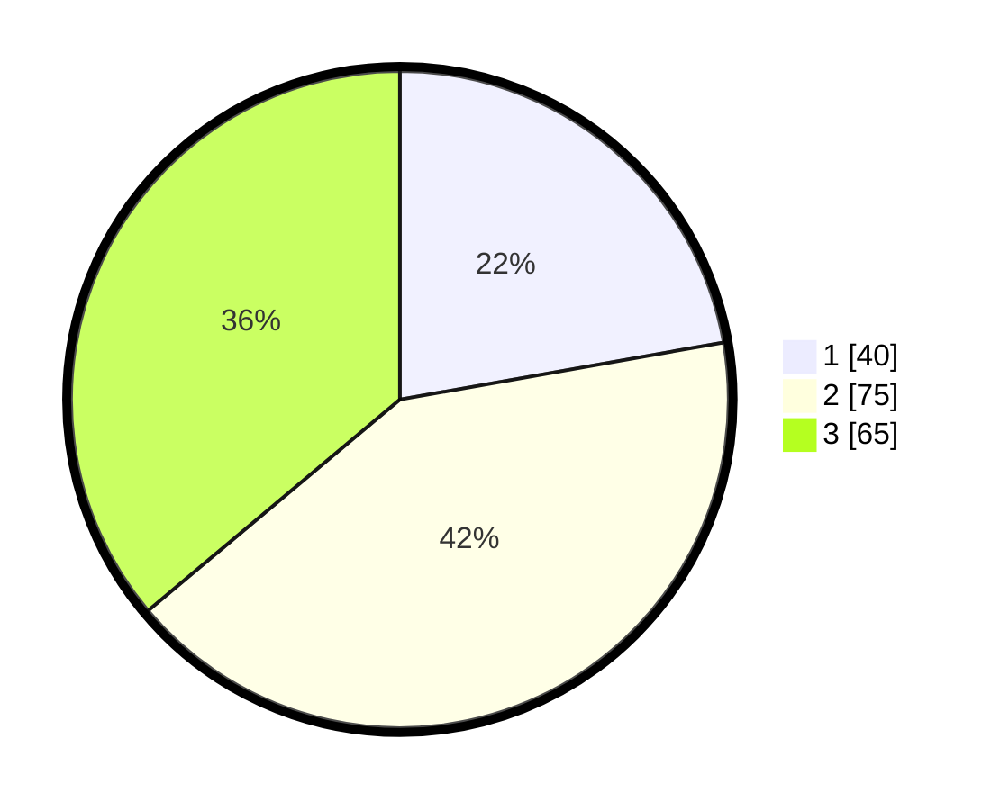

# Hasil

## Grafik

## Tabel

| No. | Nama Paslon    | Suara | Suara (raw) | Persentase |
|:--- |:-------------- | -----:| -----------:| ----------:|
| 1   | ANIES MUHAIMIN | 40    | [40][p-1]   | 22,22      |
| 2   | PRABOWO GIBRAN | 75    | [75][p-2]   | 41,67      |
| 3   | GANJAR MAHFUD  | 65    | [65][p-3]   | 36,11      |

[p-1]: https://github.com/gigit-pemilu/pemilu-2024/blob/main/pilpres/hitung-suara/sub/35-jawa-timur/sub/29-sumenep/sub/17-batuputih/sub/2003-juruan-laok/sub/009-tps/sub/paslon-1.txt
[p-2]: https://github.com/gigit-pemilu/pemilu-2024/blob/main/pilpres/hitung-suara/sub/35-jawa-timur/sub/29-sumenep/sub/17-batuputih/sub/2003-juruan-laok/sub/009-tps/sub/paslon-2.txt
[p-3]: https://github.com/gigit-pemilu/pemilu-2024/blob/main/pilpres/hitung-suara/sub/35-jawa-timur/sub/29-sumenep/sub/17-batuputih/sub/2003-juruan-laok/sub/009-tps/sub/paslon-3.txt

## Foto C Plano

https://sirekap-obj-formc.kpu.go.id/b51c/pemilu/ppwp/35/29/17/20/03/3529172003009-20240214-234235--9d5580e5-e839-4652-8a23-c3adcb6cd41a.jpg

https://sirekap-obj-formc.kpu.go.id/b51c/pemilu/ppwp/35/29/17/20/03/3529172003009-20240214-234619--96e10f3a-3fa5-405c-bbcc-08af60fec9fd.jpg

https://sirekap-obj-formc.kpu.go.id/b51c/pemilu/ppwp/35/29/17/20/03/3529172003009-20240214-234901--382e4f71-6289-4bfe-b8d1-942d24182f44.jpg

## Metadata

| Key        | Value               |
| ---------- | ------------------- |
| Time Stamp | 2024-02-25 11:00:00 |

