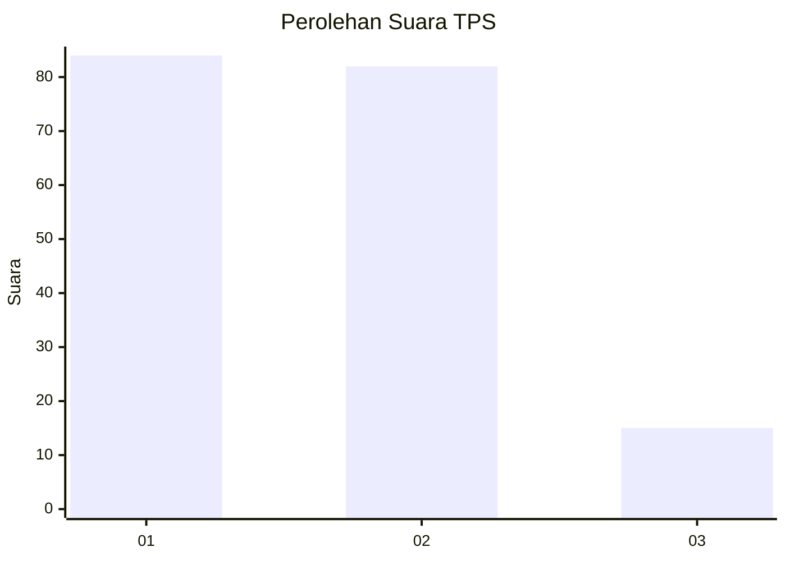
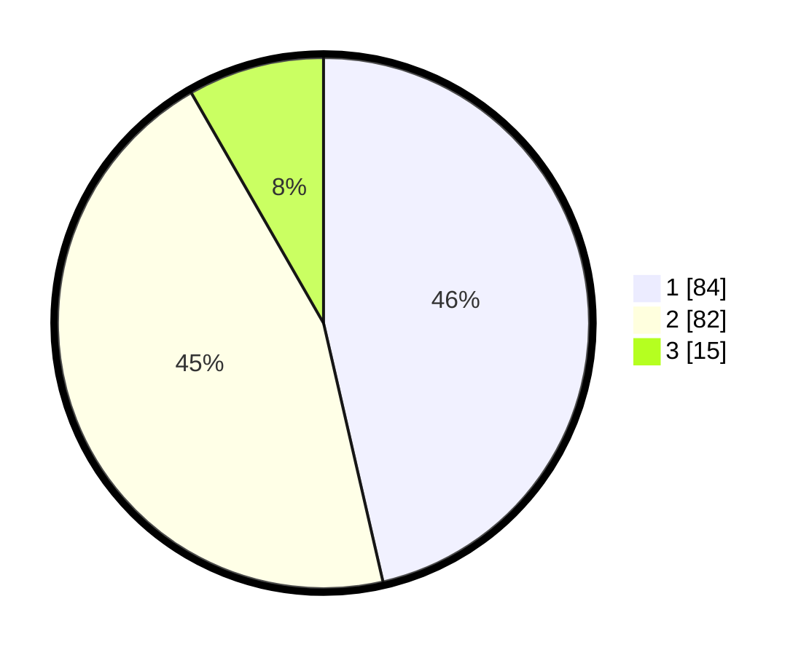

# Hasil

## Grafik

## Tabel

| No. | Nama Paslon    | Suara | Suara (raw) | Persentase |
|:--- |:-------------- | -----:| -----------:| ----------:|
| 1   | ANIES MUHAIMIN | 84    | [84][p-1]   | 46,41      |
| 2   | PRABOWO GIBRAN | 82    | [82][p-2]   | 45,30      |
| 3   | GANJAR MAHFUD  | 15    | [15][p-3]   | 8,29       |

[p-1]: https://github.com/gigit-pemilu/pemilu-2024-35-jawa-timur/blob/main/pilpres/hitung-suara/sub/35-jawa-timur/sub/29-sumenep/sub/17-batuputih/sub/2003-juruan-laok/sub/013-tps/sub/paslon-1.txt
[p-2]: https://github.com/gigit-pemilu/pemilu-2024-35-jawa-timur/blob/main/pilpres/hitung-suara/sub/35-jawa-timur/sub/29-sumenep/sub/17-batuputih/sub/2003-juruan-laok/sub/013-tps/sub/paslon-2.txt
[p-3]: https://github.com/gigit-pemilu/pemilu-2024-35-jawa-timur/blob/main/pilpres/hitung-suara/sub/35-jawa-timur/sub/29-sumenep/sub/17-batuputih/sub/2003-juruan-laok/sub/013-tps/sub/paslon-3.txt

## Foto C Plano

https://sirekap-obj-formc.kpu.go.id/89f4/pemilu/ppwp/35/29/17/20/03/3529172003013-20240215-014157--17639c5e-c84a-4a8e-8e0e-2d8a18df3437.jpg

https://sirekap-obj-formc.kpu.go.id/89f4/pemilu/ppwp/35/29/17/20/03/3529172003013-20240216-005855--dde72345-b7bf-4b44-a9ce-ca4b1ecab4f1.jpg

https://sirekap-obj-formc.kpu.go.id/89f4/pemilu/ppwp/35/29/17/20/03/3529172003013-20240215-014530--c7e3d5cc-e636-4c2a-9863-12cf44d65d3f.jpg

## Metadata

| Key        | Value               |
| ---------- | ------------------- |
| Time Stamp | 2024-02-16 01:00:27 |

