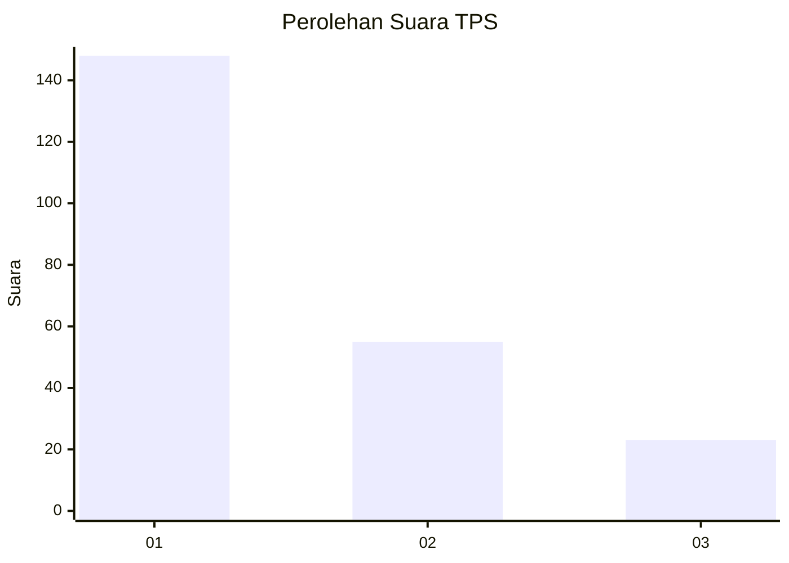
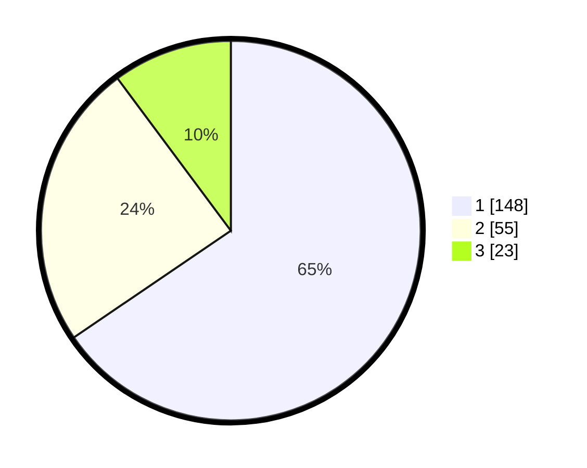

# Hasil

## Grafik

## Tabel

| No. | Nama Paslon    | Suara | Suara (raw) | Persentase |
|:--- |:-------------- | -----:| -----------:| ----------:|
| 1   | ANIES MUHAIMIN | 148   | [148][p-1]  | 65,49      |
| 2   | PRABOWO GIBRAN | 55    | [55][p-2]   | 24,34      |
| 3   | GANJAR MAHFUD  | 23    | [23][p-3]   | 10,18      |

[p-1]: https://github.com/gigit-pemilu/pemilu-2024-35-jawa-timur/blob/main/pilpres/hitung-suara/sub/35-jawa-timur/sub/29-sumenep/sub/17-batuputih/sub/2005-badur/sub/001-tps/sub/paslon-1.txt
[p-2]: https://github.com/gigit-pemilu/pemilu-2024-35-jawa-timur/blob/main/pilpres/hitung-suara/sub/35-jawa-timur/sub/29-sumenep/sub/17-batuputih/sub/2005-badur/sub/001-tps/sub/paslon-2.txt
[p-3]: https://github.com/gigit-pemilu/pemilu-2024-35-jawa-timur/blob/main/pilpres/hitung-suara/sub/35-jawa-timur/sub/29-sumenep/sub/17-batuputih/sub/2005-badur/sub/001-tps/sub/paslon-3.txt

## Foto C Plano

https://sirekap-obj-formc.kpu.go.id/145f/pemilu/ppwp/35/29/17/20/05/3529172005001-20240215-000734--7df76ddf-9f36-41fb-b178-636f947107db.jpg

https://sirekap-obj-formc.kpu.go.id/145f/pemilu/ppwp/35/29/17/20/05/3529172005001-20240215-000857--aca85569-e213-4274-9ff7-d6f40c1663ca.jpg

https://sirekap-obj-formc.kpu.go.id/145f/pemilu/ppwp/35/29/17/20/05/3529172005001-20240215-000936--6935db86-afe0-49e8-b2ca-b226fcb74756.jpg

## Metadata

| Key        | Value               |
| ---------- | ------------------- |
| Time Stamp | 2024-02-24 22:31:28 |

