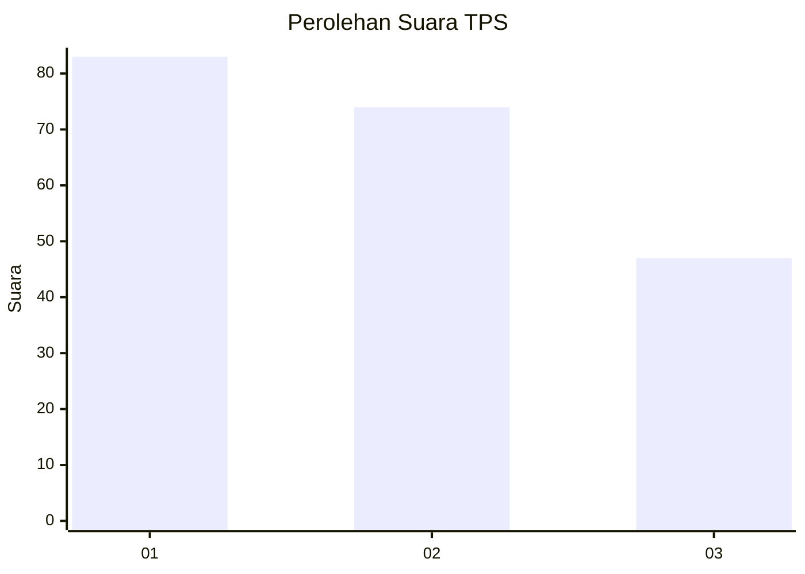
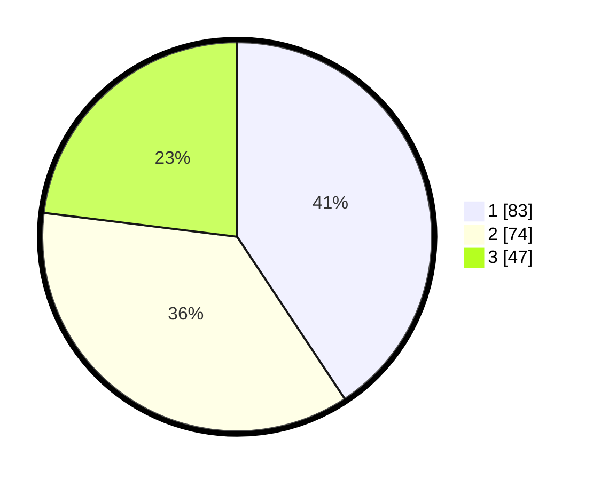

# Hasil

## Grafik

## Tabel

| No. | Nama Paslon    | Suara | Suara (raw) | Persentase |
|:--- |:-------------- | -----:| -----------:| ----------:|
| 1   | ANIES MUHAIMIN | 83    | [83][p-1]   | 40,69      |
| 2   | PRABOWO GIBRAN | 74    | [74][p-2]   | 36,27      |
| 3   | GANJAR MAHFUD  | 47    | [47][p-3]   | 23,04      |

[p-1]: https://github.com/gigit-pemilu/pemilu-2024-35-jawa-timur/blob/main/pilpres/hitung-suara/sub/35-jawa-timur/sub/29-sumenep/sub/17-batuputih/sub/2005-badur/sub/005-tps/sub/paslon-1.txt
[p-2]: https://github.com/gigit-pemilu/pemilu-2024-35-jawa-timur/blob/main/pilpres/hitung-suara/sub/35-jawa-timur/sub/29-sumenep/sub/17-batuputih/sub/2005-badur/sub/005-tps/sub/paslon-2.txt
[p-3]: https://github.com/gigit-pemilu/pemilu-2024-35-jawa-timur/blob/main/pilpres/hitung-suara/sub/35-jawa-timur/sub/29-sumenep/sub/17-batuputih/sub/2005-badur/sub/005-tps/sub/paslon-3.txt

## Foto C Plano

https://sirekap-obj-formc.kpu.go.id/5e96/pemilu/ppwp/35/29/17/20/05/3529172005005-20240215-161656--ecfe09a7-e74c-4091-aecb-8d28271a774c.jpg

https://sirekap-obj-formc.kpu.go.id/5e96/pemilu/ppwp/35/29/17/20/05/3529172005005-20240215-161823--607258ca-cd87-4cea-8528-3eaa9cb2ba1b.jpg

https://sirekap-obj-formc.kpu.go.id/5e96/pemilu/ppwp/35/29/17/20/05/3529172005005-20240215-162010--dae98c76-2f05-4030-b89c-9f15cd5d77bc.jpg

## Metadata

| Key        | Value               |
| ---------- | ------------------- |
| Time Stamp | 2024-02-25 16:00:00 |

