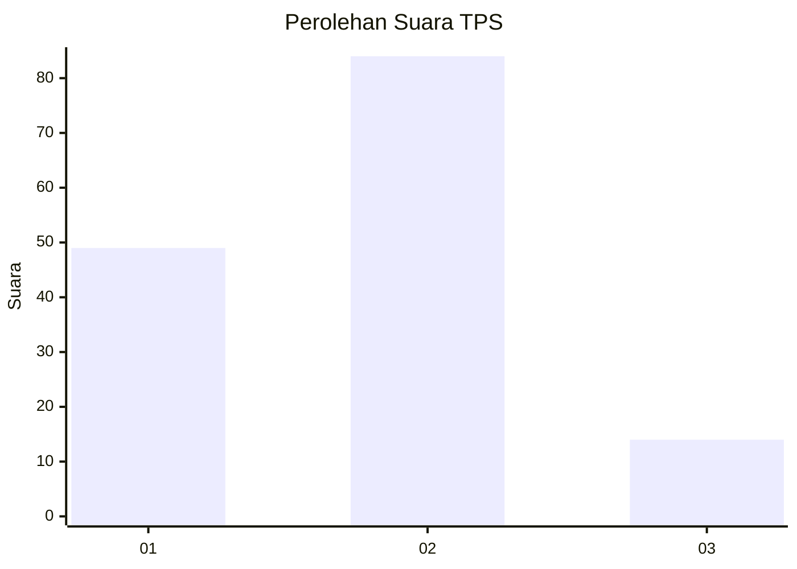
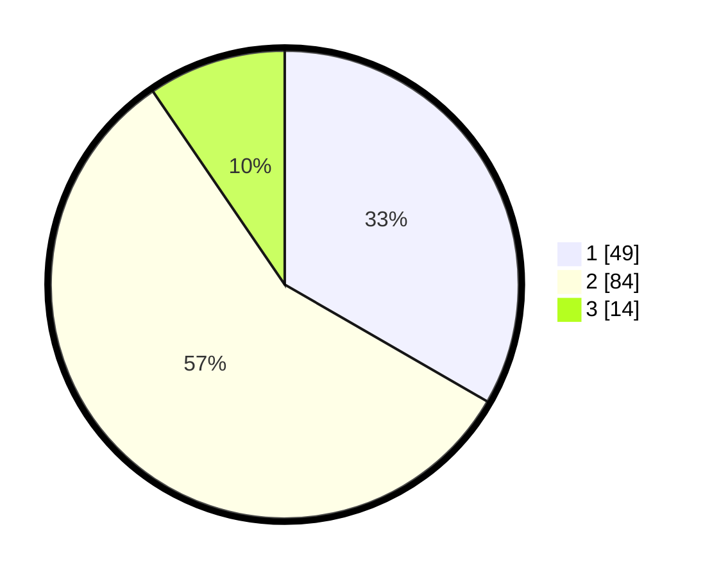

# Hasil

## Grafik

## Tabel

| No. | Nama Paslon    | Suara | Suara (raw) | Persentase |
|:--- |:-------------- | -----:| -----------:| ----------:|
| 1   | ANIES MUHAIMIN | 49    | [49][p-1]   | 33,33      |
| 2   | PRABOWO GIBRAN | 84    | [84][p-2]   | 57,14      |
| 3   | GANJAR MAHFUD  | 14    | [14][p-3]   | 9,52       |

[p-1]: https://github.com/gigit-pemilu/pemilu-2024-35-jawa-timur/blob/main/pilpres/hitung-suara/sub/35-jawa-timur/sub/29-sumenep/sub/17-batuputih/sub/2007-batuputih-kenek/sub/001-tps/sub/paslon-1.txt
[p-2]: https://github.com/gigit-pemilu/pemilu-2024-35-jawa-timur/blob/main/pilpres/hitung-suara/sub/35-jawa-timur/sub/29-sumenep/sub/17-batuputih/sub/2007-batuputih-kenek/sub/001-tps/sub/paslon-2.txt
[p-3]: https://github.com/gigit-pemilu/pemilu-2024-35-jawa-timur/blob/main/pilpres/hitung-suara/sub/35-jawa-timur/sub/29-sumenep/sub/17-batuputih/sub/2007-batuputih-kenek/sub/001-tps/sub/paslon-3.txt

## Foto C Plano

https://sirekap-obj-formc.kpu.go.id/8f6e/pemilu/ppwp/35/29/17/20/07/3529172007001-20240214-201606--b1732acb-3473-453d-bb85-cfa871ad3954.jpg

https://sirekap-obj-formc.kpu.go.id/8f6e/pemilu/ppwp/35/29/17/20/07/3529172007001-20240214-201850--c4b0411d-b5b3-470c-a372-a648af9d55ae.jpg

https://sirekap-obj-formc.kpu.go.id/8f6e/pemilu/ppwp/35/29/17/20/07/3529172007001-20240214-202010--5c1bcd80-a99f-452f-9578-8c77c1a24f56.jpg

## Metadata

| Key        | Value               |
| ---------- | ------------------- |
| Time Stamp | 2024-02-26 14:00:00 |

