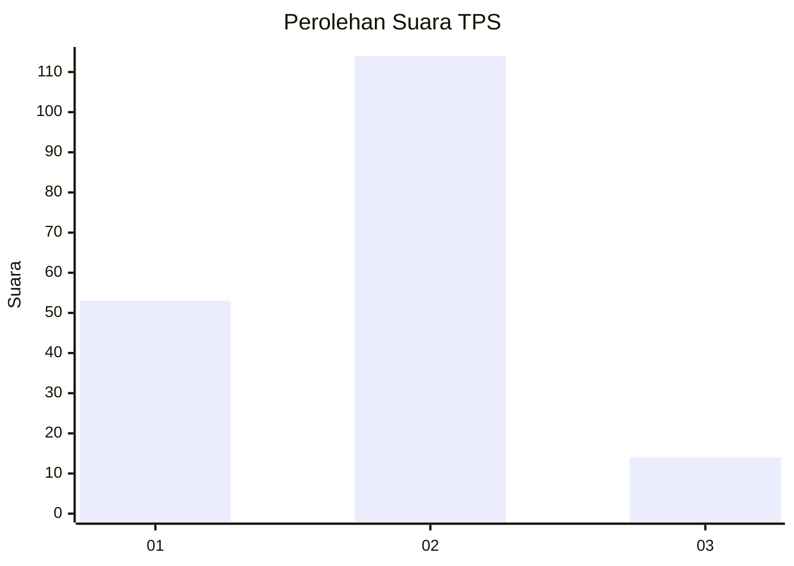
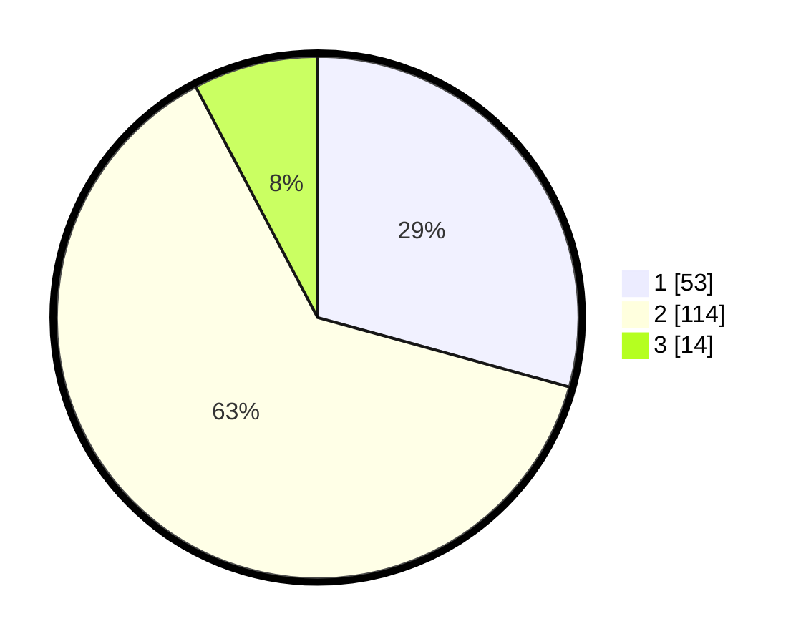

# Hasil

## Grafik

## Tabel

| No. | Nama Paslon    | Suara | Suara (raw) | Persentase |
|:--- |:-------------- | -----:| -----------:| ----------:|
| 1   | ANIES MUHAIMIN | 53    | [53][p-1]   | 29,28      |
| 2   | PRABOWO GIBRAN | 114   | [114][p-2]  | 62,98      |
| 3   | GANJAR MAHFUD  | 14    | [14][p-3]   | 7,73       |

[p-1]: https://github.com/gigit-pemilu/pemilu-2024/blob/main/pilpres/hitung-suara/sub/35-jawa-timur/sub/29-sumenep/sub/17-batuputih/sub/2007-batuputih-kenek/sub/004-tps/sub/paslon-1.txt
[p-2]: https://github.com/gigit-pemilu/pemilu-2024/blob/main/pilpres/hitung-suara/sub/35-jawa-timur/sub/29-sumenep/sub/17-batuputih/sub/2007-batuputih-kenek/sub/004-tps/sub/paslon-2.txt
[p-3]: https://github.com/gigit-pemilu/pemilu-2024/blob/main/pilpres/hitung-suara/sub/35-jawa-timur/sub/29-sumenep/sub/17-batuputih/sub/2007-batuputih-kenek/sub/004-tps/sub/paslon-3.txt

## Foto C Plano

https://sirekap-obj-formc.kpu.go.id/78e1/pemilu/ppwp/35/29/17/20/07/3529172007004-20240215-024800--105cc1fe-0fb9-4bdb-a08a-5641acb95152.jpg

https://sirekap-obj-formc.kpu.go.id/78e1/pemilu/ppwp/35/29/17/20/07/3529172007004-20240215-025256--e00c840c-13e5-428c-aeed-e12a140287fe.jpg

https://sirekap-obj-formc.kpu.go.id/78e1/pemilu/ppwp/35/29/17/20/07/3529172007004-20240215-025433--ff63a4c6-019f-482a-96c4-f1118f95a77e.jpg

## Metadata

| Key        | Value               |
| ---------- | ------------------- |
| Time Stamp | 2024-02-17 19:00:04 |

