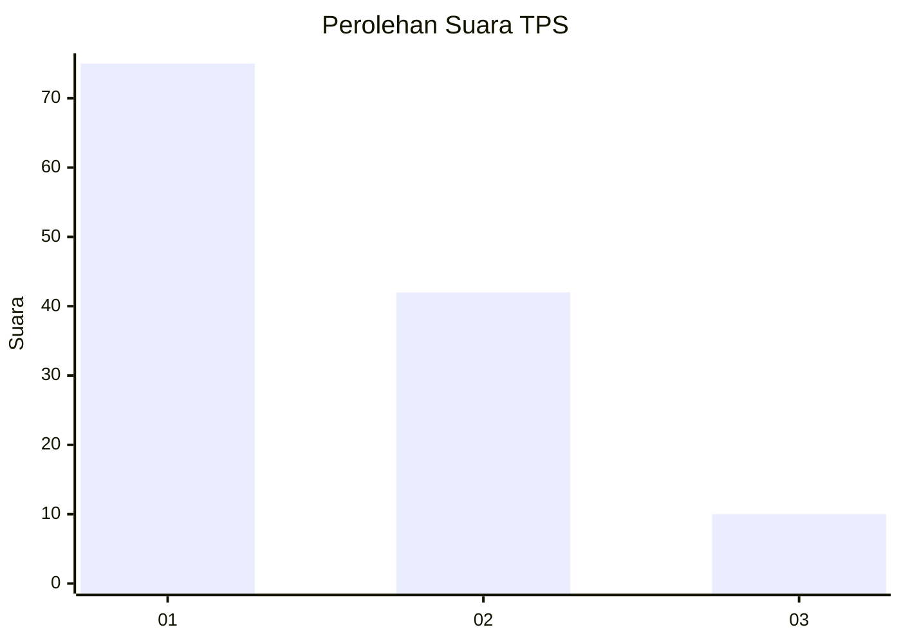
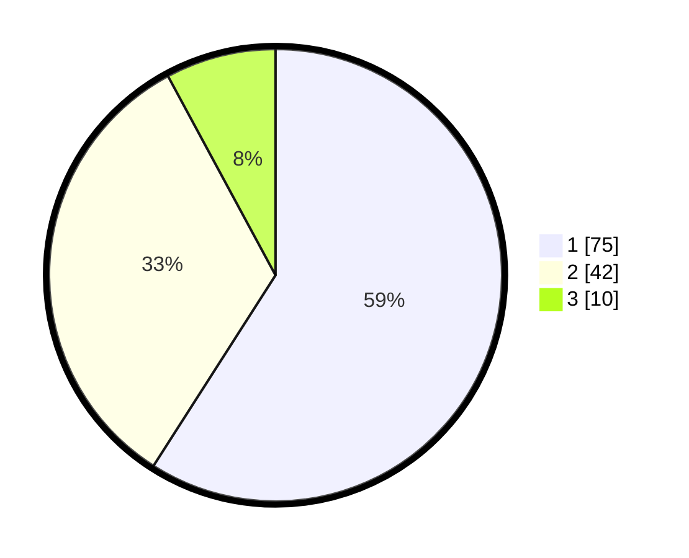

# Hasil

## Grafik

## Tabel

| No. | Nama Paslon    | Suara | Suara (raw) | Persentase |
|:--- |:-------------- | -----:| -----------:| ----------:|
| 1   | ANIES MUHAIMIN | 75    | [75][p-1]   | 59,06      |
| 2   | PRABOWO GIBRAN | 42    | [42][p-2]   | 33,07      |
| 3   | GANJAR MAHFUD  | 10    | [10][p-3]   | 7,87       |

[p-1]: https://github.com/gigit-pemilu/pemilu-2024/blob/main/pilpres/hitung-suara/sub/35-jawa-timur/sub/29-sumenep/sub/17-batuputih/sub/2008-batuputih-laok/sub/003-tps/sub/paslon-1.txt
[p-2]: https://github.com/gigit-pemilu/pemilu-2024/blob/main/pilpres/hitung-suara/sub/35-jawa-timur/sub/29-sumenep/sub/17-batuputih/sub/2008-batuputih-laok/sub/003-tps/sub/paslon-2.txt
[p-3]: https://github.com/gigit-pemilu/pemilu-2024/blob/main/pilpres/hitung-suara/sub/35-jawa-timur/sub/29-sumenep/sub/17-batuputih/sub/2008-batuputih-laok/sub/003-tps/sub/paslon-3.txt

## Foto C Plano

https://sirekap-obj-formc.kpu.go.id/2c55/pemilu/ppwp/35/29/17/20/08/3529172008003-20240215-194534--06c99019-bb9d-4c3b-9f07-9e2d34d24efd.jpg

https://sirekap-obj-formc.kpu.go.id/2c55/pemilu/ppwp/35/29/17/20/08/3529172008003-20240214-204816--d6b712ab-dc2f-4644-a297-671c3f6d11c2.jpg

https://sirekap-obj-formc.kpu.go.id/2c55/pemilu/ppwp/35/29/17/20/08/3529172008003-20240215-195850--deabef3c-7b3d-45ad-9b0b-e15a3f720cd4.jpg

## Metadata

| Key        | Value               |
| ---------- | ------------------- |
| Time Stamp | 2024-02-19 06:16:00 |

